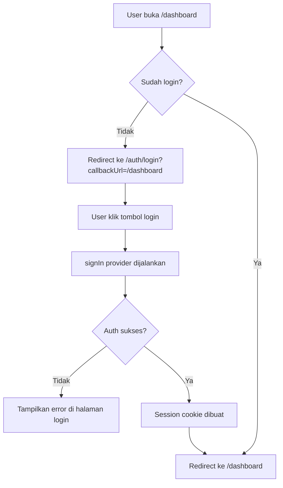

# PRD — Fix Auth.js Login Stuck di `/auth/login`

**Project:** showreels.id  
**Fitur:** Authentication & Login Flow Fix  
**Issue utama:** Tombol login aktif, tetapi setelah diklik user diarahkan ke:

```txt
https://www.showreels.id/auth/login?callbackUrl=https%3A%2F%2Fshowreels.id%2Fdashboard
```

Lalu stuck di halaman login/daftar dan tidak terjadi proses login.

---

## 1. Ringkasan Masalah

Saat user menekan tombol login, sistem tidak menjalankan proses autentikasi Auth.js dengan benar. URL menunjukkan ada kemungkinan masalah pada:

1. mismatch domain antara `www.showreels.id` dan `showreels.id`,
2. konfigurasi `callbackUrl` yang berbeda origin,
3. custom login page `/auth/login` tidak memanggil `signIn()` dengan provider yang valid,
4. environment variable Auth.js belum benar,
5. route handler Auth.js belum terpasang dengan benar,
6. middleware melakukan redirect loop ke halaman login,
7. provider credentials/OAuth belum dikonfigurasi atau gagal tanpa error handling.

Target PRD ini adalah membuat login berjalan normal, cepat, aman, dan langsung mengarahkan user ke `/dashboard` setelah berhasil login.

---

## 2. Tujuan

### 2.1 Tujuan Utama

Memperbaiki flow login Auth.js agar:

- tombol login benar-benar menjalankan proses autentikasi,
- user tidak stuck di halaman `/auth/login`,
- `callbackUrl` diarahkan dengan aman ke `/dashboard`,
- session terbentuk dengan benar,
- user yang sudah login tidak bisa kembali ke halaman login kecuali logout,
- user yang belum login diarahkan ke `/auth/login` saat membuka `/dashboard`.

### 2.2 Output yang Diharapkan

Setelah fix:

```txt
User klik login -> Auth.js signIn berjalan -> session dibuat -> redirect ke /dashboard
```

Jika login gagal:

```txt
User tetap di /auth/login -> tampil pesan error yang jelas
```

---

## 3. Referensi Teknis Resmi

- Auth.js mewajibkan `AUTH_SECRET` di production.
- Auth.js mendukung environment variable dengan prefix `AUTH_`, termasuk `AUTH_SECRET` dan `AUTH_TRUST_HOST`.
- Custom sign-in page harus didefinisikan pada `pages.signIn` dan route-nya harus benar-benar ada.
- Redirect callback Auth.js secara default hanya mengizinkan URL dengan origin yang sama.
- NextAuth/Auth.js versi lama menggunakan `NEXTAUTH_URL` dan `NEXTAUTH_SECRET`, sedangkan Auth.js v5 merekomendasikan `AUTH_URL` dan `AUTH_SECRET`.

---

## 4. Diagnosis Penyebab Paling Mungkin

### 4.1 Domain Mismatch: `www.showreels.id` vs `showreels.id`

URL saat ini:

```txt
https://www.showreels.id/auth/login?callbackUrl=https%3A%2F%2Fshowreels.id%2Fdashboard
```

Masalahnya:

- halaman login berada di `www.showreels.id`,
- callback menuju `showreels.id` tanpa `www`,
- Auth.js dapat menganggap ini beda origin,
- session cookie juga bisa gagal terbaca jika domain tidak konsisten.

### Solusi

Pilih satu canonical domain.

**Rekomendasi:** gunakan non-www.

```txt
https://showreels.id
```

Lalu redirect semua traffic dari:

```txt
https://www.showreels.id
```

ke:

```txt
https://showreels.id
```

---

## 5. Environment Variable Wajib

Tambahkan atau koreksi environment variable berikut di hosting/Vercel/server production.

### Untuk Auth.js v5

```env
AUTH_URL=https://showreels.id
AUTH_SECRET=isi_dengan_secret_random_minimal_32_karakter
AUTH_TRUST_HOST=true
```

Jika menggunakan Google OAuth:

```env
AUTH_GOOGLE_ID=google_client_id
AUTH_GOOGLE_SECRET=google_client_secret
```

Jika menggunakan GitHub OAuth:

```env
AUTH_GITHUB_ID=github_client_id
AUTH_GITHUB_SECRET=github_client_secret
```

### Jika project masih memakai NextAuth v4

```env
NEXTAUTH_URL=https://showreels.id
NEXTAUTH_SECRET=isi_dengan_secret_random_minimal_32_karakter
```

### Generate Secret

Gunakan salah satu:

```bash
openssl rand -base64 32
```

atau:

```bash
npx auth secret
```

---

## 6. Standar Route Auth.js

Pastikan file route handler Auth.js benar.

### App Router — Next.js

File:

```txt
/app/api/auth/[...nextauth]/route.ts
```

Isi minimal:

```ts
import NextAuth from "next-auth"
import { authOptions } from "@/lib/auth"

const handler = NextAuth(authOptions)

export { handler as GET, handler as POST }
```

Untuk Auth.js v5, disarankan struktur:

```txt
/auth.ts
/app/api/auth/[...nextauth]/route.ts
```

`auth.ts`:

```ts
import NextAuth from "next-auth"
import Google from "next-auth/providers/google"

export const { handlers, auth, signIn, signOut } = NextAuth({
  trustHost: true,
  pages: {
    signIn: "/auth/login",
  },
  providers: [
    Google({
      clientId: process.env.AUTH_GOOGLE_ID,
      clientSecret: process.env.AUTH_GOOGLE_SECRET,
    }),
  ],
  callbacks: {
    async redirect({ url, baseUrl }) {
      if (url.startsWith("/")) return `${baseUrl}${url}`

      const targetUrl = new URL(url)
      const base = new URL(baseUrl)

      const allowedOrigins = [
        "https://showreels.id",
        "https://www.showreels.id",
      ]

      if (allowedOrigins.includes(targetUrl.origin)) {
        return `${base.origin}${targetUrl.pathname}${targetUrl.search}`
      }

      return `${base.origin}/dashboard`
    },
    async session({ session, token }) {
      return session
    },
    async jwt({ token, user }) {
      return token
    },
  },
})
```

`/app/api/auth/[...nextauth]/route.ts`:

```ts
export { GET, POST } from "@/auth"
```

---

## 7. Fix Halaman Login

File contoh:

```txt
/app/auth/login/page.tsx
```

### Masalah yang Harus Dicek

Pastikan tombol login tidak hanya redirect ke `/auth/login`, tetapi memanggil fungsi `signIn()`.

### Client Component Login Button

```tsx
"use client"

import { signIn } from "next-auth/react"
import { useSearchParams } from "next/navigation"

export default function LoginButton() {
  const searchParams = useSearchParams()
  const callbackUrl = searchParams.get("callbackUrl") || "/dashboard"

  return (
    <button
      type="button"
      onClick={() =>
        signIn("google", {
          callbackUrl,
          redirect: true,
        })
      }
      className="w-full rounded-xl bg-black px-4 py-3 text-white"
    >
      Login dengan Google
    </button>
  )
}
```

Jika memakai Credentials Provider:

```tsx
"use client"

import { signIn } from "next-auth/react"
import { useRouter, useSearchParams } from "next/navigation"
import { useState } from "react"

export default function CredentialsLoginForm() {
  const router = useRouter()
  const searchParams = useSearchParams()
  const callbackUrl = searchParams.get("callbackUrl") || "/dashboard"

  const [email, setEmail] = useState("")
  const [password, setPassword] = useState("")
  const [error, setError] = useState("")
  const [loading, setLoading] = useState(false)

  async function handleSubmit(e: React.FormEvent) {
    e.preventDefault()
    setError("")
    setLoading(true)

    const result = await signIn("credentials", {
      email,
      password,
      redirect: false,
      callbackUrl,
    })

    setLoading(false)

    if (result?.error) {
      setError("Email atau password salah. Silakan coba lagi.")
      return
    }

    router.push(result?.url || callbackUrl)
    router.refresh()
  }

  return (
    <form onSubmit={handleSubmit} className="space-y-4">
      <input
        type="email"
        value={email}
        onChange={(e) => setEmail(e.target.value)}
        placeholder="Email"
        required
      />

      <input
        type="password"
        value={password}
        onChange={(e) => setPassword(e.target.value)}
        placeholder="Password"
        required
      />

      {error && <p className="text-sm text-red-500">{error}</p>}

      <button type="submit" disabled={loading}>
        {loading ? "Memproses..." : "Login"}
      </button>
    </form>
  )
}
```

---

## 8. Fix Middleware agar Tidak Redirect Loop

File:

```txt
/middleware.ts
```

Contoh aman:

```ts
import { auth } from "@/auth"
import { NextResponse } from "next/server"

export default auth((req) => {
  const { nextUrl } = req
  const isLoggedIn = !!req.auth

  const isAuthPage = nextUrl.pathname.startsWith("/auth/login")
  const isDashboard = nextUrl.pathname.startsWith("/dashboard")

  if (isDashboard && !isLoggedIn) {
    const loginUrl = new URL("/auth/login", nextUrl.origin)
    loginUrl.searchParams.set("callbackUrl", "/dashboard")
    return NextResponse.redirect(loginUrl)
  }

  if (isAuthPage && isLoggedIn) {
    return NextResponse.redirect(new URL("/dashboard", nextUrl.origin))
  }

  return NextResponse.next()
})

export const config = {
  matcher: ["/dashboard/:path*", "/auth/login"],
}
```

### Catatan Penting

Jangan masukkan `/api/auth/:path*` ke middleware protection. Route Auth.js harus bisa diakses bebas oleh sistem.

Hindari matcher seperti ini:

```ts
matcher: ["/:path*"]
```

karena bisa menyebabkan `/api/auth/signin`, `/api/auth/callback`, dan `/auth/login` ikut terjebak redirect loop.

---

## 9. Fix Canonical Domain

### 9.1 Vercel Redirect

Tambahkan di `next.config.js`:

```js
/** @type {import('next').NextConfig} */
const nextConfig = {
  async redirects() {
    return [
      {
        source: "/:path*",
        has: [
          {
            type: "host",
            value: "www.showreels.id",
          },
        ],
        destination: "https://showreels.id/:path*",
        permanent: true,
      },
    ]
  },
}

module.exports = nextConfig
```

### 9.2 OAuth Provider Callback URL

Jika menggunakan Google OAuth, set Authorized redirect URI:

```txt
https://showreels.id/api/auth/callback/google
```

Jika masih ingin mendukung www sementara:

```txt
https://www.showreels.id/api/auth/callback/google
```

Namun rekomendasi final tetap satu domain canonical saja.

---

## 10. Provider Credentials — Validasi Wajib

Jika menggunakan login email/password, pastikan `CredentialsProvider` mengembalikan object user saat sukses dan `null` saat gagal.

Contoh:

```ts
import Credentials from "next-auth/providers/credentials"
import bcrypt from "bcryptjs"
import { prisma } from "@/lib/prisma"

Credentials({
  name: "Credentials",
  credentials: {
    email: { label: "Email", type: "email" },
    password: { label: "Password", type: "password" },
  },
  async authorize(credentials) {
    if (!credentials?.email || !credentials?.password) {
      return null
    }

    const user = await prisma.user.findUnique({
      where: { email: credentials.email as string },
    })

    if (!user || !user.password) {
      return null
    }

    const isValidPassword = await bcrypt.compare(
      credentials.password as string,
      user.password
    )

    if (!isValidPassword) {
      return null
    }

    return {
      id: user.id,
      name: user.name,
      email: user.email,
      image: user.image,
    }
  },
})
```

---

## 11. Checklist Debugging Developer

Developer wajib menjalankan checklist berikut.

### 11.1 Cek Endpoint Auth.js

Buka:

```txt
https://showreels.id/api/auth/providers
```

Harus muncul JSON provider, contoh:

```json
{
  "google": {
    "id": "google",
    "name": "Google",
    "type": "oauth"
  }
}
```

Jika kosong atau error, berarti provider belum terdaftar.

---

### 11.2 Cek Session Endpoint

Buka:

```txt
https://showreels.id/api/auth/session
```

Sebelum login:

```json
{}
```

Sesudah login:

```json
{
  "user": {
    "name": "...",
    "email": "..."
  }
}
```

---

### 11.3 Cek Cookie

Setelah login, browser harus punya cookie Auth.js seperti:

```txt
authjs.session-token
```

atau untuk NextAuth v4:

```txt
next-auth.session-token
```

Jika tidak muncul, kemungkinan masalah pada:

- `AUTH_SECRET`,
- `AUTH_URL`,
- domain mismatch,
- HTTPS/cookie secure,
- callback gagal,
- middleware redirect loop.

---

## 12. Flow Login Final



---

## 13. Flow Logout Final

```tsx
"use client"

import { signOut } from "next-auth/react"

export default function LogoutButton() {
  return (
    <button
      type="button"
      onClick={() => signOut({ callbackUrl: "/auth/login" })}
    >
      Logout
    </button>
  )
}
```

Expected:

```txt
User klik logout -> session dihapus -> redirect ke /auth/login
```

---

## 14. Acceptance Criteria

Login dianggap selesai jika semua kriteria berikut terpenuhi:

- [ ] `/api/auth/providers` menampilkan provider aktif.
- [ ] `/api/auth/session` menampilkan session setelah login.
- [ ] user dari `/auth/login` berhasil masuk ke `/dashboard`.
- [ ] tidak ada stuck di `/auth/login`.
- [ ] tidak ada redirect loop.
- [ ] callback URL tidak lagi memakai domain campuran `www` dan non-`www`.
- [ ] user belum login tidak bisa masuk `/dashboard`.
- [ ] user sudah login otomatis diarahkan dari `/auth/login` ke `/dashboard`.
- [ ] logout menghapus session dan kembali ke `/auth/login`.
- [ ] error login ditampilkan jelas di UI.

---

## 15. Prioritas Implementasi

### Priority 0 — Wajib Hari Ini

1. Set canonical domain ke `https://showreels.id`.
2. Set `AUTH_URL=https://showreels.id`.
3. Set `AUTH_SECRET`.
4. Set `AUTH_TRUST_HOST=true`.
5. Pastikan `/api/auth/[...nextauth]/route.ts` aktif.
6. Pastikan tombol login memanggil `signIn()`.
7. Fix middleware agar tidak melindungi `/api/auth/*`.

### Priority 1 — Setelah Login Normal

1. Tambahkan error state di UI login.
2. Tambahkan loading state.
3. Tambahkan redirect otomatis jika user sudah login.
4. Tambahkan logging server untuk debugging.

### Priority 2 — Optimasi

1. Optimasi session strategy.
2. Optimasi database query user.
3. Tambahkan audit log login.
4. Tambahkan rate limiting login.

---

## 16. Prompt Siap Pakai untuk Developer / Vibe Coding

Salin prompt berikut ke AI coding agent:

```txt
Tolong fix sistem login Auth.js/NextAuth di project Next.js showreels.id.

Masalah:
Tombol login aktif, tetapi ketika diklik user diarahkan ke:
https://www.showreels.id/auth/login?callbackUrl=https%3A%2F%2Fshowreels.id%2Fdashboard
lalu stuck di halaman login/daftar dan tidak terjadi proses login.

Target:
1. Login harus benar-benar memanggil signIn() Auth.js.
2. Setelah login sukses, user masuk ke /dashboard.
3. Tidak boleh ada redirect loop.
4. Gunakan canonical domain https://showreels.id, bukan campuran www dan non-www.
5. Middleware hanya boleh protect /dashboard dan tidak boleh mengganggu /api/auth/*.
6. Jika user sudah login dan membuka /auth/login, redirect ke /dashboard.
7. Jika login gagal, tampilkan pesan error yang jelas.
8. Logout harus menghapus session dan redirect ke /auth/login.

Tugas teknis:
- Audit konfigurasi Auth.js/NextAuth.
- Pastikan route /app/api/auth/[...nextauth]/route.ts aktif.
- Pastikan providers aktif dan dapat dicek melalui /api/auth/providers.
- Pastikan environment variable production benar:
  AUTH_URL=https://showreels.id
  AUTH_SECRET=<secret minimal 32 karakter>
  AUTH_TRUST_HOST=true
- Jika project masih memakai NextAuth v4, gunakan:
  NEXTAUTH_URL=https://showreels.id
  NEXTAUTH_SECRET=<secret minimal 32 karakter>
- Fix halaman /auth/login agar tombol login memanggil signIn(provider, { callbackUrl }).
- Fix callbackUrl agar menggunakan relative path /dashboard jika memungkinkan.
- Fix redirect callback agar hanya menerima domain showreels.id dan www.showreels.id, lalu normalisasi ke https://showreels.id.
- Fix middleware matcher agar hanya menjaga /dashboard/:path* dan /auth/login.
- Jangan protect /api/auth/:path*.
- Tambahkan loading state dan error handling pada form login.
- Tambahkan pengecekan session agar user login tidak kembali ke halaman login.

Acceptance criteria:
- /api/auth/providers menampilkan provider aktif.
- /api/auth/session kosong sebelum login dan berisi user setelah login.
- Klik login berhasil redirect ke /dashboard.
- Tidak ada stuck di /auth/login.
- Tidak ada redirect loop.
- Logout berhasil kembali ke /auth/login.
```

---

## 17. Catatan Risiko

### Risiko 1 — OAuth Callback Tidak Sesuai

Jika menggunakan Google/GitHub OAuth, login bisa gagal diam-diam jika redirect URI di dashboard provider belum sesuai.

Solusi:

```txt
https://showreels.id/api/auth/callback/google
```

atau sesuai provider yang digunakan.

---

### Risiko 2 — Cookie Tidak Terbaca Karena Domain Campuran

Jika login dilakukan di `www.showreels.id`, tetapi dashboard di `showreels.id`, cookie session bisa tidak konsisten.

Solusi:

- pakai satu domain canonical,
- redirect seluruh `www` ke non-`www`,
- set `AUTH_URL=https://showreels.id`.

---

### Risiko 3 — Middleware Menjebak Auth Route

Jika middleware memaksa semua route harus login, endpoint Auth.js bisa ikut terblokir.

Solusi:

- exclude `/api/auth/*`,
- hanya protect `/dashboard/:path*`.

---

## 18. Kesimpulan

Masalah paling kuat berasal dari kombinasi domain mismatch `www.showreels.id` vs `showreels.id`, callback URL yang tidak dinormalisasi, tombol login yang kemungkinan belum menjalankan `signIn()` secara benar, serta middleware yang berpotensi membuat redirect loop.

Fix utama adalah:

```txt
Gunakan satu canonical domain + konfigurasi env Auth.js benar + tombol login memanggil signIn() + middleware tidak mengganggu /api/auth/*.
```
