# Database Cleanup System - Architecture Diagrams

## 📐 System Architecture

### High-Level Architecture

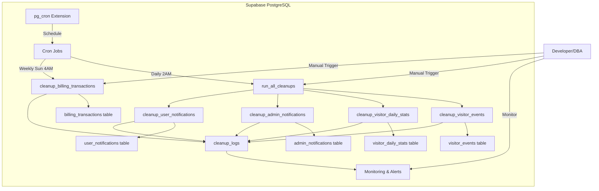

---

## 🔄 Cleanup Flow

### Daily Cleanup Flow

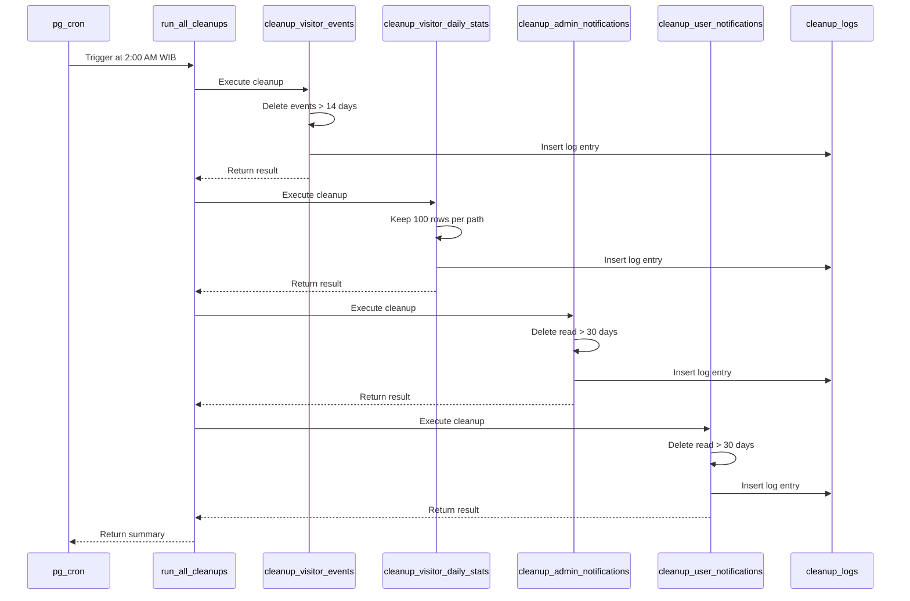

---

## 🗄️ Database Schema

### Cleanup System Tables

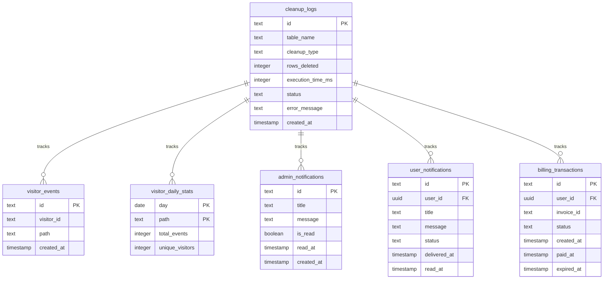

---

## ⏱️ Cleanup Schedule

### Cron Schedule Timeline

```mermaid
gantt
    title Daily Cleanup Schedule
    dateFormat HH:mm
    axisFormat %H:%M
    
    section Daily Cleanup
    visitor_events cleanup           :02:00, 5m
    visitor_daily_stats cleanup      :02:05, 3m
    admin_notifications cleanup      :02:08, 2m
    user_notifications cleanup       :02:10, 2m
    
    section Weekly Cleanup
    billing_transactions cleanup     :crit, 04:00, 5m
```

---

## 🔍 Monitoring Flow

### Monitoring & Alerting Flow

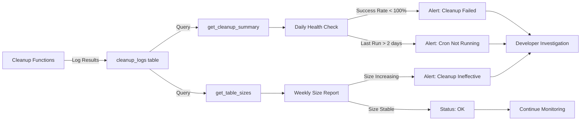

---

## 🎯 Decision Tree

### Cleanup Strategy Decision Tree

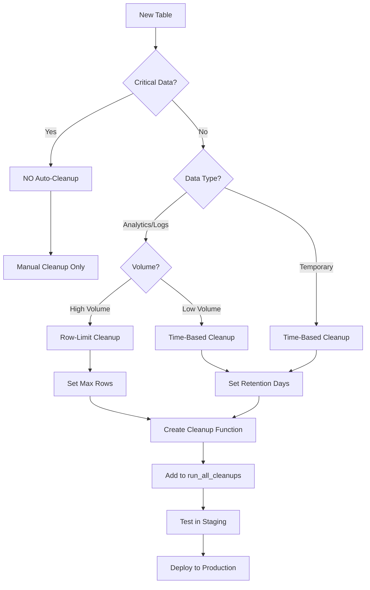

---

## 📊 Data Lifecycle

### Data Retention Lifecycle

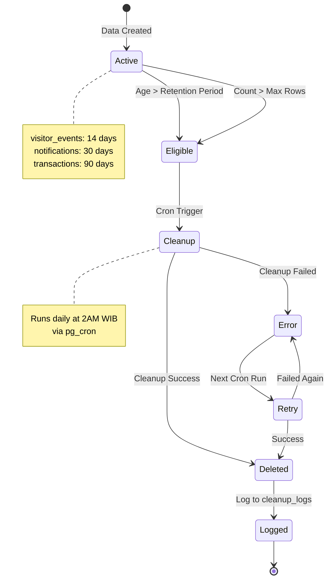

---

## 🔄 Cleanup Function Flow

### Individual Cleanup Function Flow

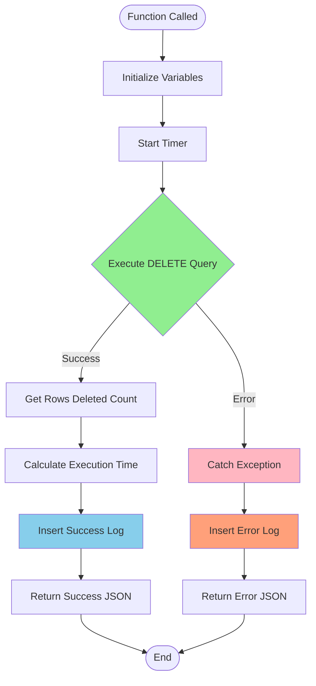

---

## 🏗️ Implementation Phases

### Implementation Timeline

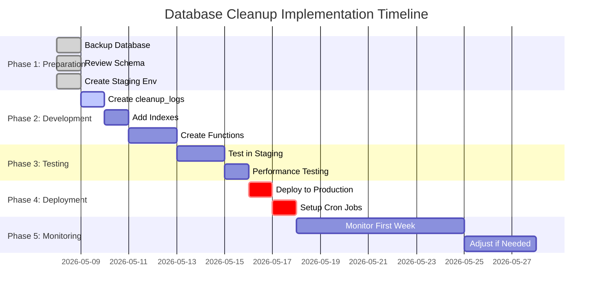

---

## 🎨 Table Size Visualization

### Expected Storage Reduction

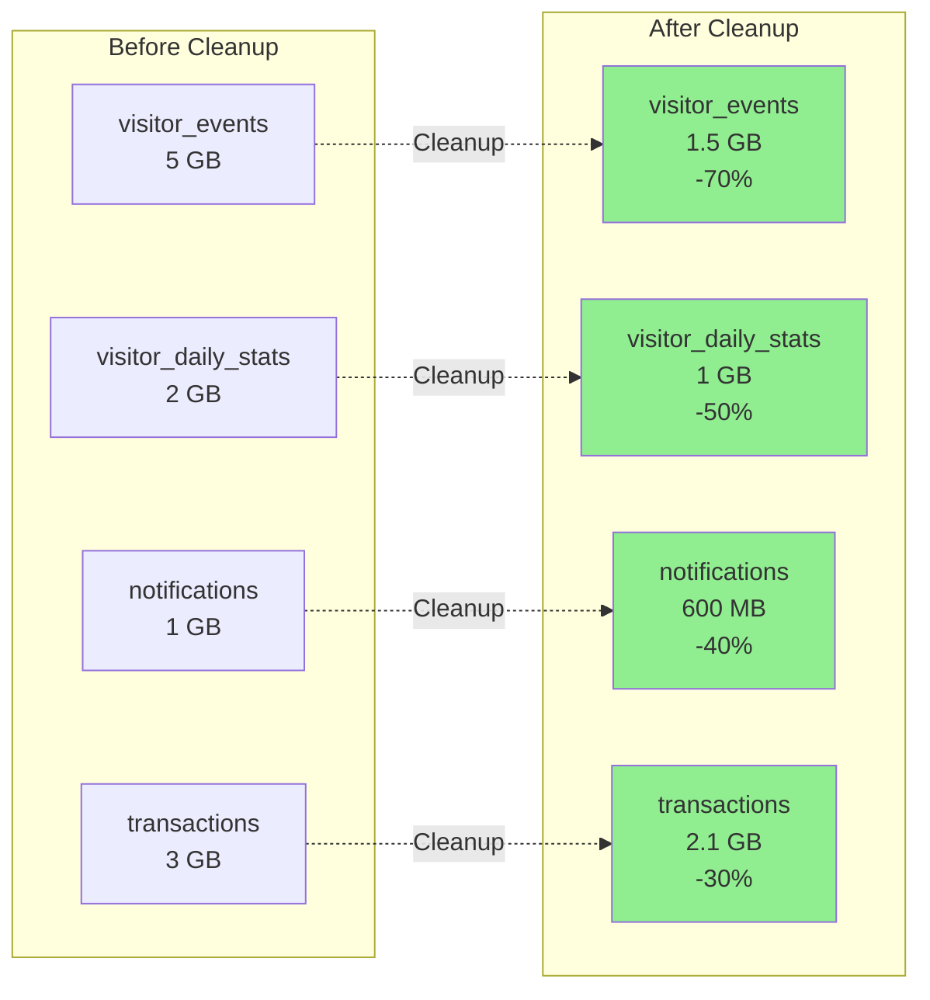

---

## 🔐 Security & Permissions

### Permission Model

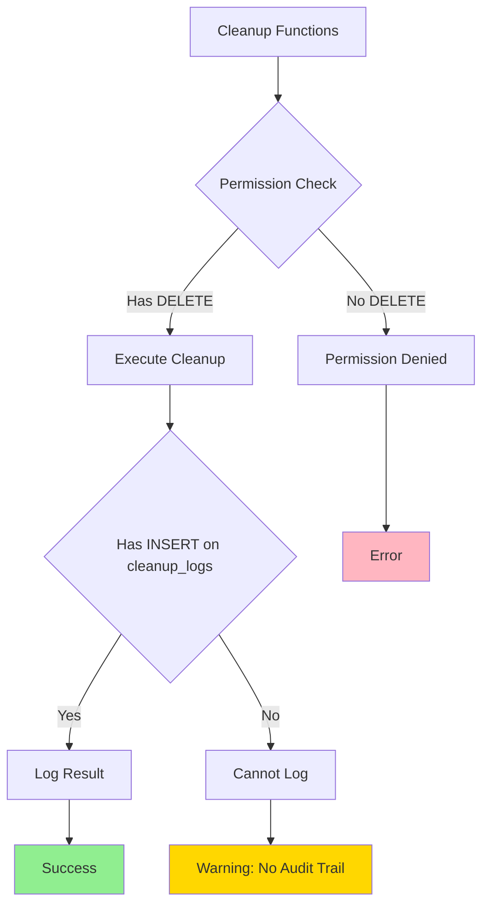

---

## 📈 Monitoring Dashboard Concept

### Ideal Monitoring Dashboard Layout

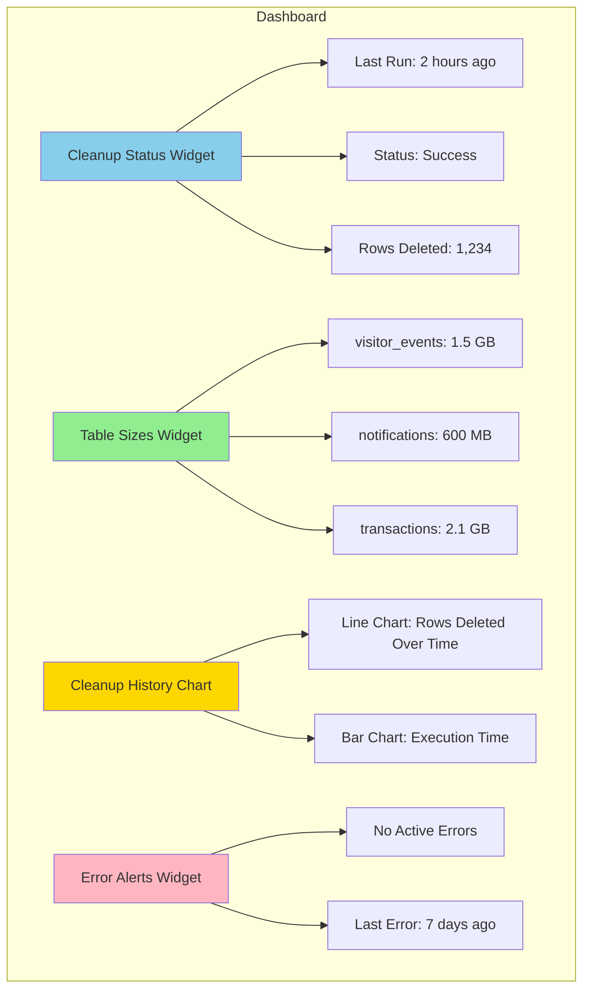

---

## 🔄 Rollback Strategy

### Rollback Decision Flow

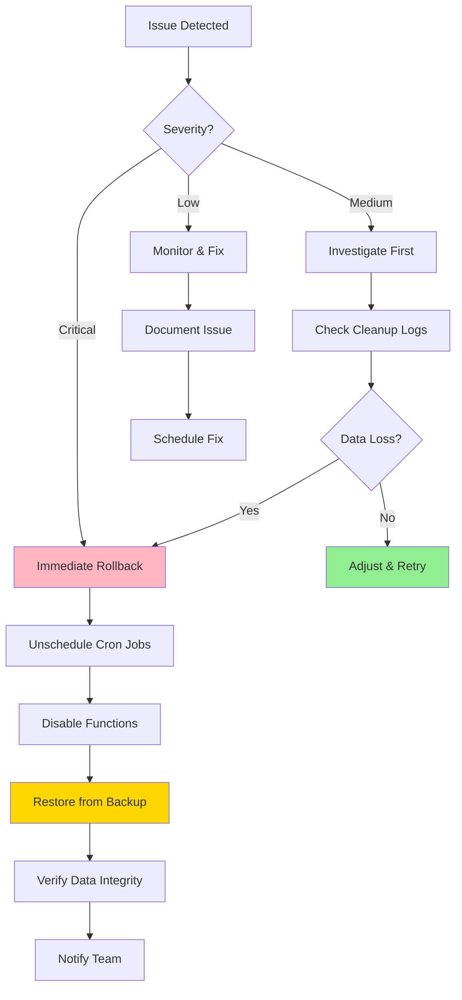

---

## 📊 Performance Metrics

### Key Performance Indicators

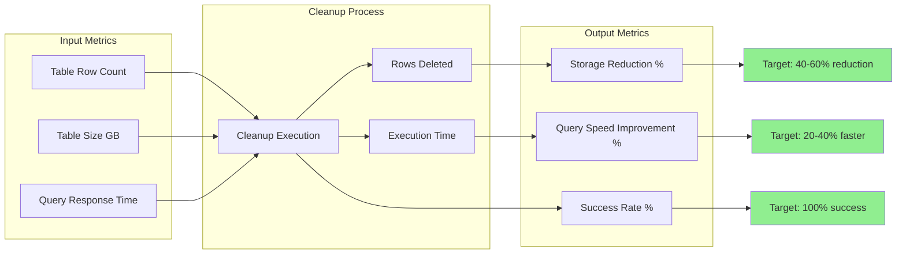

---

**Architecture Diagrams Version**: 1.0  
**Last Updated**: 2026-05-08  
**Format**: Mermaid Diagrams
