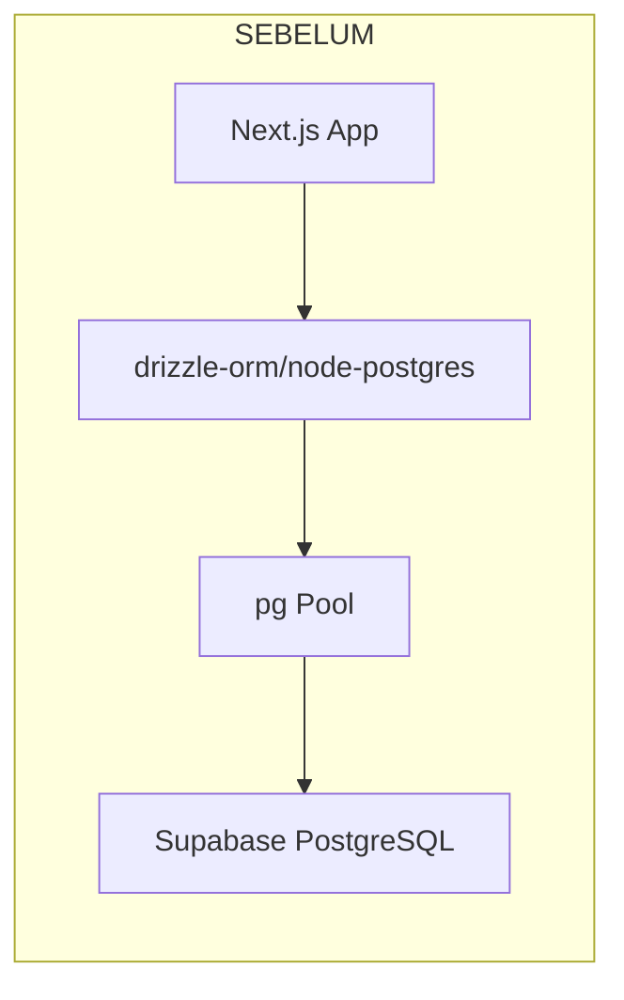
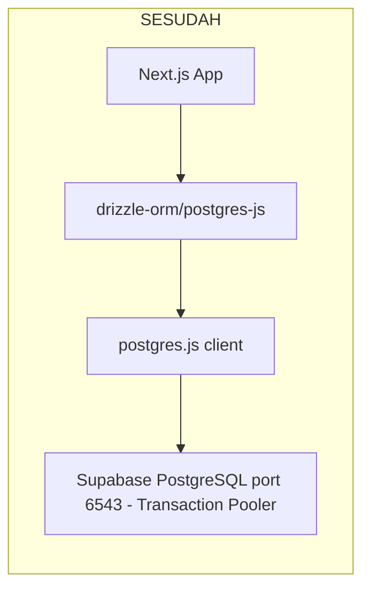

# Plan: Migrasi Driver Database dari `pg` ke `postgres.js`

## Ringkasan

Migrasi database driver dari `pg` (node-postgres) ke `postgres` (postgres.js) untuk optimasi performa di lingkungan serverless Vercel. Driver `postgres.js` lebih ringan, mendukung connection pooling bawaan, dan kompatibel dengan Vercel Edge Runtime.

---

## Status Saat Ini

| Aspek | Status |
|-------|--------|
| Drizzle ORM | ✅ Terinstal & aktif (`drizzle-orm@0.45.2`) |
| Schema | ✅ Lengkap (10+ tabel, relasi, type exports) |
| Migrasi | ✅ 18 migrasi di `drizzle/` |
| CRUD Operations | ✅ 49+ file menggunakan Drizzle |
| Driver saat ini | ⚠️ `pg` (node-postgres) + `@types/pg` |
| Supabase SDK | ✅ Hanya untuk Auth (bukan database query) |

---

## Arsitektur Sebelum vs Sesudah





---

## File yang Perlu Diubah

### File Utama (Wajib)

| File | Perubahan |
|------|-----------|
| `package.json` | Hapus `pg` + `@types/pg`, tambah `postgres` |
| `src/db/index.ts` | Refactor total: ganti Pool/pg dengan postgres.js |
| `src/db/migrate.ts` | Ganti migrator dari node-postgres ke postgres-js |

### File CLI Scripts (Penyesuaian `pool.end()` → `sql.end()`)

| File | Perubahan |
|------|-----------|
| `src/db/seed-owner.ts` | Ganti `pool.end()` → `sql.end()` |
| `src/db/backfill-auth-profiles.ts` | Ganti `pool.end()` → `sql.end()` |
| `src/db/reset-and-seed-dummy.ts` | Ganti `pool.end()` → `sql.end()` |

### File Konfigurasi (Opsional/Minor)

| File | Perubahan |
|------|-----------|
| `drizzle.config.ts` | Tidak perlu diubah - sudah menggunakan `url` |
| `src/lib/database/config.ts` | Tidak perlu diubah - sudah return connection string |

### File yang TIDAK Perlu Diubah

Semua 49+ file yang mengimport dari `@/db` dan `@/db/schema` **tidak perlu diubah** karena mereka hanya menggunakan `db` instance yang di-export, bukan driver secara langsung.

---

## Detail Implementasi

### 1. Package Changes

```bash
# Hapus pg dan types-nya
npm uninstall pg @types/pg

# Install postgres.js
npm install postgres
```

### 2. Refactor `src/db/index.ts`

**Sebelum:**
```typescript
import { drizzle } from "drizzle-orm/node-postgres";
import { Pool } from "pg";
import * as schema from "@/db/schema";
import { getDatabaseUrl, isDatabaseUrlConfigured } from "@/lib/database/config";

const connectionString = getDatabaseUrl();
export const isDatabaseConfigured = isDatabaseUrlConfigured();

const globalForDb = globalThis as unknown as {
  showreelsPool?: Pool;
};

const requiresSsl = /* ... */;

const activePool = isDatabaseConfigured
  ? globalForDb.showreelsPool ||
    new Pool({
      connectionString,
      ssl: requiresSsl ? { rejectUnauthorized: false } : false,
    })
  : null;

if (process.env.NODE_ENV !== "production" && activePool) {
  globalForDb.showreelsPool = activePool;
}

export const db = activePool
  ? drizzle(activePool, { schema })
  : (null as unknown as ReturnType<typeof drizzle<typeof schema>>);
export const pool = activePool as Pool;
```

**Sesudah:**
```typescript
import { drizzle } from "drizzle-orm/postgres-js";
import postgres from "postgres";
import * as schema from "@/db/schema";
import { getDatabaseUrl, isDatabaseUrlConfigured } from "@/lib/database/config";

const connectionString = getDatabaseUrl();
export const isDatabaseConfigured = isDatabaseUrlConfigured();

const globalForDb = globalThis as unknown as {
  showreelsSql?: postgres.Sql;
};

const activeSql = isDatabaseConfigured
  ? globalForDb.showreelsSql ||
    postgres(connectionString, {
      ssl: connectionString.includes("supabase.co") ? "require" : false,
      max: 10,
      idle_timeout: 20,
      connect_timeout: 10,
      prepare: false, // Diperlukan untuk Supabase Transaction Pooler (pgbouncer)
    })
  : null;

if (process.env.NODE_ENV !== "production" && activeSql) {
  globalForDb.showreelsSql = activeSql;
}

export const db = activeSql
  ? drizzle(activeSql, { schema })
  : (null as unknown as ReturnType<typeof drizzle<typeof schema>>);

// Export sql client untuk CLI scripts yang perlu menutup koneksi
export const sql = activeSql as postgres.Sql;
```

### 3. Refactor `src/db/migrate.ts`

**Sesudah:**
```typescript
import { config } from "dotenv";
import { migrate } from "drizzle-orm/postgres-js/migrator";

config({ path: ".env.local" });
config();

if (!process.env.DATABASE_URL_MIGRATION && !process.env.DATABASE_URL) {
  throw new Error(
    "DATABASE_URL_MIGRATION or DATABASE_URL must be set before running migrations."
  );
}

async function main() {
  const { db, sql } = await import("@/db");
  await migrate(db, {
    migrationsFolder: "./drizzle",
  });
  await sql.end();
}

main().catch(async (error) => {
  console.error("Migration failed", error);
  const { sql } = await import("@/db");
  await sql.end();
  process.exit(1);
});
```

### 4. Refactor CLI Scripts

Semua file yang menggunakan `pool.end()` perlu diganti ke `sql.end()`:

```typescript
// Sebelum:
const { pool } = await import("@/db");
await pool.end();

// Sesudah:
const { sql } = await import("@/db");
await sql.end();
```

File yang terdampak:
- `src/db/seed-owner.ts`
- `src/db/backfill-auth-profiles.ts`
- `src/db/reset-and-seed-dummy.ts`

---

## Pertimbangan Penting

### Mengapa `prepare: false`?

Supabase menggunakan **PgBouncer** sebagai transaction pooler (port 6543). PgBouncer dalam mode transaction tidak mendukung prepared statements. Opsi `prepare: false` pada postgres.js memastikan kompatibilitas.

### Environment Variable

Connection string harus menggunakan port **6543** (transaction pooler) untuk production:

```env
DATABASE_URL="postgres://[USER]:[PASSWORD]@[HOST]:6543/[DB_NAME]?pgbouncer=true"
```

Untuk migrasi, gunakan port **5432** (direct connection) karena migrasi memerlukan prepared statements:

```env
DATABASE_URL_MIGRATION="postgres://[USER]:[PASSWORD]@[HOST]:5432/[DB_NAME]"
```

### Keuntungan postgres.js vs pg

| Aspek | pg (node-postgres) | postgres.js |
|-------|-------------------|-------------|
| Bundle size | ~120KB | ~40KB |
| Serverless support | Memerlukan pool management | Native lazy connections |
| Edge Runtime | ❌ Tidak kompatibel | ✅ Kompatibel |
| Connection overhead | Pool warmup diperlukan | Lazy connect per-query |
| TypeScript | Perlu @types/pg | Built-in types |
| Prepared statements | Default ON | Configurable |

### Risiko & Mitigasi

| Risiko | Mitigasi |
|--------|----------|
| Breaking change di runtime | Test lokal sebelum deploy |
| SSL connection issues | Gunakan `ssl: "require"` untuk Supabase |
| Prepared statement error di pooler | Set `prepare: false` |
| CLI scripts gagal | Test semua npm scripts setelah migrasi |

---

## Urutan Eksekusi

1. Install `postgres`, uninstall `pg` + `@types/pg`
2. Refactor `src/db/index.ts`
3. Refactor `src/db/migrate.ts`
4. Update CLI scripts (3 file)
5. Test lokal: `npm run dev` → pastikan halaman dashboard load
6. Test migrasi: `npm run db:migrate`
7. Test CLI: `npm run db:seed:owner`
8. Deploy ke Vercel staging
9. Verifikasi production

---

## Catatan Tambahan

- `drizzle.config.ts` **tidak perlu diubah** karena drizzle-kit menangani koneksi sendiri menggunakan `url` dari `dbCredentials`.
- Semua 49+ file yang mengimport `db` dari `@/db` **tidak perlu diubah** — API Drizzle ORM tetap sama terlepas dari driver yang digunakan.
- Supabase Auth SDK tetap dipertahankan untuk autentikasi — ini bukan bagian dari migrasi driver database.
