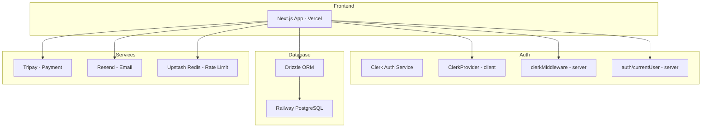

# Rencana Migrasi Full: Supabase → Railway + Clerk

## Status: FINAL PLAN — Siap Implementasi

---

## Ringkasan Migrasi

| Komponen | Dari | Ke |
|----------|------|-----|
| **Database** | Supabase PostgreSQL (Seoul) | Railway PostgreSQL |
| **Authentication** | Supabase Auth | Clerk |
| **ORM** | Drizzle ORM (tetap) | Drizzle ORM (tetap) |
| **Hosting** | Vercel (tetap) | Vercel (tetap) |

---

## Arsitektur Baru



---

## File yang Terdampak Migrasi

### Kategori 1: File Supabase yang DIHAPUS/DIGANTI

| # | File | Aksi | Pengganti |
|---|------|------|-----------|
| 1 | `src/lib/supabase/client.ts` | HAPUS | Clerk client hooks |
| 2 | `src/lib/supabase/server.ts` | HAPUS | `@clerk/nextjs/server` |
| 3 | `src/lib/supabase/config.ts` | HAPUS | Clerk env config |
| 4 | `src/lib/supabase/proxy.ts` | HAPUS | `clerkMiddleware` |

### Kategori 2: File yang Perlu DIUBAH (Auth Logic)

| # | File | Perubahan |
|---|------|-----------|
| 5 | `src/middleware.ts` | Ganti `updateSession` → `clerkMiddleware` |
| 6 | `src/server/current-user.ts` | Ganti `supabase.auth.getUser()` → `auth()` dari Clerk |
| 7 | `src/components/auth-guard.tsx` | Ganti Supabase client → Clerk `useAuth()` |
| 8 | `src/components/auth/login-form.tsx` | Ganti → Clerk `<SignIn />` atau custom form |
| 9 | `src/components/auth/signup-form.tsx` | Ganti → Clerk `<SignUp />` atau custom form |
| 10 | `src/components/landing-page.tsx` | Ganti auth check → `useAuth()` |
| 11 | `src/components/session-activity-manager.tsx` | Ganti → Clerk session management |
| 12 | `src/components/dashboard/settings-panel.tsx` | Ganti signOut → Clerk `useClerk().signOut()` |
| 13 | `src/components/dashboard/settings-hub.tsx` | Ganti signOut → Clerk |
| 14 | `src/components/dashboard/dashboard-shell.tsx` | Ganti auth → Clerk |
| 15 | `src/app/auth/callback/route.ts` | HAPUS - Clerk handles callbacks |
| 16 | `src/app/api/auth/bootstrap/route.ts` | Refactor → Clerk webhook sync |
| 17 | `src/app/api/auth/refresh-session/route.ts` | HAPUS - Clerk auto-refreshes |
| 18 | `src/app/api/auth/logout/route.ts` | Simplify → Clerk handles |
| 19 | `src/app/auth/reset-password/page.tsx` | Ganti → Clerk UI |
| 20 | `src/db/owner-utils.ts` | Hapus Supabase signUp, gunakan Clerk API |

### Kategori 3: File Database (Minimal Change)

| # | File | Perubahan |
|---|------|-----------|
| 21 | `src/db/index.ts` | Update SSL logic untuk Railway |
| 22 | `drizzle.config.ts` | Update SSL logic untuk Railway |
| 23 | `.env.local` | Ganti semua env variables |

### Kategori 4: File Auth Pages yang Diganti

| # | File | Aksi |
|---|------|------|
| 24 | `src/app/auth/login/page.tsx` | Redirect ke Clerk sign-in |
| 25 | `src/app/auth/signup/page.tsx` | Redirect ke Clerk sign-up |
| 26 | `src/app/auth/forgot-password/page.tsx` | Redirect ke Clerk |
| 27 | `src/app/auth/forgot-password/new-password/page.tsx` | HAPUS |

---

## Fase Implementasi

### Fase 0: Backup untuk Rollback

**File backup yang dibuat:**
```
backup-supabase-20260508/
├── .env.local                          # Environment variables asli
├── src/
│   ├── middleware.ts
│   ├── lib/
│   │   └── supabase/
│   │       ├── client.ts
│   │       ├── server.ts
│   │       ├── config.ts
│   │       └── proxy.ts
│   ├── server/
│   │   └── current-user.ts
│   ├── components/
│   │   ├── auth-guard.tsx
│   │   └── auth/
│   │       ├── login-form.tsx
│   │       └── signup-form.tsx
│   ├── app/
│   │   ├── auth/
│   │   │   ├── callback/route.ts
│   │   │   ├── login/page.tsx
│   │   │   ├── signup/page.tsx
│   │   │   └── reset-password/page.tsx
│   │   └── api/auth/
│   │       ├── bootstrap/route.ts
│   │       ├── refresh-session/route.ts
│   │       └── logout/route.ts
│   └── db/
│       ├── index.ts
│       └── owner-utils.ts
├── drizzle.config.ts
├── package.json
└── ROLLBACK_INSTRUCTIONS.md
```

### Fase 1: Setup Railway Database

1. Buat PostgreSQL di Railway
2. Dapatkan `DATABASE_URL`
3. Update `.env.local`
4. Update `src/db/index.ts` - hapus SSL supabase check
5. Update `drizzle.config.ts`
6. Jalankan `npm run db:push` atau `npm run db:migrate`
7. Verifikasi tabel terbuat

### Fase 2: Install dan Setup Clerk

```bash
npm install @clerk/nextjs
```

**Environment Variables baru:**
```env
# Clerk
NEXT_PUBLIC_CLERK_PUBLISHABLE_KEY="pk_test_..."
CLERK_SECRET_KEY="sk_test_..."
NEXT_PUBLIC_CLERK_SIGN_IN_URL="/auth/login"
NEXT_PUBLIC_CLERK_SIGN_UP_URL="/auth/signup"
NEXT_PUBLIC_CLERK_AFTER_SIGN_IN_URL="/dashboard"
NEXT_PUBLIC_CLERK_AFTER_SIGN_UP_URL="/onboarding"
```

### Fase 3: Implementasi Clerk - Core

#### 3.1 Layout Root - ClerkProvider
```tsx
// src/app/layout.tsx
import { ClerkProvider } from '@clerk/nextjs'

export default function RootLayout({ children }) {
  return (
    <ClerkProvider>
      <html>
        <body>{children}</body>
      </html>
    </ClerkProvider>
  )
}
```

#### 3.2 Middleware - clerkMiddleware
```tsx
// src/middleware.ts
import { clerkMiddleware, createRouteMatcher } from '@clerk/nextjs/server'

const isProtectedRoute = createRouteMatcher([
  '/dashboard(.*)',
  '/api/dashboard(.*)',
  '/api/profile(.*)',
  '/api/videos(.*)',
  '/api/settings(.*)',
  '/api/billing(.*)',
  '/api/onboarding(.*)',
  '/api/notifications(.*)',
  '/api/blocks(.*)',
  '/api/links(.*)',
  '/api/link-page(.*)',
  '/api/creator-links(.*)',
])

const isAdminRoute = createRouteMatcher([
  '/admin(.*)',
  '/api/admin(.*)',
])

export default clerkMiddleware(async (auth, req) => {
  if (isProtectedRoute(req)) {
    await auth.protect()
  }
  if (isAdminRoute(req)) {
    await auth.protect()
  }
})

export const config = {
  matcher: [
    '/((?!_next|[^?]*\\.(?:html?|css|js(?!on)|jpe?g|webp|png|gif|svg|ttf|woff2?|ico|csv|docx?|xlsx?|zip|webmanifest)).*)',
    '/(api|trpc)(.*)',
  ],
}
```

#### 3.3 Server-side Auth - getCurrentAuthUser
```tsx
// src/server/current-user.ts
import { auth, currentUser } from '@clerk/nextjs/server'

export async function getCurrentAuthUser() {
  const { userId } = await auth()
  if (!userId) return null
  
  const user = await currentUser()
  if (!user) return null
  
  return {
    id: userId,
    email: user.emailAddresses[0]?.emailAddress || '',
    user_metadata: {
      full_name: `${user.firstName || ''} ${user.lastName || ''}`.trim(),
      username: user.username,
    },
  }
}
```

### Fase 4: Migrasi Auth Pages

- Login → Clerk `<SignIn />` component
- Signup → Clerk `<SignUp />` component  
- Reset Password → Clerk handles automatically
- Callback → Clerk webhook untuk sync user ke database

### Fase 5: Clerk Webhook - Sync User ke Database

Buat webhook endpoint untuk sync Clerk users ke tabel `users`:
```
POST /api/webhooks/clerk
```

Events yang di-handle:
- `user.created` → Insert ke tabel users
- `user.updated` → Update tabel users
- `user.deleted` → Soft delete / cleanup

### Fase 6: Cleanup

- Hapus packages: `@supabase/ssr`, `@supabase/supabase-js`
- Hapus folder `src/lib/supabase/`
- Hapus env variables Supabase
- Update Vercel environment

---

## Yang Harus Anda Lengkapi

| # | Item | Cara Mendapatkan |
|---|------|------------------|
| 1 | **Akun Railway** | Daftar di https://railway.app |
| 2 | **Railway DATABASE_URL** | Provision PostgreSQL → tab Connect → copy URL |
| 3 | **Akun Clerk** | Daftar di https://clerk.com |
| 4 | **Clerk Publishable Key** | Clerk Dashboard → API Keys |
| 5 | **Clerk Secret Key** | Clerk Dashboard → API Keys |
| 6 | **Clerk Webhook Secret** | Clerk Dashboard → Webhooks → Create endpoint |

---

## Apakah Migrasi Ini Menyelesaikan Masalah?

### ✅ YA - Masalah yang Terselesaikan:

| Masalah | Solusi |
|---------|--------|
| Database Supabase down/error | Railway PostgreSQL - independent, uptime 99.9% |
| Auth Supabase down | Clerk - independent auth service, uptime 99.99% |
| Connection pooler bermasalah | Railway direct connection, tidak perlu pooler |
| Cascading failure dari Supabase outage | Tidak ada single point of failure lagi |
| Demo mode terpaksa aktif | Bisa matikan demo mode, pakai real auth + db |

### ⚠️ Yang Perlu Diperhatikan:

| Concern | Detail |
|---------|--------|
| **Data lama** | Jika ada data di Supabase, perlu export setelah pulih |
| **User accounts** | User yang sudah signup di Supabase perlu re-register di Clerk |
| **Biaya** | Railway: $5/bulan, Clerk: gratis sampai 10K MAU |
| **Waktu migrasi** | Perubahan signifikan di ~20 file |
| **Testing** | Perlu test menyeluruh setelah migrasi |

---

## Rollback Instructions

### Cara Kembali ke Supabase:

1. Copy semua file dari `backup-supabase-20260508/` kembali ke posisi asli
2. Jalankan: `npm uninstall @clerk/nextjs`
3. Jalankan: `npm install @supabase/ssr @supabase/supabase-js`
4. Restore `.env.local` dari backup
5. Update Vercel env variables kembali ke Supabase
6. Redeploy

### Script Rollback Otomatis:
Akan dibuat file `scripts/rollback-to-supabase.sh` yang mengotomasi langkah di atas.

---

## Timeline Eksekusi

```mermaid
gantt
    title Migrasi Supabase ke Railway + Clerk
    dateFormat X
    axisFormat %s
    
    section Fase 0 - Backup
    Buat backup folder dan files    :a1, 0, 1
    
    section Fase 1 - Railway DB
    Setup Railway PostgreSQL         :a2, 1, 2
    Update db connection code        :a3, 2, 3
    Run migrations                   :a4, 3, 4
    
    section Fase 2 - Clerk Setup
    Install Clerk packages           :a5, 4, 5
    Setup ClerkProvider dan middleware :a6, 5, 6
    
    section Fase 3 - Auth Migration
    Refactor current-user.ts         :a7, 6, 7
    Refactor auth pages              :a8, 7, 8
    Refactor client components       :a9, 8, 9
    
    section Fase 4 - Webhook dan Sync
    Buat Clerk webhook endpoint      :a10, 9, 10
    Sync user creation flow          :a11, 10, 11
    
    section Fase 5 - Cleanup dan Test
    Hapus Supabase packages          :a12, 11, 12
    Testing end-to-end               :a13, 12, 13
    Deploy ke Vercel                 :a14, 13, 14
```



---

## Packages yang Berubah

### Dihapus:
```json
{
  "@supabase/ssr": "^0.10.2",
  "@supabase/supabase-js": "^2.104.0"
}
```

### Ditambah:
```json
{
  "@clerk/nextjs": "^6.x"
}
```

### Tetap:
```json
{
  "drizzle-orm": "^0.45.2",
  "postgres": "^3.4.9",
  "bcryptjs": "^3.0.3"
}
```
