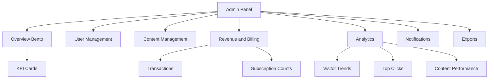

# Plan Implementasi Admin Panel Lengkap Showreels.id

## Konteks Audit

- Admin owner-only sudah tersedia di `src/app/admin/page.tsx` dan memakai data server-side dari Drizzle.
- Client UI admin saat ini berada di `src/components/admin/admin-panel-client.tsx` dengan fitur user/video management, database health, dan website control.
- Layout shell admin sudah memakai `src/components/dashboard/dashboard-shell.tsx` dengan mode admin.
- Database saat ini sudah punya `users`, `videos`, `visitorEvents`, `visitorDailyStats`, `billingSubscriptions`, dan `billingTransactions` di `src/db/schema.ts`.
- Analytics creator sudah memiliki pola query dan chart internal di `src/server/creator-analytics.ts` dan `src/components/dashboard/traffic-line-chart.tsx`.
- API admin yang ada baru mencakup health, settings, users by id, dan videos by id di `src/app/api/admin`.

## Keputusan Scope

User mengizinkan perubahan struktur database untuk analytics lebih lengkap, termasuk click tracking, likes, shares, notifications, content performance, dan geo breakdown.

## Information Architecture Admin

## Rencana Database

Tambahkan schema Drizzle dan migration untuk tabel baru:

1. `analytics_events`
   - Tujuan: event granular untuk page_view, video_view, link_click, share, like.
   - Kolom utama: id, visitorId, userId nullable, videoId nullable, eventType, path, targetType, targetId, targetUrl, country, city, region, device, referrer, metadata jsonb, createdAt.
   - Index: eventType, createdAt, userId, videoId, country/city.

2. `video_engagement_stats`
   - Tujuan: agregasi performa konten per video.
   - Kolom utama: videoId, views, uniqueVisitors, clicks, shares, likes, lastEventAt, updatedAt.
   - Primary key: videoId.

3. `admin_notifications`
   - Tujuan: feed notifikasi admin.
   - Kolom utama: id, type, severity, title, message, entityType, entityId, isRead, createdAt, readAt.
   - Index: isRead, createdAt, severity.

4. `admin_notification_preferences` opsional
   - Tujuan: konfigurasi notifikasi email/panel.
   - Kolom utama: id/global, emailEnabled, panelEnabled, events jsonb, updatedAt.

## Rencana Backend dan Query

1. Perluas `src/app/admin/page.tsx` agar mengambil data:
   - KPI utama: total users, videos, visitors, clicks, shares, likes, active subscriptions, monthly revenue.
   - Subscription 30 hari terakhir dari `billingSubscriptions`.
   - Income summary dari `billingTransactions` status paid.
   - Visitor chart 7/30 hari dari `visitorDailyStats` plus `analytics_events`.
   - Top clicks dari `analytics_events` eventType link_click.
   - Content performance dari join `videos`, `users`, dan `video_engagement_stats`.
   - Notifications terbaru dari `admin_notifications`.

2. Tambahkan API admin:
   - `src/app/api/admin/analytics/route.ts` untuk overview analytics.
   - `src/app/api/admin/payments/route.ts` untuk transaction list dan filter.
   - `src/app/api/admin/export/transactions/route.ts` untuk CSV transaksi.
   - `src/app/api/admin/notifications/route.ts` untuk list dan mark read.
   - `src/app/api/admin/notifications/[id]/route.ts` untuk update satu notifikasi.

3. Tambahkan public/event API:
   - `src/app/api/analytics/event/route.ts` untuk mencatat click/share/like/video_view dari frontend publik.
   - Integrasi bertahap ke public profile/video/share components.

## Rencana Frontend

1. Refactor `src/components/admin/admin-panel-client.tsx` menjadi panel Bento compact:
   - Header compact dengan status database dan quick actions.
   - KPI grid untuk revenue, subscriptions, visitors, clicks, videos, users.
   - Chart visitor/income menggunakan komponen SVG internal agar tidak menambah dependency.
   - Cards: top clicks, content performance, notifications, latest transactions.
   - Sections existing user/video management tetap ada, tetapi dibuat lebih compact dengan table/card responsive.

2. Tambahkan reusable components di `src/components/admin`:
   - `admin-bento-card.tsx`
   - `admin-metric-card.tsx`
   - `admin-mini-line-chart.tsx`
   - `admin-transaction-table.tsx`
   - `admin-notification-feed.tsx`
   - `admin-content-performance-table.tsx`

3. CSV export:
   - Button di revenue card memanggil endpoint CSV dan download file.

## Keputusan Chart

Gunakan SVG chart internal berbasis pola `src/components/dashboard/traffic-line-chart.tsx`. Tidak menambah Recharts pada tahap awal agar package tetap ringan dan risiko dependency rendah.

## Acceptance Checks

- Admin guard tetap memakai existing owner/admin session guard.
- Migration Drizzle dibuat dan schema types update.
- Halaman admin responsive mobile, tablet, desktop.
- Empty state tersedia untuk analytics, revenue, notifications, dan content performance.
- Export CSV transaksi menghasilkan header dan row valid.
- Event tracking tidak memblokir pengalaman user jika API gagal.
- Jalankan lint/build setelah implementasi.

## Todo Eksekusi untuk Code Mode

- [ ] Tambahkan tabel analytics dan notifications di `src/db/schema.ts`.
- [ ] Generate migration Drizzle untuk tabel baru.
- [ ] Buat helper server analytics/admin summary.
- [ ] Tambahkan API admin analytics, payments, export transactions, notifications.
- [ ] Tambahkan API event tracking publik.
- [ ] Refactor `src/app/admin/page.tsx` untuk mengambil semua data PRD.
- [ ] Refactor `src/components/admin/admin-panel-client.tsx` ke Bento UI compact.
- [ ] Tambahkan komponen admin reusable untuk metric, chart, table, notification feed.
- [ ] Integrasikan tracking event pada public profile/video/share/link actions.
- [ ] Validasi lint/build dan perbaiki type error.
