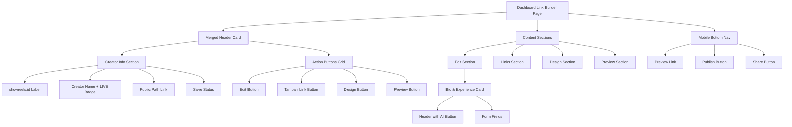
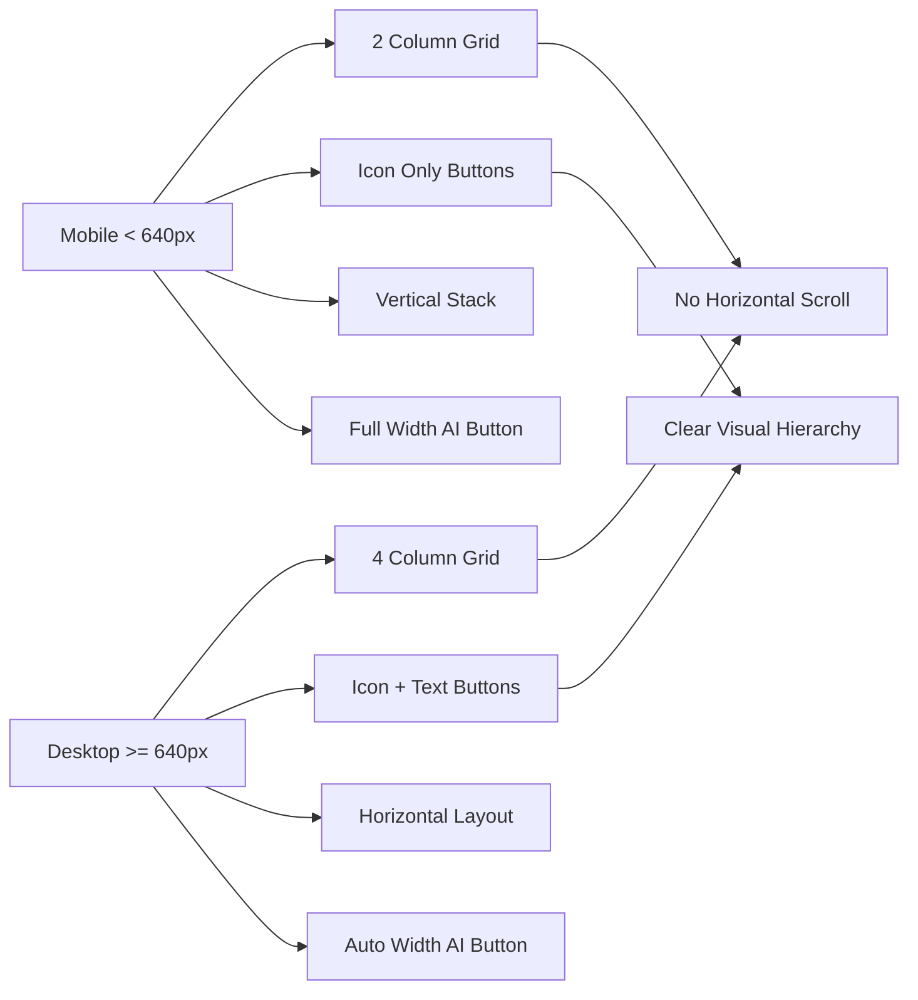

# Dashboard Link Builder UI Revision Plan

## Overview
Revisi tampilan halaman dashboard link builder untuk meningkatkan responsivitas mobile dan merapikan tata letak elemen UI.

## Current Issues (Berdasarkan Screenshot)

### 1. Top Section (Lines 989-1039)
**Masalah:**
- Tombol Preview, Share, dan Publish berada di bagian kanan atas
- Pada mobile, tombol-tombol ini dapat terpotong atau overlap
- Informasi creator name dan link terpisah dari action buttons

**Lokasi Kode:**
- File: [`src/components/builder/link-builder-editor.tsx`](src/components/builder/link-builder-editor.tsx:989)
- Lines: 989-1039

### 2. Action Buttons Section (Lines 1041-1092)
**Masalah:**
- Tombol Edit, Tambah Link, Design, Preview dalam container horizontal scroll
- Pada mobile, tombol bisa terpotong karena overflow-x-auto
- Tidak center-aligned pada desktop
- Tidak terintegrasi dengan section informasi creator

**Lokasi Kode:**
- File: [`src/components/builder/link-builder-editor.tsx`](src/components/builder/link-builder-editor.tsx:1041)
- Lines: 1041-1092

### 3. Generate with AI Button (Lines 1102-1111)
**Masalah:**
- Button "Generate with AI" tidak compact pada mobile
- Bisa overlap dengan judul "Bio & Experience"
- Perlu alignment yang lebih baik

**Lokasi Kode:**
- File: [`src/components/builder/link-builder-editor.tsx`](src/components/builder/link-builder-editor.tsx:1097)
- Lines: 1097-1111

## Proposed Changes

### Change 1: Simplify Top Section - Remove Action Buttons
**Tujuan:** Hapus tombol Preview, Share, dan Publish dari top section, sisakan hanya informasi nama dan link creator

**Before (Lines 989-1039):**
```tsx
<Card className="dashboard-clean-card border-[#d6e2f7] bg-white/90 p-4 sm:p-5">
  <div className="flex flex-wrap items-start justify-between gap-3">
    <div>
      <p className="text-xs font-semibold uppercase tracking-[0.2em] text-[#2f73ff]">
        showreels.id
      </p>
      <div className="mt-1 flex flex-wrap items-center gap-2">
        <h1 className="font-display text-2xl font-semibold text-[#201b18]">
          {profileFields.fullName || "Creator"}
        </h1>
        <span className="rounded-full bg-emerald-100 px-2 py-0.5 text-xs font-semibold text-emerald-700">
          LIVE
        </span>
        <span className="inline-flex max-w-full items-center rounded-full border border-[#d4e3fb] bg-[#edf4ff] px-3 py-1 text-xs font-semibold text-[#2f73ff]">
          {publicPath}
        </span>
      </div>
    </div>
    <div className="flex flex-wrap items-center gap-2">
      {/* HAPUS SEMUA BUTTON DI SINI */}
      <Link href={publicPath} target="_blank">
        <Button size="sm" variant="secondary">
          <Eye className="h-4 w-4" />
          Preview
        </Button>
      </Link>
      <Button size="sm" onClick={handlePublish}>
        <Rocket className="h-4 w-4" />
        Publish
      </Button>
      <Button size="sm" variant="secondary" onClick={() => setIsShareOpen(true)}>
        <Share2 className="h-4 w-4" />
        Share
      </Button>
      {saveStatus === "saving" || saveStatus === "error" ? (
        <p className="text-xs font-semibold text-[#5d5049]">
          {saveStatus === "saving" ? "Menyimpan..." : "Gagal menyimpan"}
        </p>
      ) : null}
    </div>
  </div>
</Card>
```

**After:**
```tsx
<Card className="dashboard-clean-card border-[#d6e2f7] bg-white/90 p-4 sm:p-5">
  <div className="flex flex-col items-center justify-center gap-2 text-center">
    <p className="text-xs font-semibold uppercase tracking-[0.2em] text-[#2f73ff]">
      showreels.id
    </p>
    <div className="flex flex-wrap items-center justify-center gap-2">
      <h1 className="font-display text-2xl font-semibold text-[#201b18]">
        {profileFields.fullName || "Creator"}
      </h1>
      <span className="rounded-full bg-emerald-100 px-2 py-0.5 text-xs font-semibold text-emerald-700">
        LIVE
      </span>
    </div>
    <span className="inline-flex items-center rounded-full border border-[#d4e3fb] bg-[#edf4ff] px-3 py-1 text-xs font-semibold text-[#2f73ff]">
      {publicPath}
    </span>
    {saveStatus === "saving" || saveStatus === "error" ? (
      <p className="text-xs font-semibold text-[#5d5049]">
        {saveStatus === "saving" ? "Menyimpan..." : "Gagal menyimpan"}
      </p>
    ) : null}
  </div>
</Card>
```

**Changes:**
- Remove all action buttons (Preview, Share, Publish)
- Center-align all content
- Stack elements vertically
- Keep only creator name, LIVE badge, link path, and save status

---

### Change 2: Merge Action Buttons with Creator Info Section
**Tujuan:** Gabungkan section action buttons dengan informasi creator, buat responsive dan center-aligned

**Before (Lines 1041-1092):**
```tsx
<div className="overflow-x-auto">
  <div className="inline-flex min-w-max rounded-full border border-[#d6e2f7] bg-white p-1">
    <button type="button" className={`h-9 rounded-full px-4 text-xs font-semibold transition ${...}`}>
      <PencilLine className="mr-1 inline-block h-3.5 w-3.5" />
      Edit
    </button>
    {/* ... other buttons */}
  </div>
</div>
```

**After:**
```tsx
<Card className="dashboard-clean-card border-[#d6e2f7] bg-white/90 p-4 sm:p-5">
  <div className="flex flex-col items-center justify-center gap-3">
    {/* Creator Info - sama seperti Change 1 */}
    <div className="flex flex-col items-center justify-center gap-2 text-center">
      <p className="text-xs font-semibold uppercase tracking-[0.2em] text-[#2f73ff]">
        showreels.id
      </p>
      <div className="flex flex-wrap items-center justify-center gap-2">
        <h1 className="font-display text-2xl font-semibold text-[#201b18]">
          {profileFields.fullName || "Creator"}
        </h1>
        <span className="rounded-full bg-emerald-100 px-2 py-0.5 text-xs font-semibold text-emerald-700">
          LIVE
        </span>
      </div>
      <span className="inline-flex items-center rounded-full border border-[#d4e3fb] bg-[#edf4ff] px-3 py-1 text-xs font-semibold text-[#2f73ff]">
        {publicPath}
      </span>
      {saveStatus === "saving" || saveStatus === "error" ? (
        <p className="text-xs font-semibold text-[#5d5049]">
          {saveStatus === "saving" ? "Menyimpan..." : "Gagal menyimpan"}
        </p>
      ) : null}
    </div>

    {/* Action Buttons - Responsive Grid */}
    <div className="grid w-full max-w-2xl grid-cols-2 gap-2 sm:grid-cols-4">
      <button
        type="button"
        className={`flex h-10 items-center justify-center gap-1.5 rounded-xl border text-xs font-semibold transition ${
          activeSection === "edit"
            ? "border-[#2f73ff] bg-[#2f73ff] text-white"
            : "border-[#d6e2f7] bg-white text-[#5e514b] hover:bg-[#edf4ff]"
        }`}
        onClick={() => setActiveSection("edit")}
      >
        <PencilLine className="h-3.5 w-3.5" />
        <span className="hidden sm:inline">Edit</span>
      </button>
      <button
        type="button"
        className={`flex h-10 items-center justify-center gap-1.5 rounded-xl border text-xs font-semibold transition ${
          activeSection === "links"
            ? "border-[#2f73ff] bg-[#2f73ff] text-white"
            : "border-[#d6e2f7] bg-white text-[#5e514b] hover:bg-[#edf4ff]"
        }`}
        onClick={() => setActiveSection("links")}
      >
        <Plus className="h-3.5 w-3.5" />
        <span className="hidden sm:inline">Tambah Link</span>
      </button>
      <button
        type="button"
        className={`flex h-10 items-center justify-center gap-1.5 rounded-xl border text-xs font-semibold transition ${
          activeSection === "design"
            ? "border-[#2f73ff] bg-[#2f73ff] text-white"
            : "border-[#d6e2f7] bg-white text-[#5e514b] hover:bg-[#edf4ff]"
        }`}
        onClick={() => setActiveSection("design")}
      >
        <Sparkles className="h-3.5 w-3.5" />
        <span className="hidden sm:inline">Design</span>
      </button>
      <button
        type="button"
        className={`flex h-10 items-center justify-center gap-1.5 rounded-xl border text-xs font-semibold transition ${
          activeSection === "preview"
            ? "border-[#2f73ff] bg-[#2f73ff] text-white"
            : "border-[#d6e2f7] bg-white text-[#5e514b] hover:bg-[#edf4ff]"
        }`}
        onClick={() => setActiveSection("preview")}
      >
        <Eye className="h-3.5 w-3.5" />
        <span className="hidden sm:inline">Preview</span>
      </button>
    </div>
  </div>
</Card>
```

**Changes:**
- Merge kedua section menjadi satu Card
- Center-align semua konten
- Ubah button layout dari horizontal scroll ke responsive grid (2 kolom mobile, 4 kolom desktop)
- Ubah dari rounded-full pill style ke rounded-xl card style
- Hide text label pada mobile, show icon only
- Show full text + icon pada desktop
- Remove overflow-x-auto yang menyebabkan scroll horizontal

---

### Change 3: Optimize Generate with AI Button
**Tujuan:** Buat button "Generate with AI" lebih compact dan aligned pada mobile

**Before (Lines 1097-1111):**
```tsx
<div className="mb-4 flex flex-wrap items-center justify-between gap-2">
  <div className="flex items-center gap-2">
    <PencilLine className="h-4 w-4 text-[#2f73ff]" />
    <h2 className="text-lg font-semibold text-[#201b18]">Bio & Experience</h2>
  </div>
  <Button
    type="button"
    size="sm"
    variant="secondary"
    onClick={handleGenerateBio}
    disabled={aiLoading}
  >
    <Sparkles className="h-4 w-4" />
    {aiLoading ? "Membuat bio..." : "Generate with AI"}
  </Button>
</div>
```

**After:**
```tsx
<div className="mb-4 flex flex-col gap-3 sm:flex-row sm:items-center sm:justify-between">
  <div className="flex items-center gap-2">
    <PencilLine className="h-4 w-4 text-[#2f73ff]" />
    <h2 className="text-lg font-semibold text-[#201b18]">Bio & Experience</h2>
  </div>
  <Button
    type="button"
    size="sm"
    variant="secondary"
    onClick={handleGenerateBio}
    disabled={aiLoading}
    className="w-full sm:w-auto"
  >
    <Sparkles className="h-4 w-4" />
    <span className="truncate">{aiLoading ? "Membuat bio..." : "Generate with AI"}</span>
  </Button>
</div>
```

**Changes:**
- Ubah dari flex-wrap ke flex-col pada mobile
- Stack vertically pada mobile untuk menghindari overlap
- Full width button pada mobile
- Auto width pada desktop
- Tambah truncate pada text untuk prevent overflow

---

### Change 4: Update Mobile Bottom Navigation
**Tujuan:** Update bottom navigation untuk include action yang dihapus dari top section

**Before (Lines 1890-1918):**
```tsx
<div className="fixed inset-x-0 bottom-3 z-20 px-3 md:hidden">
  <div className="mx-auto grid max-w-sm grid-cols-3 gap-2 rounded-[1.25rem] border border-[#cfe0ff] bg-white/95 p-2 shadow-[0_18px_42px_rgba(24,58,115,0.22)] backdrop-blur">
    <button type="button" className="inline-flex h-11 items-center justify-center rounded-xl bg-[#edf4ff] text-[#2f73ff]" onClick={() => setActiveSection("preview")}>
      <Eye className="h-5 w-5" />
    </button>
    <button type="button" className="inline-flex h-11 items-center justify-center rounded-xl bg-[#2f73ff] text-white" onClick={handlePublish}>
      <Rocket className="h-5 w-5" />
    </button>
    <button type="button" className="inline-flex h-11 items-center justify-center rounded-xl bg-[#edf4ff] text-[#2f73ff]" onClick={() => setIsShareOpen(true)}>
      <Share2 className="h-5 w-5" />
    </button>
  </div>
</div>
```

**After:**
```tsx
<div className="fixed inset-x-0 bottom-3 z-20 px-3 md:hidden">
  <div className="mx-auto grid max-w-sm grid-cols-3 gap-2 rounded-[1.25rem] border border-[#cfe0ff] bg-white/95 p-2 shadow-[0_18px_42px_rgba(24,58,115,0.22)] backdrop-blur">
    <Link href={publicPath} target="_blank" className="inline-flex h-11 items-center justify-center rounded-xl bg-[#edf4ff] text-[#2f73ff]">
      <Eye className="h-5 w-5" />
    </Link>
    <button
      type="button"
      className="inline-flex h-11 items-center justify-center rounded-xl bg-[#2f73ff] text-white disabled:opacity-50"
      onClick={handlePublish}
      disabled={isSavingNow}
    >
      <Rocket className="h-5 w-5" />
    </button>
    <button
      type="button"
      className="inline-flex h-11 items-center justify-center rounded-xl bg-[#edf4ff] text-[#2f73ff]"
      onClick={() => setIsShareOpen(true)}
    >
      <Share2 className="h-5 w-5" />
    </button>
  </div>
</div>
```

**Changes:**
- Keep mobile bottom navigation dengan Preview, Publish, Share
- Tambah disabled state pada Publish button
- Ubah Preview button dari onClick ke Link component

---

## Implementation Steps

### Step 1: Backup Current Code
```bash
# Create backup branch
git checkout -b backup/link-builder-ui-before-revision
git add .
git commit -m "Backup: Link builder UI before revision"
git checkout main
```

### Step 2: Implement Changes in Order

1. **Update Top Section (Change 1)**
   - File: [`src/components/builder/link-builder-editor.tsx`](src/components/builder/link-builder-editor.tsx:989)
   - Lines: 989-1039
   - Remove action buttons
   - Center-align content

2. **Merge Sections (Change 2)**
   - File: [`src/components/builder/link-builder-editor.tsx`](src/components/builder/link-builder-editor.tsx:989)
   - Lines: 989-1092
   - Combine top section and action buttons
   - Implement responsive grid layout

3. **Optimize AI Button (Change 3)**
   - File: [`src/components/builder/link-builder-editor.tsx`](src/components/builder/link-builder-editor.tsx:1097)
   - Lines: 1097-1111
   - Make button responsive
   - Stack vertically on mobile

4. **Update Mobile Navigation (Change 4)**
   - File: [`src/components/builder/link-builder-editor.tsx`](src/components/builder/link-builder-editor.tsx:1890)
   - Lines: 1890-1918
   - Keep bottom nav functional
   - Add disabled states

### Step 3: Testing Checklist

#### Mobile Testing (< 640px)
- [ ] Creator name dan link info center-aligned
- [ ] Action buttons dalam 2 kolom grid, tidak terpotong
- [ ] Icon-only buttons terlihat jelas
- [ ] Generate with AI button full width, tidak overlap
- [ ] Bottom navigation tetap berfungsi
- [ ] Tidak ada horizontal scroll
- [ ] Tidak ada text overlap

#### Tablet Testing (640px - 1024px)
- [ ] Layout transisi smooth dari mobile ke desktop
- [ ] Action buttons menampilkan text + icon
- [ ] Spacing proporsional

#### Desktop Testing (> 1024px)
- [ ] Semua konten center-aligned
- [ ] Action buttons dalam 4 kolom grid
- [ ] Max-width container mencegah stretch berlebihan
- [ ] Text dan button alignment rapi

### Step 4: Visual Regression Testing
- [ ] Screenshot mobile view (375px)
- [ ] Screenshot tablet view (768px)
- [ ] Screenshot desktop view (1440px)
- [ ] Compare dengan screenshot sebelumnya

---

## Responsive Breakpoints

```css
/* Mobile First */
Default: Stack vertically, 2-column grid, icon-only buttons

/* Small (sm: 640px) */
@media (min-width: 640px) {
  - Show button text labels
  - Wider spacing
}

/* Medium (md: 768px) */
@media (min-width: 768px) {
  - Hide mobile bottom navigation
  - Full desktop layout
}

/* Large (lg: 1024px) */
@media (min-width: 1024px) {
  - 4-column button grid
  - Max-width constraints
}
```

---

## CSS Classes Reference

### Layout Classes
- `flex flex-col` - Vertical stack
- `flex flex-row` - Horizontal layout
- `items-center` - Center align items
- `justify-center` - Center justify content
- `gap-2` / `gap-3` - Spacing between items

### Responsive Grid
- `grid grid-cols-2` - 2 columns mobile
- `sm:grid-cols-4` - 4 columns desktop
- `w-full` - Full width
- `max-w-2xl` - Max width constraint

### Button Styles
- `h-10` - Fixed height
- `rounded-xl` - Rounded corners
- `border` - Border
- `text-xs font-semibold` - Typography

### Responsive Visibility
- `hidden sm:inline` - Hide on mobile, show on desktop
- `w-full sm:w-auto` - Full width mobile, auto desktop

---

## Files to Modify

1. **Primary File:**
   - [`src/components/builder/link-builder-editor.tsx`](src/components/builder/link-builder-editor.tsx:1)
   - Total changes: ~150 lines

2. **No Additional Files Needed:**
   - All changes contained in single component
   - No new components required
   - No CSS file changes needed (using Tailwind)

---

## Rollback Plan

If issues occur:
```bash
# Revert to backup
git checkout backup/link-builder-ui-before-revision
git checkout -b main-rollback
git push origin main-rollback

# Or revert specific commit
git revert <commit-hash>
```

---

## Success Criteria

### Functional Requirements
- ✅ Preview, Share, Publish buttons removed from top section
- ✅ Creator info center-aligned
- ✅ Action buttons merged with creator info section
- ✅ Responsive 2/4 column grid layout
- ✅ Generate with AI button compact on mobile
- ✅ No text overlap or truncation issues
- ✅ Mobile bottom navigation functional

### Visual Requirements
- ✅ Clean, centered layout
- ✅ Consistent spacing
- ✅ No horizontal scroll on mobile
- ✅ Smooth responsive transitions
- ✅ Proper button sizing and alignment

### Performance Requirements
- ✅ No layout shift (CLS)
- ✅ Fast render time
- ✅ Smooth animations

---

## Mermaid Diagram: Layout Structure



---

## Mermaid Diagram: Responsive Behavior



---

## Notes

1. **Tailwind CSS:** All styling menggunakan Tailwind utility classes, tidak perlu custom CSS
2. **Accessibility:** Maintain proper ARIA labels dan keyboard navigation
3. **Performance:** Perubahan hanya UI, tidak ada logic changes
4. **Backward Compatibility:** Mobile bottom nav tetap berfungsi untuk quick actions
5. **Future Enhancement:** Bisa tambahkan animation transitions untuk smooth UX

---

## Questions for User

Sebelum implementasi, konfirmasi:

1. ✅ Apakah Preview, Share, Publish buttons benar-benar dihapus dari top section?
2. ✅ Apakah mobile bottom navigation tetap dipertahankan dengan 3 buttons tersebut?
3. ✅ Apakah layout center-aligned untuk desktop sudah sesuai?
4. ✅ Apakah icon-only buttons pada mobile acceptable?

---

## Timeline Estimate

- Analysis & Planning: ✅ Complete
- Implementation: 2-3 hours
- Testing: 1-2 hours
- Bug Fixes: 1 hour
- Total: 4-6 hours

---

## Risk Assessment

| Risk | Impact | Mitigation |
|------|--------|------------|
| Layout breaks on specific devices | Medium | Extensive responsive testing |
| Button text truncation | Low | Use truncate class and proper sizing |
| Accessibility issues | Medium | Maintain ARIA labels and semantic HTML |
| User confusion from removed buttons | Low | Mobile bottom nav provides same actions |

---

## Conclusion

Revisi ini akan menghasilkan:
- ✅ Cleaner, more focused top section
- ✅ Better mobile responsiveness
- ✅ No horizontal scroll issues
- ✅ Proper alignment and spacing
- ✅ Improved user experience on all devices

Ready untuk implementasi setelah approval dari user.
