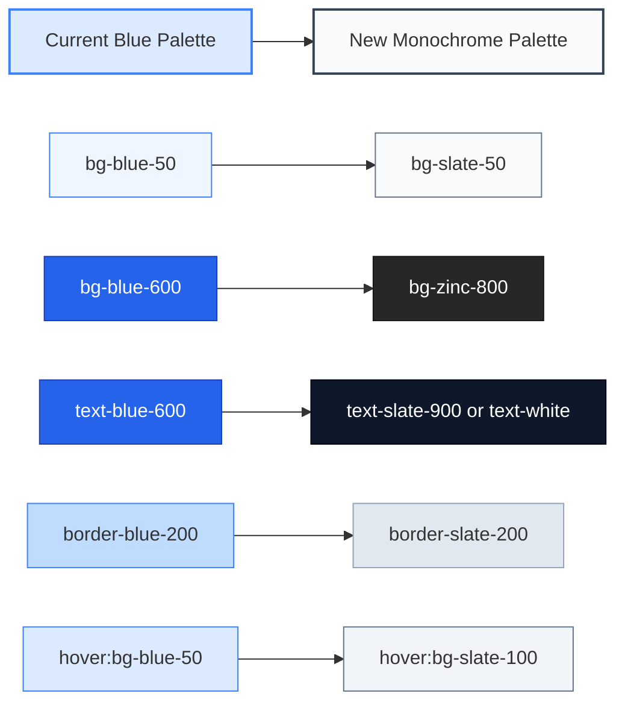
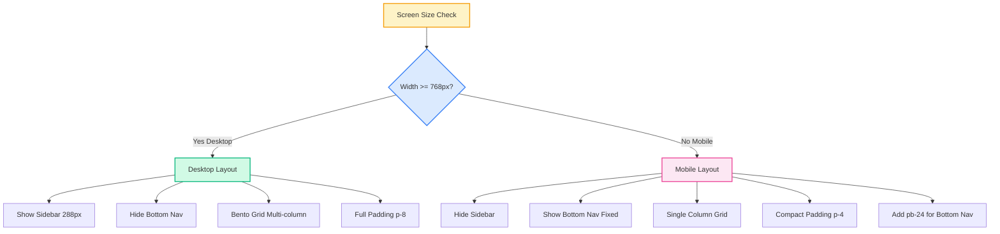
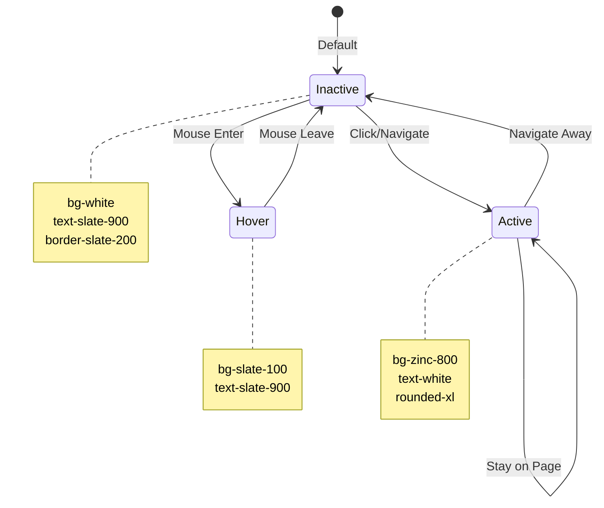
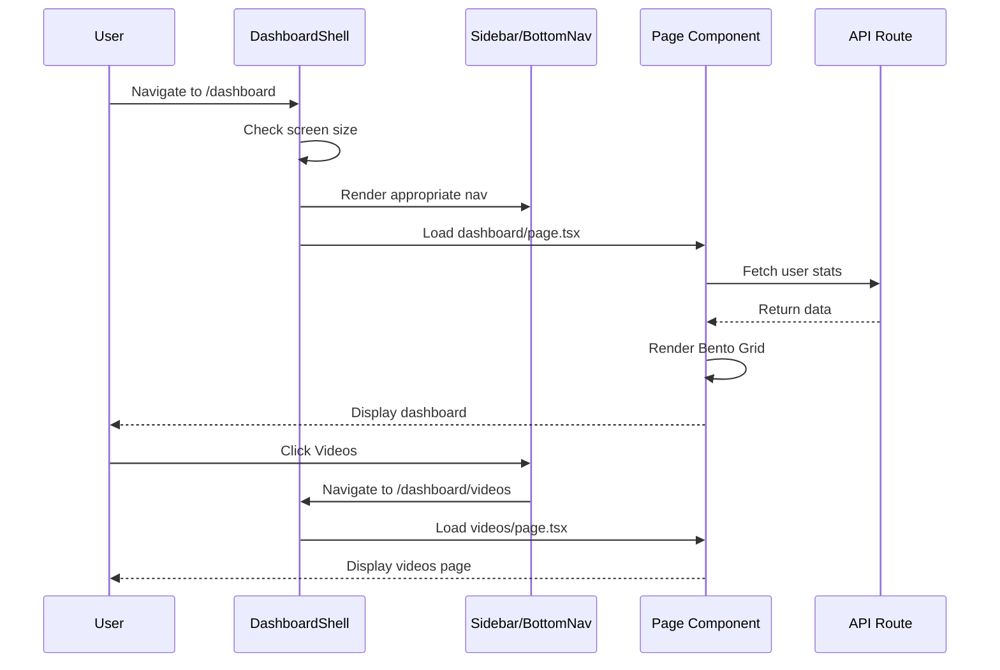

# Dashboard Redesign — Architecture & Component Flow

## System Architecture Diagram

```mermaid
graph TD
    A[DashboardShell] --> B[Desktop Sidebar]
    A --> C[Top Header]
    A --> D[Main Content Area]
    A --> E[Mobile Bottom Nav]
    
    B --> B1[Logo Chip]
    B --> B2[Plan Badge]
    B --> B3[Main Menu]
    B --> B4[Account Menu]
    B --> B5[Help Card]
    
    C --> C1[Breadcrumb]
    C --> C2[Username Badge]
    C --> C3[Avatar]
    
    D --> D1[Dashboard Overview]
    D --> D2[Videos Page]
    D --> D3[Analytics Page]
    D --> D4[Billing Page]
    D --> D5[Profile Page]
    D --> D6[Settings Page]
    
    D1 --> D1A[Hero Card]
    D1 --> D1B[Stats Grid]
    D1 --> D1C[Video List]
    D1 --> D1D[Quick Actions]
    D1 --> D1E[Public Link Card]
    
    E --> E1[Overview Icon]
    E --> E2[Build Link Icon]
    E --> E3[Videos Icon]
    E --> E4[Analytics Icon]
    
    style A fill:#f8fafc,stroke:#334155,stroke-width:3px
    style B fill:#ffffff,stroke:#e2e8f0,stroke-width:2px
    style C fill:#ffffff,stroke:#e2e8f0,stroke-width:2px
    style D fill:#f8fafc,stroke:#e2e8f0,stroke-width:2px
    style E fill:#ffffff,stroke:#e2e8f0,stroke-width:2px
    style D1 fill:#fafafa,stroke:#cbd5e1,stroke-width:1px
```



## Color Migration Map



## Responsive Layout Flow



## Component State Machine



## Data Flow



## File Dependency Tree

```
src/
├── app/
│   └── dashboard/
│       ├── page.tsx (Overview - MAJOR UPDATE)
│       ├── layout.tsx (Uses DashboardShell)
│       ├── videos/
│       │   └── page.tsx (UPDATE)
│       ├── analytics/
│       │   └── page.tsx (UPDATE)
│       ├── billing/
│       │   └── page.tsx (UPDATE)
│       ├── profile/
│       │   └── page.tsx (UPDATE)
│       └── settings/
│           └── page.tsx (UPDATE)
│
├── components/
│   ├── dashboard/
│   │   ├── dashboard-shell.tsx (MAJOR REDESIGN)
│   │   ├── bottom-navigation.tsx (NEW FILE)
│   │   ├── dashboard-video-list.tsx (UPDATE)
│   │   ├── billing-panel.tsx (UPDATE)
│   │   └── profile-form.tsx (UPDATE)
│   │
│   └── ui/
│       ├── button.tsx (UPDATE VARIANTS)
│       ├── badge.tsx (UPDATE VARIANTS)
│       └── card.tsx (UPDATE DEFAULTS)
```

---

## Implementation Phases Detail

### Phase 1: Foundation (2-3 hours)
- Update color constants
- Modify DashboardShell
- Create BottomNavigation component
- Test navigation flow

### Phase 2: Overview Page (2-3 hours)
- Redesign hero card
- Update stats grid
- Modify video list container
- Update quick actions
- Test Bento Grid responsiveness

### Phase 3: Child Pages (3-4 hours)
- Update Videos page
- Update Analytics page
- Update Billing page
- Update Profile page
- Update Settings pages
- Test all page transitions

### Phase 4: UI Components (1-2 hours)
- Update Button variants
- Update Badge variants
- Update Card defaults
- Global color search and replace

### Phase 5: QA & Polish (1-2 hours)
- Visual regression testing
- Responsive testing
- Accessibility audit
- Performance check

**Total Estimated Time: 9-14 hours**

---

## Risk Assessment

### High Risk
- **Breaking existing functionality**: Mitigate by testing each component after changes
- **Color contrast issues**: Verify WCAG AA compliance for slate/zinc palette
- **Mobile navigation conflicts**: Test bottom nav doesn't interfere with content

### Medium Risk
- **Inconsistent styling across pages**: Use shared components and constants
- **Performance impact**: Monitor bundle size with new components
- **Browser compatibility**: Test on major browsers

### Low Risk
- **User confusion with new design**: Monochrome is familiar SaaS pattern
- **Maintenance burden**: Simpler color system is easier to maintain

---

## Success Metrics

### Visual Metrics
- Zero blue accent colors in dashboard
- All cards use slate-200 borders
- Active states consistently use zinc-800
- Emerald badges only for positive states

### Functional Metrics
- Navigation works on both desktop and mobile
- All existing features remain functional
- Page load times unchanged or improved
- No console errors or warnings

### User Experience Metrics
- Reduced visual noise
- Clearer information hierarchy
- Improved mobile usability with bottom nav
- Faster task completion with Bento Grid

---

## Rollback Plan

If issues arise during implementation:

1. **Git branch strategy**: Work on feature branch `feature/dashboard-monochrome-redesign`
2. **Incremental commits**: Commit after each phase completion
3. **Feature flag**: Consider adding feature flag for gradual rollout
4. **Backup**: Keep current blue theme as fallback variant

---

## Post-Implementation Tasks

- [ ] Update design documentation
- [ ] Create component style guide
- [ ] Document new color system
- [ ] Update Storybook (if applicable)
- [ ] Train team on new patterns
- [ ] Monitor user feedback
- [ ] Plan future iterations
