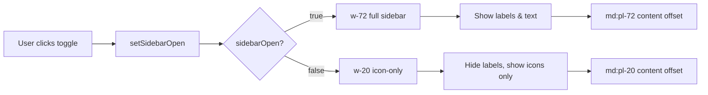

# Dashboard Revisi UI/UX - Implementation Plan

## Executive Summary

Dokumen ini berisi rencana implementasi detail untuk 7 perbaikan UI/UX dashboard Showreels.id berdasarkan PRD revisi. Fokus utama: **compactness, readability, dan collapsible sidebar**.

## Status Overview

| # | Feature | Priority | Status | Files Affected |
|---|---------|----------|--------|----------------|
| 1 | Active Menu Readability | ✅ DONE | Already correct | - |
| 2 | Stats Grid Mobile 4 Columns | 🔴 HIGH | Pending | [`dashboard/page.tsx`](../src/app/dashboard/page.tsx) |
| 3 | Public Link Card Compact | 🔴 HIGH | Pending | [`dashboard/page.tsx`](../src/app/dashboard/page.tsx), [`share-profile-actions.tsx`](../src/components/dashboard/share-profile-actions.tsx) |
| 4 | Collapsible Sidebar | 🟡 MEDIUM | Pending | [`dashboard-shell.tsx`](../src/components/dashboard/dashboard-shell.tsx) |
| 5 | Logo Workspace | 🟢 LOW | Pending | [`dashboard-shell.tsx`](../src/components/dashboard/dashboard-shell.tsx) |
| 6 | Hero Buttons Compact | 🟡 MEDIUM | Pending | [`dashboard/page.tsx`](../src/app/dashboard/page.tsx) |
| 7 | Public Link Spacing | 🔴 HIGH | Pending | [`dashboard/page.tsx`](../src/app/dashboard/page.tsx) |

---

## Phase 1: Stats Grid Mobile Optimization 🔴 HIGH

### Current State
```typescript
// Line 172 in dashboard/page.tsx
<div className="grid grid-cols-1 gap-4 sm:grid-cols-2 lg:grid-cols-4">
```

**Problem**: Mobile menggunakan 1 kolom, tablet 2 kolom. PRD meminta 4 kolom compact di mobile.

### Target State
```typescript
<div className="grid grid-cols-4 gap-2 md:gap-4">
```

### Implementation Details

#### 1.1 Update StatCard Component (Lines 146-167)

**Before**:
```typescript
function StatCard({ item }: { item: MetricCard }) {
  const Icon = item.icon;
  return (
    <div className="rounded-2xl border border-slate-200 bg-white p-4 md:p-5">
      <div className="flex items-center justify-between gap-3">
        <p className="text-xs font-medium uppercase tracking-[0.18em] text-slate-400">
          {item.label}
        </p>
        <span className="inline-flex h-9 w-9 items-center justify-center rounded-xl bg-slate-50 text-slate-700">
          <Icon className="h-4 w-4" />
        </span>
      </div>
      <p className="mt-5 text-3xl font-semibold tracking-tight text-slate-900">
        {formatNumber(item.value)}
      </p>
      <span className="mt-2 inline-flex rounded-full bg-emerald-50 px-2.5 py-0.5 text-xs font-medium text-emerald-600">
        {item.helper}
      </span>
    </div>
  );
}
```

**After**:
```typescript
function StatCard({ item }: { item: MetricCard }) {
  const Icon = item.icon;
  return (
    <div className="rounded-xl border border-slate-200 bg-white p-2.5 md:rounded-2xl md:p-5">
      <div className="flex items-start justify-between gap-1 md:gap-3">
        <p className="truncate text-[10px] font-medium uppercase leading-tight tracking-[0.12em] text-slate-400 md:text-xs md:tracking-[0.18em]">
          {item.label}
        </p>
        <span className="hidden h-8 w-8 shrink-0 items-center justify-center rounded-xl bg-slate-50 text-slate-600 md:flex md:h-9 md:w-9">
          <Icon className="h-3.5 w-3.5 md:h-4 md:w-4" />
        </span>
      </div>
      <p className="mt-2 text-xl font-semibold tracking-tight text-slate-950 md:mt-5 md:text-3xl">
        {formatNumber(item.value)}
      </p>
      <span className="mt-1 hidden w-fit rounded-full bg-emerald-50 px-2.5 py-0.5 text-xs font-medium text-emerald-600 md:inline-flex md:mt-2">
        {item.helper}
      </span>
    </div>
  );
}
```

#### 1.2 Update StatsGrid Component (Lines 169-179)

**Before**:
```typescript
function StatsGrid({ metricCards }: { metricCards: MetricCard[] }) {
  return (
    <section className="lg:col-span-3">
      <div className="grid grid-cols-1 gap-4 sm:grid-cols-2 lg:grid-cols-4">
        {metricCards.map((item) => (
          <StatCard key={item.label} item={item} />
        ))}
      </div>
    </section>
  );
}
```

**After**:
```typescript
function StatsGrid({ metricCards }: { metricCards: MetricCard[] }) {
  return (
    <section className="lg:col-span-3">
      <div className="grid grid-cols-4 gap-2 md:gap-4">
        {metricCards.map((item) => (
          <StatCard key={item.label} item={item} />
        ))}
      </div>
    </section>
  );
}
```

### Visual Comparison

**Mobile (375px)**:
```
Before: [Card 1      ]  [Card 2      ]
        [Card 3      ]  [Card 4      ]

After:  [C1] [C2] [C3] [C4]
        (compact, 4 columns)
```

### Testing Checklist
- [ ] Mobile 375px: 4 kolom visible, text readable
- [ ] Tablet 768px: 4 kolom dengan spacing lebih besar
- [ ] Desktop 1024px+: 4 kolom full size
- [ ] Badge hidden di mobile, visible di desktop
- [ ] Icon hidden di mobile, visible di desktop

---

## Phase 2: Public Link Card Compact 🔴 HIGH

### Current State
```typescript
// Line 124-143 in dashboard/page.tsx
<BentoCard className="lg:col-span-1">
  <div className="flex h-full flex-col justify-between gap-6">
    {/* Content */}
  </div>
</BentoCard>
```

**Problem**: `gap-6` terlalu besar, tombol tidak compact.

### Target State
```typescript
<BentoCard className="lg:col-span-1">
  <div className="flex h-full flex-col justify-between space-y-3">
    {/* Content */}
  </div>
</BentoCard>
```

### Implementation Details

#### 2.1 Update PublicLinkCard (Lines 116-144)

**Before**:
```typescript
function PublicLinkCard({
  profilePath,
  username,
}: {
  profilePath: string;
  username: string;
}) {
  return (
    <BentoCard className="lg:col-span-1">
      <div className="flex h-full flex-col justify-between gap-6">
        <div>
          <div className="flex items-center justify-between gap-3">
            <p className="text-xs font-medium uppercase tracking-[0.18em] text-slate-400">
              Public Link
            </p>
            <span className="inline-flex h-10 w-10 items-center justify-center rounded-2xl bg-zinc-800 text-white shadow-sm">
              <Share2 className="h-4 w-4" />
            </span>
          </div>
          <h3 className="mt-5 truncate text-xl font-semibold text-slate-900">{profilePath}</h3>
          <p className="mt-2 text-sm leading-6 text-slate-500">
            Bagikan profil creator, link penting, bio, dan portfolio video ke client.
          </p>
        </div>
        <ShareProfileActions username={username} iconOnlyOnMobile />
      </div>
    </BentoCard>
  );
}
```

**After**:
```typescript
function PublicLinkCard({
  profilePath,
  username,
}: {
  profilePath: string;
  username: string;
}) {
  return (
    <BentoCard className="lg:col-span-1">
      <div className="flex h-full flex-col justify-between space-y-3">
        <div className="space-y-3">
          <div className="flex items-center justify-between gap-3">
            <p className="text-xs font-medium uppercase tracking-[0.18em] text-slate-400">
              Public Link
            </p>
            <span className="inline-flex h-10 w-10 items-center justify-center rounded-2xl bg-zinc-800 text-white shadow-sm">
              <Share2 className="h-4 w-4" />
            </span>
          </div>
          <h3 className="truncate text-xl font-semibold text-slate-900">{profilePath}</h3>
          <p className="line-clamp-2 text-sm leading-relaxed text-slate-500">
            Bagikan profil creator, link penting, bio, dan portfolio video ke client.
          </p>
        </div>
        <ShareProfileActions username={username} iconOnlyOnMobile compact />
      </div>
    </BentoCard>
  );
}
```

#### 2.2 Update ShareProfileActions Component

**File**: `src/components/dashboard/share-profile-actions.tsx`

**Add compact prop to type (Line 21-24)**:
```typescript
type ShareProfileActionsProps = {
  username: string;
  iconOnlyOnMobile?: boolean;
  compact?: boolean; // NEW
};
```

**Update function signature (Line 64)**:
```typescript
export function ShareProfileActions({ 
  username, 
  iconOnlyOnMobile = false,
  compact = false // NEW
}: ShareProfileActionsProps) {
```

**Update button rendering (Lines 148-163)**:
```typescript
return (
  <>
    <div className="flex flex-wrap gap-2">
      <Button 
        type="button" 
        size="sm" 
        onClick={() => setIsOpen(true)}
        className={compact ? "h-9 px-3 text-sm" : ""}
      >
        <Share2 className="h-4 w-4" />
        <span className={iconOnlyOnMobile ? "sr-only sm:not-sr-only" : ""}>Share Link</span>
      </Button>
      <Button 
        type="button" 
        variant="secondary" 
        size="sm" 
        onClick={handleCopy}
        className={compact ? "h-9 px-3 text-sm" : ""}
      >
        <Copy className="h-4 w-4" />
        <span className={iconOnlyOnMobile ? "sr-only sm:not-sr-only" : ""}>Copy Link</span>
      </Button>
      <Link href={publicPath} target="_blank">
        <Button 
          type="button" 
          variant="secondary" 
          size="sm"
          className={compact ? "h-9 px-3 text-sm" : ""}
        >
          <ExternalLink className="h-4 w-4" />
          <span className={iconOnlyOnMobile ? "sr-only sm:not-sr-only" : ""}>Buka Public Link</span>
        </Button>
      </Link>
    </div>
    {/* Modal remains unchanged */}
  </>
);
```

### Visual Impact
- Spacing reduced from `gap-6` (24px) to `space-y-3` (12px)
- Buttons height reduced from default to `h-9` (36px)
- More compact, professional look

---

## Phase 3: Collapsible Sidebar 🟡 MEDIUM

### Architecture Overview



### Implementation Details

#### 3.1 Add State Management (Line 68)

**Add after existing state**:
```typescript
const [mobileMenuOpen, setMobileMenuOpen] = useState(false);
const [sidebarOpen, setSidebarOpen] = useState(true); // NEW
```

#### 3.2 Update Sidebar Container (Line 229)

**Before**:
```typescript
<aside className="fixed inset-y-0 left-0 z-40 hidden w-72 border-r border-slate-200 bg-white md:block">
```

**After**:
```typescript
<aside className={cn(
  "fixed inset-y-0 left-0 z-40 hidden border-r border-slate-200 bg-white transition-all duration-300 ease-in-out md:block",
  sidebarOpen ? "w-72" : "w-20"
)}>
```

#### 3.3 Update Logo Section (Lines 175-184)

**Before**:
```typescript
<div className="flex items-center gap-3 rounded-xl border border-slate-200 px-3 py-2">
  <div className="flex h-8 w-8 shrink-0 items-center justify-center rounded-lg bg-zinc-900 text-white">
    <Link2 className="h-4 w-4" />
  </div>
  <div className="min-w-0 flex-1">
    <p className="truncate text-sm font-semibold text-slate-900">showreels.id</p>
    <p className="text-xs text-slate-500">Creator workspace</p>
  </div>
  <ChevronDown className="h-4 w-4 text-slate-400" />
</div>
```

**After**:
```typescript
<div className={cn(
  "flex items-center gap-3 rounded-xl border border-slate-200 px-3 py-2",
  !sidebarOpen && "justify-center"
)}>
  <div className="flex h-8 w-8 shrink-0 items-center justify-center rounded-lg bg-zinc-900 text-white">
    <Link2 className="h-4 w-4" />
  </div>
  {sidebarOpen && (
    <>
      <div className="min-w-0 flex-1">
        <p className="truncate text-sm font-semibold text-slate-900">showreels.id</p>
        <p className="text-xs text-slate-500">Creator workspace</p>
      </div>
      <ChevronDown className="h-4 w-4 text-slate-400" />
    </>
  )}
</div>
```

#### 3.4 Add Toggle Button (After logo section, ~Line 185)

**Add new import**:
```typescript
import { PanelLeftClose, PanelLeftOpen } from "lucide-react";
```

**Add toggle button**:
```typescript
{/* Toggle button */}
<button
  type="button"
  onClick={() => setSidebarOpen(!sidebarOpen)}
  className={cn(
    "mt-4 flex items-center justify-center rounded-xl border border-slate-200 bg-white text-slate-600 transition-colors hover:bg-slate-100",
    sidebarOpen ? "h-9 gap-2 px-3" : "h-10 w-full"
  )}
  aria-label={sidebarOpen ? "Collapse sidebar" : "Expand sidebar"}
>
  {sidebarOpen ? (
    <>
      <PanelLeftClose size={16} />
      <span className="text-xs font-medium">Collapse</span>
    </>
  ) : (
    <PanelLeftOpen size={16} />
  )}
</button>
```

#### 3.5 Update Plan Badge (Lines 186-191)

**After**:
```typescript
{sidebarOpen && (
  <div className="mt-6 rounded-2xl border border-slate-200 bg-slate-50 p-4">
    <p className="text-xs font-medium uppercase tracking-[0.18em] text-slate-400">
      Creator Mode
    </p>
    <p className="mt-1 text-sm font-medium text-slate-900">{planLabel} plan aktif</p>
  </div>
)}
```

#### 3.6 Update Navigation Items (Line 153)

**Update renderNavItem function**:
```typescript
const renderNavItem = (item: NavItem, mobile = false) => {
  const Icon = item.icon;
  const active = isNavItemActive(item);

  return (
    <Link
      key={`${mobile ? "mobile" : "desktop"}-${item.href}`}
      href={item.href}
      onClick={mobile ? () => setMobileMenuOpen(false) : undefined}
      className={cn(
        "flex items-center gap-3 rounded-xl px-3 py-2.5 text-sm font-medium transition-colors",
        active ? "bg-zinc-800 text-white" : "text-slate-900 hover:bg-slate-100",
        !sidebarOpen && !mobile && "justify-center" // NEW
      )}
      title={!sidebarOpen && !mobile ? item.label : undefined} // NEW: Tooltip
    >
      <Icon className={cn("h-4 w-4", active ? "text-white" : "text-slate-400")} />
      {(sidebarOpen || mobile) && <span>{item.label}</span>}
    </Link>
  );
};
```

#### 3.7 Update Section Labels (Lines 194, 202)

**Wrap labels with conditional**:
```typescript
{sidebarOpen && (
  <p className="px-1 text-[11px] font-semibold uppercase tracking-[0.16em] text-slate-500">
    Main Menu
  </p>
)}
```

#### 3.8 Update Main Content Offset (Line 305)

**Before**:
```typescript
<div className="min-h-screen pt-16 md:pl-72">
```

**After**:
```typescript
<div className={cn(
  "min-h-screen pt-16 transition-all duration-300 ease-in-out",
  sidebarOpen ? "md:pl-72" : "md:pl-20"
)}>
```

#### 3.9 Update Header Offset (Line 233)

**Before**:
```typescript
<header className="fixed inset-x-0 top-0 z-30 border-b border-slate-200 bg-white/80 backdrop-blur-xl md:left-72">
```

**After**:
```typescript
<header className={cn(
  "fixed inset-x-0 top-0 z-30 border-b border-slate-200 bg-white/80 backdrop-blur-xl transition-all duration-300 ease-in-out",
  sidebarOpen ? "md:left-72" : "md:left-20"
)}>
```

### Visual States

**Expanded (w-72)**:
```
┌─────────────────────┐
│ [Logo] showreels.id │
│        Creator...    │
│ [Collapse]          │
│                     │
│ MAIN MENU           │
│ [🏠] Dashboard      │
│ [🔗] Build Link     │
│ [🎬] Upload Video   │
│ ...                 │
└─────────────────────┘
```

**Collapsed (w-20)**:
```
┌───┐
│[L]│
│[↔]│
│   │
│[🏠]│
│[🔗]│
│[🎬]│
│...│
└───┘
```

---

## Phase 4: Logo Workspace 🟢 LOW

### Implementation

**Update logo section (Line 176-178)**:

**Before**:
```typescript
<div className="flex h-8 w-8 shrink-0 items-center justify-center rounded-lg bg-zinc-900 text-white">
  <Link2 className="h-4 w-4" />
</div>
```

**After**:
```typescript
<div className="relative flex h-8 w-8 shrink-0 items-center justify-center overflow-hidden rounded-lg bg-zinc-900">
   {
      const target = e.currentTarget;
      target.style.display = 'none';
      const fallback = target.nextElementSibling as HTMLElement;
      if (fallback) fallback.classList.remove('hidden');
    }}
  />
  <Link2 className="hidden h-4 w-4 text-white" />
</div>
```

### Fallback Strategy
1. Try to load `/logo.png`
2. If error, hide image and show Link2 icon
3. Maintains visual consistency

---

## Phase 5: Hero Buttons Compact 🟡 MEDIUM

### Implementation

**Update hero buttons (Lines 96-109)**:

**Before**:
```typescript
<Button className="rounded-xl bg-zinc-800 px-4 py-2.5 text-sm font-medium text-white hover:bg-zinc-700">
  {canUseBuildLink ? <Wand2 className="h-4 w-4" /> : <Lock className="h-4 w-4" />}
  {canUseBuildLink ? "Mulai Build Link" : "Unlock Build Link"}
</Button>
```

**After**:
```typescript
<Button className="inline-flex h-10 items-center gap-2 rounded-xl bg-zinc-800 px-3.5 text-sm font-medium text-white hover:bg-zinc-700">
  {canUseBuildLink ? <Wand2 className="h-4 w-4" /> : <Lock className="h-4 w-4" />}
  {canUseBuildLink ? "Mulai Build Link" : "Unlock Build Link"}
</Button>
```

**Secondary button**:
```typescript
<Button
  variant="secondary"
  className="inline-flex h-10 items-center gap-2 rounded-xl border border-slate-200 bg-white px-3.5 text-sm font-medium text-slate-900 hover:bg-slate-100"
>
  <Plus className="h-4 w-4" />
  Upload Video
</Button>
```

### Changes
- Explicit `h-10` (40px height)
- Padding `px-3.5` instead of `px-4 py-2.5`
- Added `inline-flex items-center gap-2` for better icon alignment

---

## Testing Strategy

### Breakpoint Testing Matrix

| Feature | 375px | 768px | 1024px | 1920px |
|---------|-------|-------|--------|--------|
| Stats 4 cols | ✓ Compact | ✓ Medium | ✓ Full | ✓ Full |
| Public Link spacing | ✓ Compact | ✓ Compact | ✓ Compact | ✓ Compact |
| Sidebar collapse | N/A | N/A | ✓ Toggle | ✓ Toggle |
| Logo display | ✓ Icon | ✓ Icon | ✓ Logo | ✓ Logo |
| Hero buttons | ✓ Stack | ✓ Row | ✓ Row | ✓ Row |

### Manual Testing Checklist

#### Phase 1: Stats Grid
- [ ] Mobile 375px: 4 cards visible, text readable (10px label, 20px value)
- [ ] Tablet 768px: 4 cards with medium spacing
- [ ] Desktop 1024px+: 4 cards full size with badges
- [ ] Icon hidden on mobile, visible on desktop
- [ ] Badge hidden on mobile, visible on desktop
- [ ] No horizontal scroll on any breakpoint

#### Phase 2: Public Link Card
- [ ] Spacing reduced from 24px to 12px
- [ ] Buttons height 36px (h-9)
- [ ] Text remains readable
- [ ] Card doesn't look cramped
- [ ] Share modal still works correctly

#### Phase 3: Collapsible Sidebar
- [ ] Toggle button visible and clickable
- [ ] Smooth transition (300ms ease-in-out)
- [ ] Collapsed state shows icons only
- [ ] Expanded state shows full labels
- [ ] Content offset adjusts correctly
- [ ] Header offset adjusts correctly
- [ ] No layout shift or jank
- [ ] Tooltip shows on hover when collapsed

#### Phase 4: Logo Workspace
- [ ] Logo loads correctly from `/logo.png`
- [ ] Fallback icon shows if logo fails
- [ ] Size maintained (h-8 w-8 container)
- [ ] Logo centered in container

#### Phase 5: Hero Buttons
- [ ] Height exactly 40px (h-10)
- [ ] Padding 14px horizontal (px-3.5)
- [ ] Icons aligned with text
- [ ] Hover states work correctly
- [ ] Mobile: buttons stack vertically
- [ ] Desktop: buttons in row

### Browser Testing
- [ ] Chrome/Edge (Chromium)
- [ ] Firefox
- [ ] Safari (if available)
- [ ] Mobile Safari (iOS)
- [ ] Chrome Mobile (Android)

### Accessibility Testing
- [ ] Keyboard navigation works
- [ ] Focus states visible
- [ ] Screen reader labels correct
- [ ] Color contrast meets WCAG AA
- [ ] Touch targets ≥44px on mobile

---

## Deployment Checklist

### Pre-deployment
- [ ] All phases implemented
- [ ] All tests passed
- [ ] No TypeScript errors
- [ ] No ESLint errors
- [ ] `npm run build` succeeds
- [ ] Local testing complete

### Git Workflow
```bash
# Stage changes
git add src/app/dashboard/page.tsx
git add src/components/dashboard/dashboard-shell.tsx
git add src/components/dashboard/share-profile-actions.tsx

# Commit with descriptive message
git commit -m "feat(dashboard): implement PRD revisi UI/UX improvements

- Stats grid: 4 columns compact layout for mobile
- Public Link card: reduced spacing and compact buttons
- Sidebar: collapsible with toggle button
- Logo: replaced icon with landing page logo
- Hero buttons: compact sizing (h-10, px-3.5)
- Improved responsive behavior across all breakpoints

Closes #[issue-number]"

# Push to GitHub
git push origin main
```

### Vercel Deployment
```bash
# Deploy to production
vercel --prod

# Or let GitHub Actions auto-deploy
# (if CI/CD is configured)
```

### Post-deployment
- [ ] Verify production build
- [ ] Test on production URL
- [ ] Check Vercel logs for errors
- [ ] Monitor analytics for issues
- [ ] Notify stakeholders

---

## Rollback Plan

If issues occur in production:

1. **Quick Rollback**:
   ```bash
   git revert HEAD
   git push origin main
   ```

2. **Vercel Rollback**:
   - Go to Vercel dashboard
   - Select previous deployment
   - Click "Promote to Production"

3. **Partial Rollback**:
   - Identify problematic phase
   - Revert specific file changes
   - Redeploy

---

## Success Metrics

### Quantitative
- Build time: < 2 minutes
- Bundle size increase: < 5KB
- Lighthouse Performance: ≥ 90
- No new console errors
- Zero TypeScript errors

### Qualitative
- Stats readable on mobile
- Sidebar collapse smooth
- Buttons feel more compact
- Overall cleaner appearance
- No user complaints

---

## Notes & Considerations

### Design Decisions
1. **Stats Grid**: Chose `text-xl` for mobile instead of `text-2xl` to fit 4 columns
2. **Sidebar**: Used `w-20` for collapsed state (enough for icons + padding)
3. **Transitions**: 300ms duration for smooth but not sluggish feel
4. **Logo**: Fallback to icon ensures no broken images

### Technical Debt
- Consider adding localStorage to persist sidebar state
- Could add animation for stats number changes
- Might need to optimize bundle size if icons increase

### Future Enhancements
- [ ] Add sidebar state persistence
- [ ] Add keyboard shortcut for sidebar toggle (Ctrl+B)
- [ ] Add animation for stat value changes
- [ ] Consider dark mode support
- [ ] Add more compact mode for ultra-small screens

---

## File Change Summary

| File | Lines Changed | Type |
|------|---------------|------|
| [`dashboard/page.tsx`](../src/app/dashboard/page.tsx) | ~50 | Modified |
| [`dashboard-shell.tsx`](../src/components/dashboard/dashboard-shell.tsx) | ~80 | Modified |
| [`share-profile-actions.tsx`](../src/components/dashboard/share-profile-actions.tsx) | ~20 | Modified |

**Total**: ~150 lines changed across 3 files

---

## Timeline Estimate

| Phase | Task | Duration |
|-------|------|----------|
| 1 | Stats Grid Mobile | 30 min |
| 2 | Public Link Compact | 45 min |
| 3 | Collapsible Sidebar | 1 hour |
| 4 | Logo Workspace | 15 min |
| 5 | Hero Buttons | 15 min |
| 6 | Testing | 30 min |
| 7 | Deployment | 15 min |
| **Total** | | **~3.5 hours** |

---

## Contact & Support

**Questions?** Contact the development team or refer to:
- Original PRD: `plans/dashboard-monochrome-redesign-plan.md`
- Gap Analysis: `plans/dashboard-revisi-ui-ux-plan.md`
- Architecture Doc: `plans/dashboard-redesign-architecture.md`

---

*Document created: 2026-04-29*  
*Last updated: 2026-04-29*  
*Version: 1.0*
