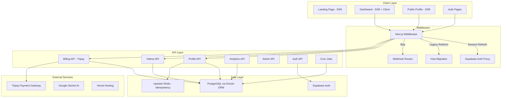

# Laporan Hasil Deep Audit & Pre-Release Technical Analysis
**Project:** showreels.id  
**Tanggal Audit:** 8 Mei 2026  
**Auditor:** AI Audit System  
**Status:** Analisis Selesai — Menunggu Tindak Lanjut

---

## Ringkasan Eksekutif

Aplikasi **showreels.id** adalah platform portfolio video untuk creator, dibangun dengan **Next.js 16.2.4**, **React 19**, **Supabase Auth**, **Drizzle ORM** (PostgreSQL), dan **Tripay** sebagai payment gateway. Secara keseluruhan arsitektur sudah solid, namun ditemukan **beberapa isu kritis dan medium** yang perlu ditangani sebelum production release.

---

## 1. Temuan Audit: Logika & State Management

### ✅ Hal yang Sudah Baik
- **SWR + React Query dual-layer caching** — Konfigurasi `dedupingInterval`, `revalidateOnFocus`, dan `keepPreviousData` sudah tepat
- **Auth state persistence** — Middleware di `src/middleware.ts` memanggil `supabase.auth.getUser()` setiap request untuk refresh session cookies
- **Session Activity Manager** — Auto-logout setelah 15 menit idle dengan warning di menit ke-10
- **Centralized cache keys** di `src/lib/swr-config.ts` mencegah typo dan inkonsistensi

### 🟡 Temuan Medium

> **[ISSUE-001]: AppProviders — Dark Mode Force Removal**
> * **Kategori:** Logic
> * **Keparahan:** 🟡 Medium
> * **Deskripsi:** Di `src/providers/app-providers.tsx` baris 19-24, setiap mount selalu menghapus dark mode classes dan localStorage. Ini mencegah fitur dark mode di masa depan dan bisa menyebabkan flash of unstyled content (FOUC).
> * **Langkah Perbaikan:** Pindahkan logic ini ke conditional check atau hapus jika dark mode memang tidak didukung.
> * **Status:** Open

> **[ISSUE-002]: AuthGuard Menggunakan useMockApp**
> * **Kategori:** Logic
> * **Keparahan:** 🟡 Medium
> * **Deskripsi:** `src/components/auth-guard.tsx` bergantung pada `useMockApp()` hook. Jika DEMO_MODE tidak aktif di production, perlu dipastikan hook ini tetap mengembalikan session yang valid dari Supabase.
> * **Langkah Perbaikan:** Verifikasi bahwa `useMockApp` fallback ke real Supabase session saat `DEMO_MODE=false`.
> * **Status:** Open

> **[ISSUE-003]: Dual Data Fetching Library (SWR + React Query)**
> * **Kategori:** Logic / Perf
> * **Keparahan:** 🟡 Medium
> * **Deskripsi:** Aplikasi menggunakan SWR DAN React Query secara bersamaan. Ini menambah bundle size dan potensi konflik cache.
> * **Langkah Perbaikan:** Konsolidasi ke satu library. Jika SWR sudah dominan, hapus React Query atau sebaliknya.
> * **Status:** Open

---

## 2. Temuan Audit: Error Handling & Edge Cases

### ✅ Hal yang Sudah Baik
- **FetchError class** di `src/lib/fetcher.ts` — Custom error dengan status code dan info
- **SWR error retry** — 3x retry dengan interval 5 detik
- **Graceful fallback** di `current-user.ts` — Jika sync gagal, return `createFallbackAuthProfile`
- **Schema mismatch handling** — Banyak `try/catch` dengan fallback untuk backward compatibility
- **Webhook signature verification** — Midtrans dan Tripay callback divalidasi

### 🔴 Temuan Kritis

> **[ISSUE-004]: Tidak Ada Error Boundary di Level Aplikasi**
> * **Kategori:** UI / Logic
> * **Keparahan:** 🔴 High
> * **Deskripsi:** Tidak ditemukan file `error.tsx` atau komponen `ErrorBoundary` di `src/app/`. Jika terjadi unhandled error di rendering, user akan melihat white screen of death.
> * **Langkah Perbaikan:** 
>   1. Buat `src/app/error.tsx` sebagai global error boundary
>   2. Buat `src/app/dashboard/error.tsx` untuk dashboard-specific errors
>   3. Buat `src/app/global-error.tsx` untuk root layout errors
> * **Status:** Open

### 🟡 Temuan Medium

> **[ISSUE-005]: console.log/error Masih Ada di Production Code**
> * **Kategori:** Security / Perf
> * **Keparahan:** 🟡 Medium
> * **Deskripsi:** Ditemukan **48 instance** `console.log/warn/error` di source code. Beberapa di antaranya ada di API routes dan server code yang akan terekspos di server logs. Yang di `seed-owner.ts`, `migrate.ts`, `backfill-auth-profiles.ts` bisa diterima karena CLI scripts, tapi yang di API routes sebaiknya menggunakan structured logging.
> * **Langkah Perbaikan:** 
>   1. Hapus `console.log` dari production API routes
>   2. Ganti `console.error` dengan structured logger (atau biarkan untuk server-side monitoring)
>   3. Pastikan tidak ada sensitive data yang di-log
> * **Status:** Open

> **[ISSUE-006]: CRON_SECRET Menggunakan Default Value**
> * **Kategori:** Security
> * **Keparahan:** 🟡 Medium
> * **Deskripsi:** Di `src/app/api/cron/trial-expiry/route.ts` baris 12: `process.env.CRON_SECRET || "your-secret-key"`. Jika env var tidak di-set, siapapun bisa trigger cron endpoint.
> * **Langkah Perbaikan:** Hapus default value, return 401 jika CRON_SECRET tidak dikonfigurasi.
> * **Status:** Open

---

## 3. Temuan Audit: UI/UX & Mobile Responsiveness

### ✅ Hal yang Sudah Baik
- **Viewport meta** sudah dikonfigurasi dengan `maximumScale: 1` dan `userScalable: false`
- **Font optimization** — `display: "swap"` pada Google Fonts (Inter + Instrument Serif)
- **Loading states** — File `loading.tsx` tersedia di beberapa route dashboard
- **Bottom Navigation** component untuk mobile
- **Skeleton loading** menggunakan `react-loading-skeleton`

### 🟡 Temuan Medium

> **[ISSUE-007]: Tidak Ada Not-Found Page Custom**
> * **Kategori:** UI
> * **Keparahan:** 🟡 Medium
> * **Deskripsi:** Tidak ditemukan `src/app/not-found.tsx`. User yang mengakses URL invalid akan melihat default Next.js 404 page.
> * **Langkah Perbaikan:** Buat custom 404 page yang sesuai branding showreels.id.
> * **Status:** Open

> **[ISSUE-008]: Layout Shift Potensial pada Video/Image Loading**
> * **Kategori:** UI / Perf
> * **Keparahan:** 🟡 Medium
> * **Deskripsi:** Meskipun `next/image` sudah dikonfigurasi dengan remote patterns, perlu dipastikan semua penggunaan `<Image>` memiliki `width`/`height` atau `fill` prop untuk mencegah CLS.
> * **Langkah Perbaikan:** Audit semua penggunaan `<Image>` dan pastikan dimensi eksplisit.
> * **Status:** Open

---

## 4. Temuan Audit: Database, API & Security

### ✅ Hal yang Sudah Baik
- **Drizzle ORM** dengan typed schema — Tidak ada raw `select(*)` query
- **Proper indexing** — Users, videos, billing, notifications semua memiliki index yang tepat
- **Webhook route exclusion** dari middleware — Tripay/Midtrans callback tidak di-redirect
- **Environment variable validation** — `hasPlaceholderEnvValue()` dan `normalizeEnvValue()` utility
- **Signature verification** pada payment webhooks (SHA512 untuk Midtrans, HMAC untuk Tripay)
- **Cascade delete** pada foreign keys (user deletion cascades ke videos, onboarding, dll)
- **Idempotency layer** dengan Redis/Memory fallback

### 🔴 Temuan Kritis

> **[ISSUE-009]: File .env Terekspos di Repository**
> * **Kategori:** Security
> * **Keparahan:** 🔴 High
> * **Deskripsi:** File `vercel-env-tripay-sandbox.env` ada di root project dan TIDAK ada di `.gitignore`. Meskipun `.env*` di-ignore, file ini menggunakan nama berbeda dan bisa terekspos.
> * **Langkah Perbaikan:** 
>   1. Tambahkan `vercel-env-tripay-sandbox.env` ke `.gitignore`
>   2. Hapus dari git history jika sudah ter-commit
>   3. Rotate semua keys yang ada di file tersebut
> * **Status:** Open

### 🟡 Temuan Medium

> **[ISSUE-010]: RLS (Row Level Security) Tidak Terverifikasi**
> * **Kategori:** Security
> * **Keparahan:** 🟡 Medium
> * **Deskripsi:** Aplikasi menggunakan Supabase tetapi semua query dilakukan via Drizzle ORM dengan service role (server-side). RLS di Supabase mungkin tidak aktif karena akses langsung ke database. Ini aman selama semua akses melalui API routes yang sudah di-guard, tapi perlu dipastikan tidak ada direct client-side Supabase query yang bypass auth.
> * **Langkah Perbaikan:** Audit bahwa `createClient()` (client-side) hanya digunakan untuk auth operations, bukan data queries.
> * **Status:** Open

> **[ISSUE-011]: Midtrans Legacy Code Masih Aktif**
> * **Kategori:** Security / Logic
> * **Keparahan:** 🟡 Medium
> * **Deskripsi:** Meskipun sudah deprecated, endpoint `/api/billing/midtrans/webhook` dan `/api/billing/payment-status/[invoiceId]/qr` masih aktif. Ini memperluas attack surface.
> * **Langkah Perbaikan:** Pertimbangkan untuk menambahkan rate limiting atau menonaktifkan sepenuhnya jika tidak ada transaksi Midtrans yang masih pending.
> * **Status:** Open

---

## 5. Temuan Audit: Kesiapan Deployment (Vercel)

### ✅ Hal yang Sudah Baik
- **vercel.json** terkonfigurasi dengan cron job untuk trial expiry
- **next.config.ts** — Image optimization (AVIF/WebP), package imports optimization, static asset caching (1 year immutable)
- **Preconnect headers** untuk Google Fonts dan Google Auth
- **Compress enabled** di next.config
- **.vercelignore** tersedia

### 🟡 Temuan Medium

> **[ISSUE-012]: Environment Variables Checklist Belum Lengkap**
> * **Kategori:** Deployment
> * **Keparahan:** 🟡 Medium
> * **Deskripsi:** Berdasarkan analisis kode, berikut env vars yang WAJIB dikonfigurasi di Vercel Dashboard:
> 
> | Variable | Tujuan | Kritis? |
> |----------|--------|---------|
> | `NEXT_PUBLIC_SUPABASE_URL` | Supabase connection | ✅ |
> | `NEXT_PUBLIC_SUPABASE_PUBLISHABLE_KEY` | Supabase anon key | ✅ |
> | `DATABASE_URL` | PostgreSQL connection | ✅ |
> | `TRIPAY_API_KEY` | Payment gateway | ✅ |
> | `TRIPAY_PRIVATE_KEY` | Tripay signature | ✅ |
> | `TRIPAY_MERCHANT_CODE` | Tripay merchant | ✅ |
> | `TRIPAY_CALLBACK_SECRET` | Webhook verification | ✅ |
> | `TRIPAY_IS_PRODUCTION` | Sandbox/Production toggle | ✅ |
> | `CRON_SECRET` | Cron job auth | ✅ |
> | `PASSWORD_RECOVERY_SECRET` | Token signing | ✅ |
> | `ADMIN_EMAILS` | Admin access control | ✅ |
> | `NEXT_PUBLIC_APP_URL` | App origin | ⚠️ |
> | `UPSTASH_REDIS_REST_URL` | Idempotency cache | ⚠️ |
> | `UPSTASH_REDIS_REST_TOKEN` | Redis auth | ⚠️ |
> | `GEMINI_API_KEY` | AI bio generation | ⚠️ |
> | `OWNER_EMAIL` | Owner account | ⚠️ |
> | `NEXT_PUBLIC_DEMO_MODE` | Demo toggle (harus false) | ⚠️ |
> 
> * **Langkah Perbaikan:** Buat checklist deployment dan verifikasi semua env vars sudah di-set.
> * **Status:** Open

> **[ISSUE-013]: Bundle Size — Dual State Management**
> * **Kategori:** Perf
> * **Keparahan:** 🔵 Low
> * **Deskripsi:** Menggunakan SWR + React Query + Zustand secara bersamaan. `optimizePackageImports` sudah dikonfigurasi tapi bundle masih bisa lebih kecil.
> * **Langkah Perbaikan:** Analisis bundle dengan `@next/bundle-analyzer` dan pertimbangkan konsolidasi.
> * **Status:** Open

---

## 6. Checklist Rilis Final (Updated)

| # | Item | Status |
|---|------|--------|
| 1 | Error Boundary (`error.tsx`) terpasang di app level | ❌ Belum |
| 2 | Custom 404 page (`not-found.tsx`) | ❌ Belum |
| 3 | `vercel-env-tripay-sandbox.env` dihapus/di-gitignore | ❌ Belum |
| 4 | CRON_SECRET default value dihapus | ❌ Belum |
| 5 | Environment Variables di Vercel Dashboard lengkap | ⚠️ Perlu verifikasi |
| 6 | `console.log` di API routes di-review | ⚠️ Perlu cleanup |
| 7 | `NEXT_PUBLIC_DEMO_MODE` = false di production | ⚠️ Perlu verifikasi |
| 8 | Optimasi gambar (Next/Image) sudah diimplementasikan | ✅ Done |
| 9 | Favicon dan Metadata SEO sudah sesuai | ✅ Done |
| 10 | Webhook signature verification aktif | ✅ Done |
| 11 | Session management & auto-logout | ✅ Done |
| 12 | Static asset caching headers | ✅ Done |
| 13 | Font optimization (swap) | ✅ Done |
| 14 | Cron job trial-expiry terkonfigurasi | ✅ Done |

---

## 7. Diagram Arsitektur Sistem

---

## 8. Prioritas Perbaikan

### 🔴 Prioritas Tinggi (Harus sebelum production)
1. **ISSUE-004** — Tambah Error Boundary
2. **ISSUE-009** — Amankan file env yang terekspos
3. **ISSUE-006** — Hapus default CRON_SECRET

### 🟡 Prioritas Sedang (Sebaiknya sebelum production)
4. **ISSUE-005** — Cleanup console.log
5. **ISSUE-012** — Verifikasi semua env vars
6. **ISSUE-007** — Custom 404 page
7. **ISSUE-002** — Verifikasi AuthGuard di non-demo mode
8. **ISSUE-010** — Audit RLS dan client-side queries
9. **ISSUE-011** — Review Midtrans legacy endpoints

### 🔵 Prioritas Rendah (Post-launch improvement)
10. **ISSUE-001** — Dark mode force removal cleanup
11. **ISSUE-003** — Konsolidasi SWR/React Query
12. **ISSUE-008** — Audit CLS pada images
13. **ISSUE-013** — Bundle size optimization

---

*Dokumen ini dihasilkan dari analisis mendalam terhadap source code showreels.id pada 8 Mei 2026.*
