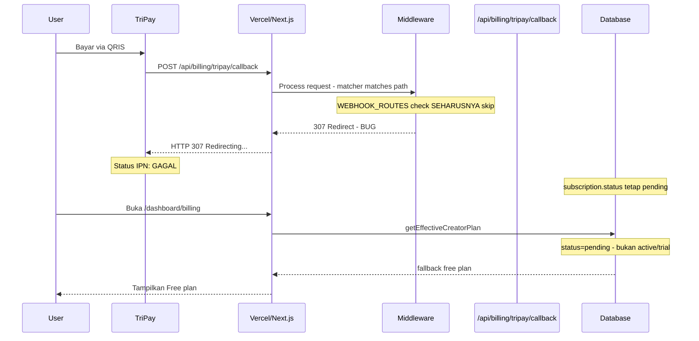
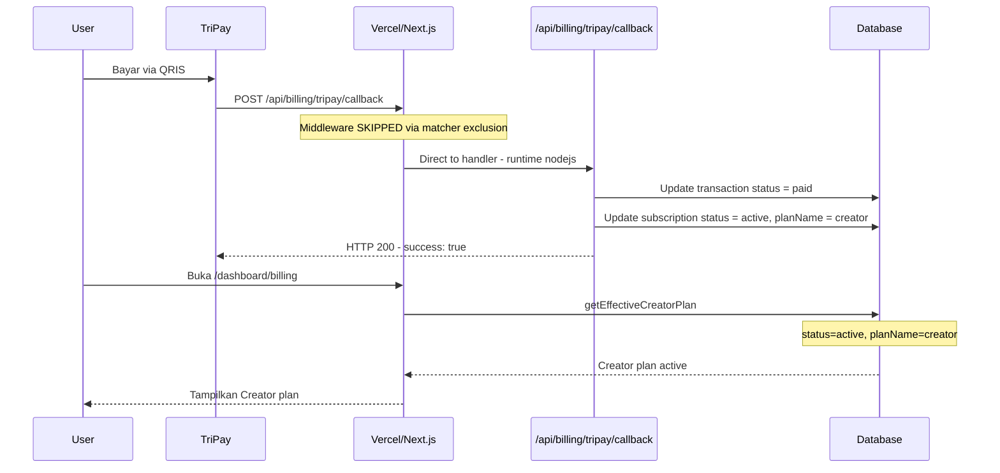

# Fix: TriPay Callback HTTP 307 Redirect & Full Midtrans Removal

## Problem Statement

Setelah pembayaran berhasil di TriPay (status "PAID"), callback IPN gagal memperbarui database karena:
1. **HTTP 307 Redirect** - Server merespons dengan redirect alih-alih memproses callback
2. **Status IPN: GAGAL** - Karena redirect, data pembayaran tidak pernah diproses
3. **Billing page tetap menampilkan "Free"** - Subscription status stuck di "pending"

## Root Cause Analysis

### Penyebab Utama: HTTP 307 pada Callback

Dari screenshot TriPay simulator:
- URL: `https://showreels.id/api/billing/tripay/callback`
- Method: POST
- Kode HTTP: **307** (Temporary Redirect)
- Respon: "Redirecting..."

Kemungkinan penyebab 307:
1. **Next.js Edge Runtime** - Tanpa explicit `runtime = 'nodejs'`, route bisa berjalan di edge yang memiliki behavior redirect
2. **Middleware masih ter-trigger** - Meskipun ada skip logic di runtime, matcher pattern masih mencocokkan path ini sehingga middleware tetap dijalankan
3. **Supabase `updateSession`** - Jika middleware tetap jalan, `updateSession` bisa menyebabkan redirect karena tidak ada auth cookies di request callback

### Penyebab Sekunder: Tidak Ada Fallback Mechanism

- `refreshBillingTransactionStatusFromMidtrans` hanya support Midtrans (deprecated, tidak berguna)
- Tidak ada mekanisme polling ke TriPay API untuk sinkronisasi status
- Jika callback gagal, tidak ada cara lain untuk update status

### Flow Diagram - Current (Broken)



### Flow Diagram - Fixed



## Solution Plan

### Fix 1: Force Node.js Runtime & Dynamic pada Callback Route

**File:** `src/app/api/billing/tripay/callback/route.ts`

Tambahkan export config di awal file:

```typescript
export const runtime = 'nodejs';
export const dynamic = 'force-dynamic';
export const fetchCache = 'force-no-store';
```

Ini memastikan:
- Route TIDAK berjalan di Edge Runtime
- Route TIDAK di-cache oleh Vercel
- Setiap request diproses fresh

### Fix 2: Exclude Webhook dari Middleware Matcher Pattern

**File:** `src/middleware.ts`

Ubah matcher config agar webhook paths di-exclude di level regex pattern (bukan hanya runtime check):

```typescript
export const config = {
  matcher: [
    "/((?!_next/static|_next/image|favicon.ico|api/billing/tripay/callback|api/billing/midtrans/webhook|.*\\.(?:svg|png|jpg|jpeg|gif|webp|mp4)$).*)",
  ],
};
```

Dengan ini, middleware function TIDAK AKAN PERNAH dipanggil untuk webhook routes.

### Fix 3: Buat `refreshTripayTransactionStatus` Function

**File:** `src/server/billing.ts`

Buat fungsi baru yang polling langsung ke TriPay API:

```typescript
export async function refreshTripayTransactionStatus(input: {
  userId: string;
  invoiceId: string;
}): Promise<BillingTransactionRow | null> {
  // 1. Cari transaksi di DB by userId + invoiceId
  const transaction = await getBillingTransactionByInvoiceForUser(input.userId, input.invoiceId);
  if (!transaction) return null;

  // 2. Jika status sudah final (paid/expired/failed/cancelled), return as-is
  if (['paid', 'expired', 'failed', 'cancelled'].includes(transaction.status)) {
    return transaction;
  }

  // 3. Call TriPay API untuk cek status terbaru
  const tripayDetail = await getTripayTransactionDetail(transaction.providerReference || '');
  if (!tripayDetail) return transaction;

  // 4. Map status dan update DB jika berubah
  const newStatus = mapTripayStatusToInternal(tripayDetail.status as TripayTransactionStatus);
  if (newStatus === transaction.status) return transaction;

  // 5. Update transaction
  const now = new Date();
  await db.update(billingTransactions).set({
    status: newStatus,
    paidAt: newStatus === 'paid' ? now : transaction.paidAt,
    updatedAt: now,
  }).where(eq(billingTransactions.id, transaction.id));

  // 6. Update subscription jika paid
  if (newStatus === 'paid' && transaction.subscriptionId) {
    const renewalDate = new Date();
    renewalDate.setMonth(renewalDate.getMonth() + (transaction.billingCycle === 'yearly' ? 12 : 1));

    await db.update(billingSubscriptions).set({
      status: 'active',
      planName: transaction.planName,
      renewalDate,
      updatedAt: now,
    }).where(eq(billingSubscriptions.id, transaction.subscriptionId));
  }

  // 7. Return updated transaction
  return { ...transaction, status: newStatus, paidAt: newStatus === 'paid' ? now : transaction.paidAt };
}
```

### Fix 4: Rewrite Payment Status Route - Full Tripay

**File:** `src/app/api/billing/payment-status/[invoiceId]/route.ts`

Hapus semua referensi Midtrans, gunakan `refreshTripayTransactionStatus`:

```typescript
import { NextResponse } from "next/server";
import { isAdminEmail } from "@/server/admin-access";
import { refreshTripayTransactionStatus, toBillingPaymentSummary } from "@/server/billing";
import { getCurrentUser } from "@/server/current-user";

export async function GET(
  _request: Request,
  context: { params: Promise<{ invoiceId: string }> }
) {
  const currentUser = await getCurrentUser();
  if (!currentUser?.id) {
    return NextResponse.json({ error: "Unauthorized" }, { status: 401 });
  }
  if (isAdminEmail(currentUser.email)) {
    return NextResponse.json(
      { error: "Akun owner tidak menggunakan billing creator." },
      { status: 403 }
    );
  }

  const { invoiceId } = await context.params;
  const transaction = await refreshTripayTransactionStatus({
    userId: currentUser.id,
    invoiceId,
  });

  if (!transaction) {
    return NextResponse.json({ error: "Invoice tidak ditemukan." }, { status: 404 });
  }

  return NextResponse.json({
    transaction,
    payment: toBillingPaymentSummary(transaction),
  });
}
```

### Fix 5: Hapus Semua Kode Midtrans Legacy dari billing.ts

**File:** `src/server/billing.ts`

Hapus fungsi-fungsi berikut:
- `isMidtransConfigured()` 
- `mapMidtransStatus()`
- `mapSubscriptionStatus()`
- `handleMidtransWebhook()`
- `refreshBillingTransactionStatusFromMidtrans()`

### Fix 6: Auto-Sync di Billing Page

**File:** `src/components/dashboard/billing-panel.tsx`

Saat user kembali dari pembayaran (detected via `?payment=success` query param):
1. Ambil invoiceId dari transaksi terakhir yang pending
2. Poll `/api/billing/payment-status/[invoiceId]` setiap 3 detik, max 10x
3. Jika status berubah ke `paid`, refresh billing data via SWR mutate
4. Tampilkan loading indicator selama polling

### Fix 7: Verifikasi getAppOrigin

**File:** `src/server/billing.ts`

`getAppOrigin()` sudah memiliki fallback ke `https://showreels.id`. Tambahkan console.log saat create transaction untuk debugging:

```typescript
const callbackUrl = `${getAppOrigin()}/api/billing/tripay/callback`;
console.log('[billing] Using callback URL:', callbackUrl);
```

### Fix 8: Hapus/Deprecate Midtrans Webhook Route

**File:** `src/app/api/billing/midtrans/webhook/route.ts`

Ganti isi dengan response 410 Gone:

```typescript
import { NextResponse } from "next/server";

export const runtime = 'nodejs';

export async function POST() {
  return NextResponse.json(
    { error: "Midtrans webhook sudah tidak digunakan. Gunakan Tripay." },
    { status: 410 }
  );
}
```

## Files to Modify

| # | File | Action |
|---|------|--------|
| 1 | `src/app/api/billing/tripay/callback/route.ts` | Tambah runtime/dynamic exports |
| 2 | `src/middleware.ts` | Exclude webhook dari matcher pattern |
| 3 | `src/server/billing.ts` | Tambah `refreshTripayTransactionStatus`, hapus semua Midtrans legacy |
| 4 | `src/app/api/billing/payment-status/[invoiceId]/route.ts` | Rewrite full Tripay |
| 5 | `src/components/dashboard/billing-panel.tsx` | Auto-sync polling |
| 6 | `src/app/api/billing/midtrans/webhook/route.ts` | Replace dengan 410 Gone |

## Priority Order

1. **Fix 1 + Fix 2** (Critical) - Perbaiki 307 redirect agar callback bisa diterima
2. **Fix 3 + Fix 4** (High) - Fallback polling sebagai safety net
3. **Fix 5** (High) - Hapus dead code Midtrans
4. **Fix 6** (Medium) - UX improvement auto-sync
5. **Fix 7** (Low) - Logging/verification
6. **Fix 8** (Low) - Cleanup deprecated route

## Testing Checklist

- [ ] Deploy ke Vercel
- [ ] Buka TriPay simulator, kirim callback → harus dapat HTTP 200
- [ ] Verifikasi database terupdate (transaction status = paid, subscription status = active)
- [ ] Buka billing page → harus menampilkan plan yang benar (Creator/Business)
- [ ] Test fallback: bayar, lalu buka billing page → auto-sync harus poll dan update
- [ ] Pastikan midtrans webhook route return 410
- [ ] Pastikan tidak ada import error setelah hapus Midtrans functions
