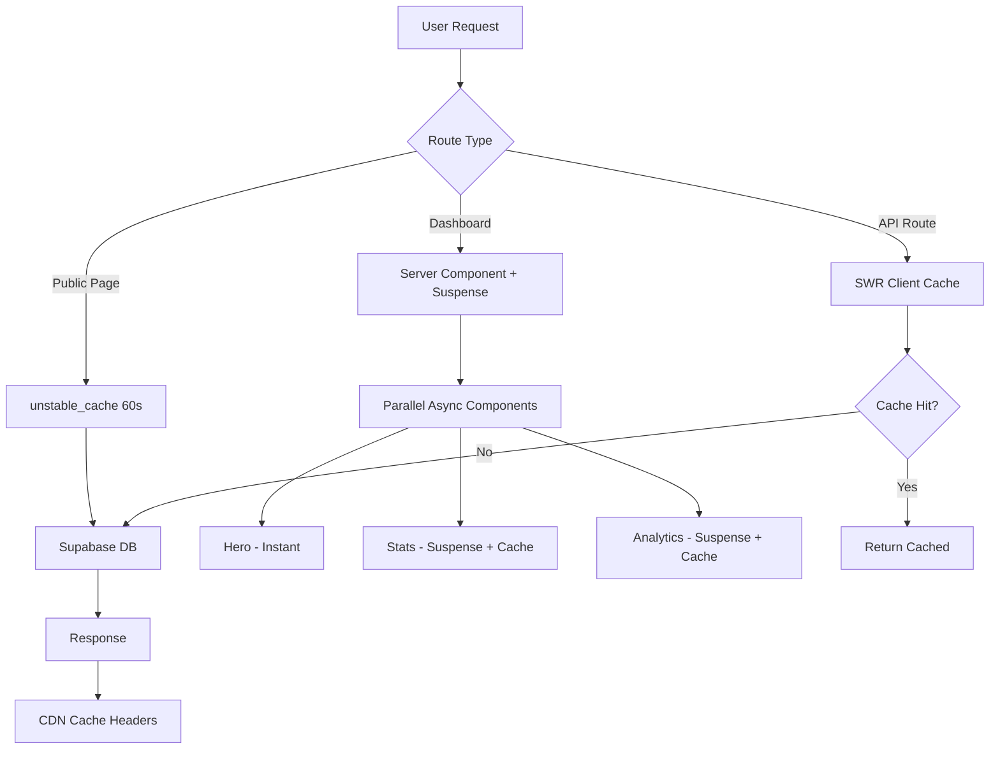
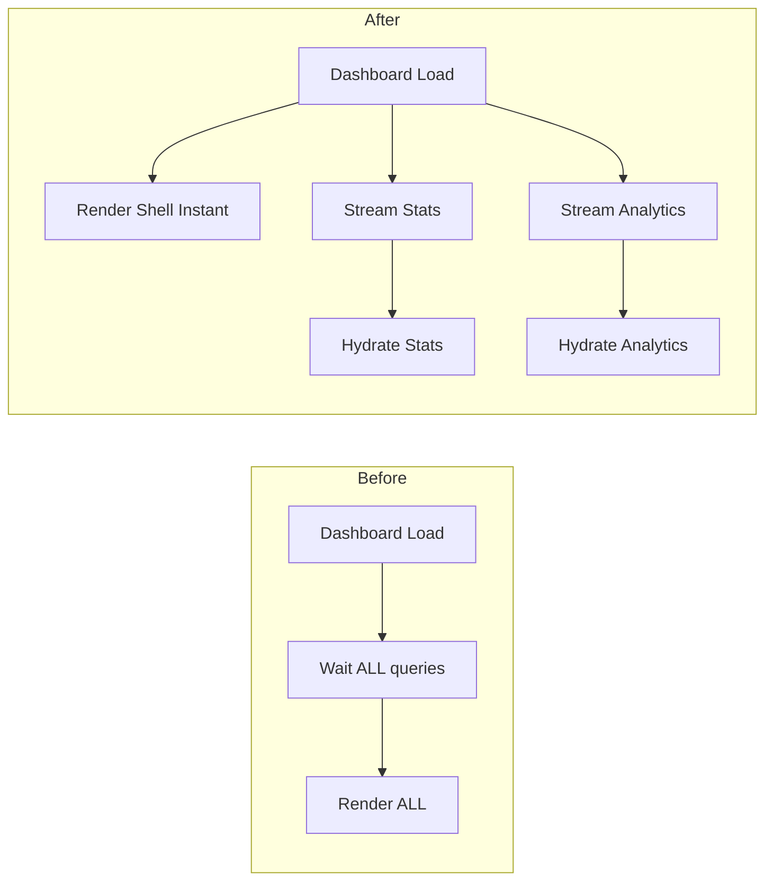

# Plan: Full-Stack Deep Optimization — showreels.id

**Berdasarkan:** `PRD_FullStack_Optimization_V3.md`  
**Tanggal:** 2026-05-08  
**Status:** Draft — Menunggu approval sebelum eksekusi

---

## Ringkasan Temuan Audit

Setelah menganalisis codebase, berikut temuan utama yang perlu dioptimasi:

### Kondisi Saat Ini (Positif)
- ✅ SWR sudah diimplementasi dengan cache keys terpusat (`swr-config.ts`)
- ✅ `unstable_cache` sudah digunakan di `public-data.ts` untuk landing stats
- ✅ `next.config.ts` sudah memiliki image optimization (AVIF/WebP), cache headers, dan `optimizePackageImports`
- ✅ Dashboard sudah memiliki `loading.tsx` skeleton
- ✅ `PrefetchLink` component sudah ada untuk prefetch data on hover
- ✅ Query database sudah menggunakan specific column select (bukan `select(*)`)

### Masalah yang Ditemukan
- ❌ Dashboard page melakukan **heavy DB queries langsung di server component** tanpa caching (visitor count, videos list)
- ❌ `VideoEmbed` langsung render iframe tanpa lazy loading — boros bandwidth
- ❌ Landing page component 1935 baris — perlu code splitting
- ❌ Analytics auto-refresh setiap 30 detik — boros database reads
- ❌ 47+ `console.log/warn/error` di production code
- ❌ Tidak ada pagination di beberapa query (dashboard videos)
- ❌ Public profile page melakukan 2x database call di `generateMetadata` + render
- ❌ Beberapa API routes tidak memiliki response caching headers

---

## Execution Plan

### Phase 1: Database Cost Reduction (Penghematan Supabase Reads)

#### 1.1 — Cache Dashboard Summary Query
**File:** `src/app/dashboard/page.tsx`  
**Masalah:** Query `visitorEvents` count dan `videos.findMany` dipanggil setiap kali halaman dimuat tanpa cache.  
**Solusi:**
- Pindahkan logic data-fetching ke dedicated server function dengan `unstable_cache`
- Set revalidate 60 detik untuk visitor count
- Set revalidate 30 detik untuk video list

#### 1.2 — Reduce Analytics Polling Frequency
**File:** `src/hooks/use-dashboard-data.ts`  
**Masalah:** `useAnalyticsSummary` refresh setiap 30 detik (`refreshInterval: 30000`)  
**Solusi:**
- Ubah ke 120 detik (2 menit) — analytics tidak perlu real-time
- Tambahkan `revalidateOnFocus: false` untuk analytics

#### 1.3 — Cache Public Profile Data
**File:** `src/app/[slug]/page.tsx` + `src/server/public-data.ts`  
**Masalah:** `getPublicProfile` dipanggil 2x — sekali di `generateMetadata`, sekali di render. Tidak ada deduplication.  
**Solusi:**
- Wrap `getPublicProfile` dan `getPublicVideo` dengan `unstable_cache` (revalidate: 60)
- Next.js akan otomatis dedupe fetch yang sama dalam satu request, tapi cache antar-request tetap diperlukan

#### 1.4 — Add Pagination to Dashboard Videos
**File:** `src/app/dashboard/page.tsx` (line 298-309)  
**Masalah:** `db.query.videos.findMany` tanpa limit — jika user punya 100+ video, semua ditarik.  
**Solusi:**
- Tambahkan `.limit(20)` untuk dashboard overview
- Halaman `/dashboard/videos` tetap full list tapi dengan pagination

#### 1.5 — Cache API Route Responses
**Files:** `src/app/api/billing/plan/route.ts`, `src/app/api/link-types/route.ts`  
**Masalah:** Data yang jarang berubah (plan info, link types) di-fetch ulang setiap request.  
**Solusi:**
- Tambahkan `Cache-Control: private, max-age=300` header untuk billing plan
- Tambahkan `Cache-Control: public, max-age=3600` untuk link-types (static data)

---

### Phase 2: Instant Loading Implementation

#### 2.1 — Lazy Load Video Embeds
**File:** `src/components/video-embed.tsx`  
**Masalah:** iframe langsung dimuat tanpa intersection observer.  
**Solusi:**
- Tampilkan thumbnail terlebih dahulu
- Load iframe hanya saat element masuk viewport (IntersectionObserver)
- Tambahkan `loading="lazy"` pada iframe sebagai fallback

#### 2.2 — Add Suspense Boundaries ke Dashboard Sub-sections
**File:** `src/app/dashboard/page.tsx`  
**Masalah:** Seluruh dashboard menunggu semua query selesai sebelum render.  
**Solusi:**
- Pisahkan `StatsGrid` dan `AnalyticsChartCard` ke async server components terpisah
- Bungkus dengan `<Suspense fallback={<Skeleton />}>`
- Hero card dan Quick Actions render instant tanpa data

#### 2.3 — Streaming untuk Public Profile Page
**File:** `src/app/[slug]/page.tsx`  
**Masalah:** Halaman publik menunggu semua data sebelum render.  
**Solusi:**
- Pisahkan video grid ke komponen async terpisah
- Bungkus dengan Suspense agar header/bio muncul duluan

#### 2.4 — Prefetch Dashboard Navigation Links
**File:** `src/components/dashboard/bottom-navigation.tsx`  
**Masalah:** Navigasi dashboard belum memanfaatkan prefetch data.  
**Solusi:**
- Gunakan `PrefetchLink` yang sudah ada untuk nav items utama
- Prefetch API data untuk halaman yang akan dikunjungi

---

### Phase 3: Aggressive Code Cleanup

#### 3.1 — Remove Console Statements dari Production Code
**Files:** 11 file `.tsx` + 15 file `.ts`  
**Masalah:** 47+ console statements di production.  
**Solusi:**
- Hapus `console.log` yang bersifat debug (idempotent-button, idempotent-form)
- Pertahankan `console.error` di error boundaries dan critical paths (billing, auth)
- Pertahankan `console.warn` untuk schema mismatch (berguna untuk monitoring)
- Hapus `console.log` di seed/migration scripts (hanya jalan di dev)

**Yang DIHAPUS:**
| File | Line | Statement |
|------|------|-----------|
| `idempotent-button.tsx` | 43, 48 | `console.log` cooldown/processing |
| `idempotent-form.tsx` | 32 | `console.log` already submitting |
| `dashboard/videos/page.tsx` | 36 | `console.warn` schema mismatch (sudah handled) |

**Yang DIPERTAHANKAN:**
- Error boundaries (`error.tsx`) — diperlukan untuk monitoring
- Billing/payment callbacks — critical path logging
- Auth sync errors — diperlukan untuk debugging production issues

#### 3.2 — Code Split Landing Page
**File:** `src/components/landing-page.tsx` (1935 baris)  
**Masalah:** Satu file monolitik yang membebani bundle.  
**Solusi:**
- Pisahkan ke sub-components: `HeroSection`, `FeaturesSection`, `PricingSection`, `FooterSection`
- Gunakan dynamic import untuk sections below the fold
- Lazy load heavy animations (framer-motion sections)

#### 3.3 — Remove Unused Imports & Dead Code
**Scan:** ESLint + manual review  
**Solusi:**
- Jalankan `eslint --fix` untuk auto-remove unused imports
- Review komponen yang tidak digunakan di tree

---

### Phase 4: Responsive & UI Fixes

#### 4.1 — Audit Tailwind Class Conflicts
**Target:** Semua komponen UI  
**Solusi:**
- Scan untuk pattern conflicting classes (flex+block, multiple padding)
- Gunakan `cn()` utility yang sudah ada untuk merge classes properly

#### 4.2 — Fix Fixed Width Elements
**Target:** Dashboard cards, public profile  
**Solusi:**
- Replace `w-[500px]` patterns dengan responsive alternatives
- Pastikan semua cards menggunakan `max-w-full` atau responsive grid

---

## Arsitektur Optimasi

---

## Prioritas Eksekusi

| # | Task | Impact | Risk |
|---|------|--------|------|
| 1 | Cache Dashboard queries | 🔴 High DB savings | Low |
| 2 | Reduce analytics polling | 🔴 High DB savings | Low |
| 3 | Cache public profile | 🟠 Medium DB savings | Low |
| 4 | Lazy load video embeds | 🟠 Medium UX improvement | Low |
| 5 | Suspense boundaries dashboard | 🟠 Medium UX improvement | Medium |
| 6 | Remove console statements | 🟢 Low - cleanup | Low |
| 7 | Code split landing page | 🟢 Low - bundle size | Medium |
| 8 | Add pagination | 🟠 Medium DB savings | Low |
| 9 | Streaming public pages | 🟢 Low - UX polish | Medium |
| 10 | Tailwind audit | 🟢 Low - visual fix | Low |

---

## File yang Akan Dimodifikasi

### High Priority
1. `src/app/dashboard/page.tsx` — Cache + Suspense + Pagination
2. `src/hooks/use-dashboard-data.ts` — Reduce polling
3. `src/server/public-data.ts` — Extend caching
4. `src/components/video-embed.tsx` — Lazy load iframe
5. `src/app/[slug]/page.tsx` — Streaming + cache dedup

### Medium Priority
6. `src/components/landing-page.tsx` — Code split
7. `src/components/idempotent-button.tsx` — Remove console.log
8. `src/components/idempotent-form.tsx` — Remove console.log
9. `src/components/dashboard/bottom-navigation.tsx` — Prefetch links
10. `src/app/api/billing/plan/route.ts` — Cache headers

### Low Priority
11. `src/app/dashboard/videos/page.tsx` — Remove console.warn
12. Various API routes — Add Cache-Control headers
13. Tailwind class audit across components

---

## Batasan & Aturan

1. **TIDAK mengubah business logic** — Hanya optimasi performa dan cleanup
2. **TIDAK menghapus error handling** — console.error di critical paths tetap ada
3. **TIDAK mengubah database schema** — Hanya cara query yang dioptimasi
4. **Backward compatible** — Semua API response format tetap sama
5. **Test setelah setiap phase** — Pastikan tidak ada regression

---

## Estimasi Penghematan Database

| Optimasi | Sebelum | Sesudah | Savings |
|----------|---------|---------|---------|
| Dashboard page load | 3 queries/visit | 3 queries/60s | ~98% reduction per user |
| Analytics polling | 1 query/30s | 1 query/120s | 75% reduction |
| Public profile | 2 queries/visit | 2 queries/60s | ~95% for popular profiles |
| Landing stats | cached 60s | cached 60s | Already optimized |

---

## Next Steps

Setelah plan ini disetujui, eksekusi akan dilakukan per-phase di mode **Code** dengan urutan prioritas di atas.
