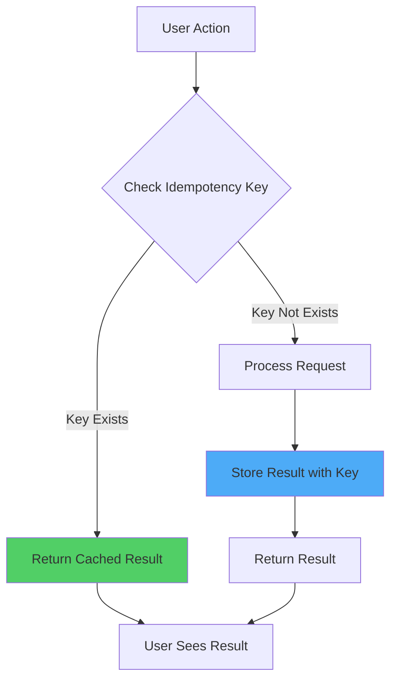

# Idempotency Implementation Plan

## 🎯 Apa itu Idempotency?

**Idempotency** adalah properti dimana operasi yang sama dapat dilakukan berkali-kali tanpa mengubah hasil setelah aplikasi pertama.

**Contoh:**
- ✅ **Idempotent**: `SET user.name = "John"` - Bisa dipanggil berkali-kali, hasilnya sama
- ❌ **Not Idempotent**: `user.balance += 100` - Setiap call menambah balance

**Kenapa Penting?**
- Prevent duplicate payments
- Prevent duplicate video uploads
- Prevent duplicate notifications
- Handle network retries safely
- Better user experience (no accidental double-clicks)

---

## 🏗️ Idempotency Architecture



---

## 📦 Implementation Strategy

### Phase 1: Client-Side Idempotency

#### A. Request Deduplication Hook
```typescript
// src/hooks/use-idempotent-request.ts
import { useRef, useCallback } from 'react'

type RequestState = {
  pending: boolean
  result: any
  error: any
}

export function useIdempotentRequest<T = any>() {
  const requestsRef = useRef<Map<string, RequestState>>(new Map())

  const execute = useCallback(async (
    key: string,
    fn: () => Promise<T>,
    options?: {
      ttl?: number // Time to live in ms
      force?: boolean // Force re-execution
    }
  ): Promise<T> => {
    const { ttl = 5000, force = false } = options || {}

    // Check if request is already pending
    const existing = requestsRef.current.get(key)
    
    if (existing && !force) {
      if (existing.pending) {
        // Wait for pending request
        return new Promise((resolve, reject) => {
          const checkInterval = setInterval(() => {
            const current = requestsRef.current.get(key)
            if (current && !current.pending) {
              clearInterval(checkInterval)
              if (current.error) reject(current.error)
              else resolve(current.result)
            }
          }, 100)
        })
      }
      
      if (existing.result) {
        // Return cached result
        return existing.result
      }
    }

    // Mark as pending
    requestsRef.current.set(key, { pending: true, result: null, error: null })

    try {
      const result = await fn()
      
      // Store result
      requestsRef.current.set(key, { pending: false, result, error: null })
      
      // Clear after TTL
      setTimeout(() => {
        requestsRef.current.delete(key)
      }, ttl)
      
      return result
    } catch (error) {
      // Store error
      requestsRef.current.set(key, { pending: false, result: null, error })
      
      // Clear after shorter TTL for errors
      setTimeout(() => {
        requestsRef.current.delete(key)
      }, 1000)
      
      throw error
    }
  }, [])

  const clear = useCallback((key?: string) => {
    if (key) {
      requestsRef.current.delete(key)
    } else {
      requestsRef.current.clear()
    }
  }, [])

  return { execute, clear }
}
```

#### B. Usage Example
```typescript
import { useIdempotentRequest } from '@/hooks/use-idempotent-request'

function VideoUploadForm() {
  const { execute } = useIdempotentRequest()
  
  const handleSubmit = async (data: VideoInput) => {
    // Generate idempotency key
    const key = `upload-video-${Date.now()}`
    
    try {
      const result = await execute(
        key,
        () => fetch('/api/videos', {
          method: 'POST',
          body: JSON.stringify(data),
        }),
        { ttl: 10000 } // Cache for 10 seconds
      )
      
      console.log('Video uploaded:', result)
    } catch (error) {
      console.error('Upload failed:', error)
    }
  }
  
  return <form onSubmit={handleSubmit}>...</form>
}
```

---

### Phase 2: Server-Side Idempotency

#### A. Idempotency Middleware
```typescript
// src/middleware/idempotency.ts
import { NextRequest, NextResponse } from 'next/server'
import { Redis } from '@upstash/redis'

const redis = new Redis({
  url: process.env.UPSTASH_REDIS_REST_URL!,
  token: process.env.UPSTASH_REDIS_REST_TOKEN!,
})

const IDEMPOTENCY_TTL = 86400 // 24 hours

export async function withIdempotency(
  request: NextRequest,
  handler: (req: NextRequest) => Promise<NextResponse>
): Promise<NextResponse> {
  // Only apply to POST, PUT, PATCH, DELETE
  if (!['POST', 'PUT', 'PATCH', 'DELETE'].includes(request.method)) {
    return handler(request)
  }

  // Get idempotency key from header
  const idempotencyKey = request.headers.get('Idempotency-Key')
  
  if (!idempotencyKey) {
    // No idempotency key, process normally
    return handler(request)
  }

  // Check if we've seen this key before
  const cacheKey = `idempotency:${idempotencyKey}`
  const cached = await redis.get(cacheKey)

  if (cached) {
    // Return cached response
    const { status, headers, body } = cached as any
    return new NextResponse(body, { status, headers })
  }

  // Process request
  const response = await handler(request)

  // Cache response
  const responseData = {
    status: response.status,
    headers: Object.fromEntries(response.headers.entries()),
    body: await response.text(),
  }

  await redis.setex(cacheKey, IDEMPOTENCY_TTL, JSON.stringify(responseData))

  return new NextResponse(responseData.body, {
    status: responseData.status,
    headers: responseData.headers,
  })
}
```

#### B. API Route with Idempotency
```typescript
// src/app/api/videos/route.ts
import { withIdempotency } from '@/middleware/idempotency'

export async function POST(request: NextRequest) {
  return withIdempotency(request, async (req) => {
    const body = await req.json()
    
    // Process video upload
    const video = await createVideo(body)
    
    return NextResponse.json(video, { status: 201 })
  })
}
```

---

### Phase 3: Database-Level Idempotency

#### A. Unique Constraints
```sql
-- Add unique constraint for idempotency
ALTER TABLE videos 
ADD COLUMN idempotency_key VARCHAR(255) UNIQUE;

CREATE INDEX idx_videos_idempotency_key 
ON videos(idempotency_key);
```

#### B. Upsert Pattern
```typescript
// src/server/video-service.ts
export async function createVideoIdempotent(
  data: VideoInput,
  idempotencyKey: string
) {
  // Try to find existing video with same idempotency key
  const existing = await db.query.videos.findFirst({
    where: eq(videos.idempotencyKey, idempotencyKey),
  })

  if (existing) {
    // Return existing video (idempotent)
    return existing
  }

  // Create new video
  const [video] = await db.insert(videos).values({
    ...data,
    idempotencyKey,
  }).returning()

  return video
}
```

---

### Phase 4: Payment Idempotency

#### A. Payment Request with Idempotency
```typescript
// src/app/api/billing/checkout/route.ts
export async function POST(request: NextRequest) {
  const body = await request.json()
  const { planId, userId } = body
  
  // Generate idempotency key for payment
  const idempotencyKey = `payment-${userId}-${planId}-${Date.now()}`
  
  // Check if payment already exists
  const existingPayment = await db.query.payments.findFirst({
    where: eq(payments.idempotencyKey, idempotencyKey),
  })
  
  if (existingPayment) {
    // Return existing payment URL
    return NextResponse.json({
      paymentUrl: existingPayment.paymentUrl,
      invoiceId: existingPayment.invoiceId,
    })
  }
  
  // Create new payment
  const payment = await createMidtransPayment({
    userId,
    planId,
    idempotencyKey,
  })
  
  return NextResponse.json(payment)
}
```

#### B. Midtrans Webhook Idempotency
```typescript
// src/app/api/billing/midtrans/webhook/route.ts
export async function POST(request: NextRequest) {
  const body = await request.json()
  const { order_id, transaction_status } = body
  
  // Use order_id as idempotency key
  const processedKey = `webhook-processed:${order_id}`
  
  // Check if already processed
  const alreadyProcessed = await redis.get(processedKey)
  
  if (alreadyProcessed) {
    // Already processed, return success
    return NextResponse.json({ status: 'ok' })
  }
  
  // Process webhook
  await processPaymentWebhook(body)
  
  // Mark as processed (24 hour TTL)
  await redis.setex(processedKey, 86400, 'true')
  
  return NextResponse.json({ status: 'ok' })
}
```

---

### Phase 5: UI-Level Idempotency

#### A. Disable Button During Request
```typescript
// src/components/idempotent-button.tsx
'use client'

import { useState } from 'react'
import { Button } from '@/components/ui/button'

type IdempotentButtonProps = {
  onClick: () => Promise<void>
  children: React.ReactNode
  cooldown?: number // Cooldown in ms
}

export function IdempotentButton({
  onClick,
  children,
  cooldown = 2000,
}: IdempotentButtonProps) {
  const [isProcessing, setIsProcessing] = useState(false)
  const [lastClickTime, setLastClickTime] = useState(0)

  const handleClick = async () => {
    const now = Date.now()
    
    // Check cooldown
    if (now - lastClickTime < cooldown) {
      console.log('Button in cooldown period')
      return
    }
    
    if (isProcessing) {
      console.log('Request already in progress')
      return
    }

    setIsProcessing(true)
    setLastClickTime(now)

    try {
      await onClick()
    } finally {
      setIsProcessing(false)
    }
  }

  return (
    <Button
      onClick={handleClick}
      disabled={isProcessing}
    >
      {isProcessing ? 'Processing...' : children}
    </Button>
  )
}
```

#### B. Usage Example
```typescript
import { IdempotentButton } from '@/components/idempotent-button'

function PaymentForm() {
  const handlePayment = async () => {
    await fetch('/api/billing/checkout', {
      method: 'POST',
      body: JSON.stringify({ planId: 'creator' }),
    })
  }

  return (
    <IdempotentButton onClick={handlePayment} cooldown={3000}>
      Bayar Sekarang
    </IdempotentButton>
  )
}
```

---

### Phase 6: Form Submission Idempotency

#### A. Form with Idempotency
```typescript
// src/components/idempotent-form.tsx
'use client'

import { useState, useRef } from 'react'
import { v4 as uuidv4 } from 'uuid'

type IdempotentFormProps = {
  onSubmit: (data: any, idempotencyKey: string) => Promise<void>
  children: React.ReactNode
}

export function IdempotentForm({ onSubmit, children }: IdempotentFormProps) {
  const [isSubmitting, setIsSubmitting] = useState(false)
  const idempotencyKeyRef = useRef<string>(uuidv4())

  const handleSubmit = async (e: React.FormEvent<HTMLFormElement>) => {
    e.preventDefault()
    
    if (isSubmitting) {
      console.log('Form already submitting')
      return
    }

    setIsSubmitting(true)

    try {
      const formData = new FormData(e.currentTarget)
      const data = Object.fromEntries(formData.entries())
      
      await onSubmit(data, idempotencyKeyRef.current)
      
      // Generate new key for next submission
      idempotencyKeyRef.current = uuidv4()
    } finally {
      setIsSubmitting(false)
    }
  }

  return (
    <form onSubmit={handleSubmit}>
      {children}
      <input
        type="hidden"
        name="idempotencyKey"
        value={idempotencyKeyRef.current}
      />
    </form>
  )
}
```

#### B. Usage Example
```typescript
import { IdempotentForm } from '@/components/idempotent-form'

function VideoUploadForm() {
  const handleSubmit = async (data: any, idempotencyKey: string) => {
    await fetch('/api/videos', {
      method: 'POST',
      headers: {
        'Content-Type': 'application/json',
        'Idempotency-Key': idempotencyKey,
      },
      body: JSON.stringify(data),
    })
  }

  return (
    <IdempotentForm onSubmit={handleSubmit}>
      <input name="title" placeholder="Video Title" />
      <input name="url" placeholder="Video URL" />
      <button type="submit">Upload Video</button>
    </IdempotentForm>
  )
}
```

---

## 📦 Required Dependencies

```bash
# For Redis-based idempotency
npm install @upstash/redis

# For UUID generation
npm install uuid
npm install --save-dev @types/uuid
```

---

## 🎯 Implementation Checklist

### Client-Side Idempotency
- [ ] Create `useIdempotentRequest` hook
- [ ] Create `IdempotentButton` component
- [ ] Create `IdempotentForm` component
- [ ] Add idempotency keys to all mutations

### Server-Side Idempotency
- [ ] Setup Redis (Upstash or local)
- [ ] Create idempotency middleware
- [ ] Apply to all POST/PUT/PATCH/DELETE routes
- [ ] Add idempotency key validation

### Database-Level Idempotency
- [ ] Add `idempotency_key` column to critical tables
- [ ] Add unique constraints
- [ ] Implement upsert patterns
- [ ] Add database indexes

### Payment Idempotency
- [ ] Add idempotency to checkout flow
- [ ] Add idempotency to webhook processing
- [ ] Prevent duplicate charges
- [ ] Handle retry scenarios

### Testing
- [ ] Test double-click scenarios
- [ ] Test network retry scenarios
- [ ] Test concurrent requests
- [ ] Test webhook replay attacks

---

## 🔍 Critical Areas for Idempotency

### High Priority (Must Have)
1. **Payment Processing** - Prevent duplicate charges
2. **Video Upload** - Prevent duplicate uploads
3. **User Registration** - Prevent duplicate accounts
4. **Subscription Changes** - Prevent duplicate upgrades/downgrades

### Medium Priority (Should Have)
1. **Profile Updates** - Prevent race conditions
2. **Notification Sending** - Prevent duplicate notifications
3. **Analytics Events** - Prevent duplicate tracking
4. **File Uploads** - Prevent duplicate files

### Low Priority (Nice to Have)
1. **Read Operations** - Cache results
2. **Search Queries** - Deduplicate searches
3. **Navigation** - Prevent rapid clicks

---

## 📊 Expected Benefits

### User Experience
- ✅ No accidental double-clicks
- ✅ No duplicate payments
- ✅ No duplicate uploads
- ✅ Better error handling
- ✅ Consistent behavior

### Technical Benefits
- ✅ Prevent race conditions
- ✅ Handle network retries safely
- ✅ Reduce server load
- ✅ Better data consistency
- ✅ Easier debugging

### Business Benefits
- ✅ No duplicate charges (customer trust)
- ✅ No duplicate data (data integrity)
- ✅ Better reliability
- ✅ Reduced support tickets
- ✅ Compliance with payment standards

---

## 🚀 Quick Start Implementation

### Step 1: Setup Redis (5 minutes)
```bash
# Sign up for Upstash (free tier)
# Get Redis URL and Token
# Add to .env
UPSTASH_REDIS_REST_URL=https://...
UPSTASH_REDIS_REST_TOKEN=...
```

### Step 2: Create Hooks (10 minutes)
```bash
# Copy useIdempotentRequest hook
# Copy IdempotentButton component
# Copy IdempotentForm component
```

### Step 3: Apply to Critical Routes (30 minutes)
```typescript
// Payment route
export async function POST(request: NextRequest) {
  return withIdempotency(request, async (req) => {
    // Your payment logic
  })
}
```

### Step 4: Update UI Components (30 minutes)
```typescript
// Replace Button with IdempotentButton
<IdempotentButton onClick={handlePayment}>
  Bayar Sekarang
</IdempotentButton>
```

---

**Total Implementation Time:** 1-2 days  
**Expected Impact:** High - Prevent critical bugs and improve UX  
**Complexity:** Medium - Requires systematic implementation
