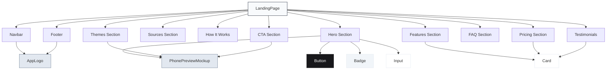
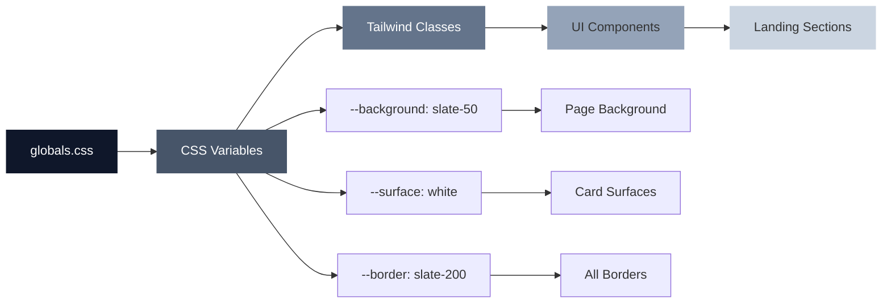

# Landing Page Monochrome Redesign — Implementation Plan

## Overview
Transform the Showreels.id landing page from colorful blue/purple gradients to an ultra-clean monochrome design system matching the dashboard's aesthetic. This redesign ensures visual consistency across the entire platform using slate/zinc/white as the foundation.

## Design System Foundation

### Color Tokens (PRD Specification)
```typescript
const monochromeTheme = {
  // Page & Surface
  page: "bg-slate-50",
  surface: "bg-white",
  surfaceMuted: "bg-slate-100",
  
  // Text Hierarchy
  textPrimary: "text-slate-950",
  textSecondary: "text-slate-500",
  textMuted: "text-slate-400",
  
  // Borders
  border: "border border-slate-200",
  borderActive: "border-zinc-900",
  
  // Primary Actions
  primary: "bg-zinc-900 text-white",
  primaryHover: "hover:bg-zinc-800",
  
  // Secondary Actions
  secondary: "bg-white text-slate-900 border border-slate-200 hover:bg-slate-50",
  
  // States
  active: "bg-zinc-900 text-white",
  badge: "bg-slate-100 text-slate-600 border border-slate-200",
  positive: "bg-emerald-50 text-emerald-600 border border-emerald-100",
}
```

### Typography System
- **Font Family**: Inter (replacing Plus Jakarta Sans for landing)
- **Heading Primary**: `text-slate-950 font-semibold tracking-tight`
- **Body Text**: `text-slate-500 leading-relaxed`
- **Labels**: `uppercase tracking-[0.18em] text-xs font-medium text-slate-400`
- **Accent Text**: `font-serif italic text-slate-700` (NOT blue)

## Current State Analysis

### Files to Modify
1. [`src/app/globals.css`](src/app/globals.css) — CSS variables and theme tokens
2. [`src/components/landing-page.tsx`](src/components/landing-page.tsx) — Main landing component (1969 lines)
3. [`src/components/app-logo.tsx`](src/components/app-logo.tsx) — Logo component
4. [`src/components/ui/button.tsx`](src/components/ui/button.tsx) — Button component
5. [`src/components/ui/badge.tsx`](src/components/ui/badge.tsx) — Badge component
6. [`src/components/ui/card.tsx`](src/components/ui/card.tsx) — Card component

### Current Color Issues Identified
- **CSS Variables**: Blue gradients in `:root` and body background
- **Hero Section**: Blue accent text, blue buttons, blue phone mockup backgrounds
- **Features Section**: Blue badges, blue gradients in cards
- **Platform Sources**: Colorful brand icons (YouTube red, Drive blue, etc.)
- **Themes Section**: Blue/purple gradient phone backgrounds
- **Pricing**: Blue highlight borders and badges
- **Testimonials**: Yellow star ratings, blue/purple avatar gradients
- **FAQ**: Blue icon backgrounds
- **CTA Section**: Blue dark backgrounds and buttons
- **Footer**: Blue link hover states

## Implementation Strategy

### Phase 1: Foundation & Global Styles

#### 1.1 Update Global CSS Variables
**File**: [`src/app/globals.css`](src/app/globals.css:1)

**Changes Required**:
```css
:root {
  /* Replace blue variables with monochrome */
  --background: #f8fafc; /* slate-50 */
  --foreground: #0f172a; /* slate-950 */
  --surface: rgba(255, 255, 255, 0.95);
  --surface-muted: #f1f5f9; /* slate-100 */
  --border: #e2e8f0; /* slate-200 */
  
  /* Remove brand colors */
  /* --color-brand-* removed */
  /* --color-accent-* removed */
}

body {
  background: var(--background);
  /* Remove blue gradient background */
  background-image: none;
}
```

#### 1.2 Update UI Components

**File**: [`src/components/ui/button.tsx`](src/components/ui/button.tsx:1)
```typescript
const variantClasses: Record<ButtonVariant, string> = {
  primary: "bg-zinc-900 text-white hover:bg-zinc-800 shadow-sm",
  secondary: "border border-slate-200 bg-white text-slate-900 hover:bg-slate-50",
  ghost: "text-slate-600 hover:bg-slate-100 hover:text-slate-950",
}
```

**File**: [`src/components/ui/badge.tsx`](src/components/ui/badge.tsx:1)
```typescript
// Add variant support
type BadgeVariant = "default" | "positive" | "dark";

const variantClasses = {
  default: "border-slate-200 bg-slate-100 text-slate-600",
  positive: "border-emerald-100 bg-emerald-50 text-emerald-600",
  dark: "border-zinc-900 bg-zinc-900 text-white",
}
```

**File**: [`src/components/ui/card.tsx`](src/components/ui/card.tsx:1)
```typescript
// Already monochrome-ready, verify shadow
className: "rounded-2xl border border-slate-200 bg-white shadow-sm"
```

### Phase 2: Section-by-Section Redesign

#### 2.1 Navbar Component
**Location**: [`src/components/landing-page.tsx`](src/components/landing-page.tsx:725)

**Changes**:
- Background: `bg-white/80 backdrop-blur-xl border-b border-slate-200`
- Links: `text-slate-500 hover:text-slate-950`
- Logo: Ensure monochrome version
- Language toggle: Badge style with `bg-slate-100 text-slate-600`
- Mobile menu: `bg-white border-slate-200`

#### 2.2 Hero Section
**Location**: [`src/components/landing-page.tsx`](src/components/landing-page.tsx:970)

**Changes**:
- Badge: `bg-slate-100 text-slate-600 border border-slate-200` (remove emerald)
- Heading accent: Remove blue, use `font-serif italic text-slate-700`
- Input container: `bg-white border-slate-200`
- Primary button: `bg-zinc-900 text-white hover:bg-zinc-800`
- Status badge: Keep emerald for available, use rose for error
- Phone mockup background: `bg-zinc-950` or `bg-slate-950`
- Phone card links: `bg-white text-slate-900 border-slate-200`
- Platform icons in phone: `bg-slate-100 text-slate-700`

#### 2.3 Features Section (Bento Grid)
**Location**: [`src/components/landing-page.tsx`](src/components/landing-page.tsx:1132)

**Changes**:
- Section background: `bg-slate-50`
- Badge: `bg-slate-100 text-slate-600`
- Heading: `text-slate-950` (remove gradient)
- All cards: `bg-white border-slate-200 rounded-2xl shadow-sm`
- Profile card cover: `bg-gradient-to-br from-slate-200 to-slate-300`
- Skill badges: `bg-slate-100 text-slate-600`
- Contact button: `bg-zinc-900 text-white`
- Platform icons: Monochrome `text-slate-700` with `bg-slate-100`
- Visibility icons: `text-slate-500`
- Active state: `border-zinc-900`

#### 2.4 Video Sources Section
**Location**: [`src/components/landing-page.tsx`](src/components/landing-page.tsx:1313)

**Changes**:
- Background: `bg-white`
- Platform icons: Convert to monochrome outline style `text-slate-700`
- Icon containers: `bg-slate-100 border-slate-200`
- "Supported" badge: `bg-emerald-50 text-emerald-600 border-emerald-100`
- Remove brand colors (YouTube red, Drive blue, etc.)

#### 2.5 How It Works Section
**Location**: [`src/components/landing-page.tsx`](src/components/landing-page.tsx:1390)

**Changes**:
- Background: `bg-slate-50`
- Step badges: `bg-zinc-900 text-white`
- Step icon containers: `bg-slate-100 text-slate-700`
- Card borders: `border-slate-200`
- Illustration elements: Use slate tones only
- Arrow connectors: `text-slate-300`

#### 2.6 Themes Section
**Location**: [`src/components/landing-page.tsx`](src/components/landing-page.tsx:1513)

**Changes**:
- Phone mockup backgrounds: Replace all blue gradients
  - Creator Clean: `from-slate-200/70 to-slate-300/80`
  - Portfolio Warm: `from-slate-100/70 to-slate-200/80`
  - Studio Focus: `from-slate-300/70 to-slate-400/80`
  - Editorial Soft: `from-slate-50/70 to-slate-100/80`
  - Minimal Dark: `from-zinc-800/80 to-zinc-950/90`
- Avatar backgrounds: `bg-slate-100 text-slate-700`
- Link pills: `bg-white border-slate-200 text-slate-700`
- Active theme ring: `ring-zinc-900`

#### 2.7 Pricing Section
**Location**: [`src/components/landing-page.tsx`](src/components/landing-page.tsx:1568)

**Changes**:
- Container: `bg-white border-slate-200 rounded-3xl`
- Featured plan: `border-zinc-900 ring-1 ring-zinc-900` (not blue)
- "Most popular" badge: `bg-zinc-900 text-white`
- Plan cards: `bg-white border-slate-200`
- CTA button: `bg-zinc-900 text-white hover:bg-zinc-800`

#### 2.8 Testimonial Section
**Location**: [`src/components/landing-page.tsx`](src/components/landing-page.tsx:1644)

**Changes**:
- Star ratings: `text-slate-900` (not yellow)
- Light cards: `bg-white border-slate-200 text-slate-900`
- Dark cards: `bg-zinc-900 text-white border-zinc-900`
- Avatar circles: Monochrome gradients `from-slate-300 to-slate-500`
- Rating text: `text-slate-500`

#### 2.9 FAQ Section
**Location**: [`src/components/landing-page.tsx`](src/components/landing-page.tsx:1736)

**Changes**:
- Background: `bg-slate-50`
- Accordion container: `bg-white border-slate-200`
- Border between items: `border-slate-200`
- Icon buttons: `bg-slate-100 text-slate-700 border-slate-200`
- Open state: `bg-slate-50`
- Plus/minus icons: `text-slate-500`

#### 2.10 Final CTA Section
**Location**: [`src/components/landing-page.tsx`](src/components/landing-page.tsx:1772)

**Changes**:
- Background: `bg-zinc-950 border-zinc-900`
- Video overlay: Grayscale filter
- Badge: `bg-zinc-900 text-white border-zinc-800`
- Heading accent: `text-zinc-300` (not blue)
- Primary button: `bg-white text-zinc-950 hover:bg-slate-100`
- Secondary button: `border-white/20 text-white hover:bg-white/10`
- Phone mockups: Monochrome backgrounds
- Check icons: `bg-slate-100 text-slate-700`

#### 2.11 Footer
**Location**: [`src/components/landing-page.tsx`](src/components/landing-page.tsx:1878)

**Changes**:
- Background: `bg-white border-t border-slate-200`
- Text: `text-slate-500`
- Links: `hover:text-slate-950`
- Logo: Monochrome version

### Phase 3: Component Utilities

#### 3.1 PhonePreviewMockup Component
**Location**: [`src/components/landing-page.tsx`](src/components/landing-page.tsx:197)

**Changes**:
- Frame border: `border-zinc-900/40 ring-slate-200/60`
- Notch: `bg-zinc-950`
- Avatar fallback: `bg-slate-100 text-slate-700`
- Link pills: `bg-white/95 border-white/70 text-slate-700`
- Icon containers: `bg-slate-100 text-slate-700`
- Status badges: `bg-slate-100 text-slate-600`

#### 3.2 Toast Notification System
**New File**: Enhance existing [`src/components/ui/toast.tsx`](src/components/ui/toast.tsx:1)

**Implementation**:
```typescript
const toastVariants = {
  success: "border-emerald-100 bg-emerald-50 text-emerald-700",
  warning: "border-amber-100 bg-amber-50 text-amber-700",
  info: "border-slate-200 bg-white text-slate-700",
  error: "border-rose-100 bg-rose-50 text-rose-700",
}

// Icon backgrounds
const iconVariants = {
  success: "bg-emerald-100 text-emerald-700",
  warning: "bg-amber-100 text-amber-700",
  info: "bg-slate-100 text-slate-700",
  error: "bg-rose-100 text-rose-700",
}
```

### Phase 4: Logo & Branding

#### 4.1 AppLogo Component
**File**: [`src/components/app-logo.tsx`](src/components/app-logo.tsx:1)

**Changes**:
- Ensure logo image is monochrome or has minimal color
- Text color: `text-slate-950` for dark tone, `text-white` for light
- If logo.png is colorful, consider creating logo-mono.png

## Responsive Considerations

### Desktop (lg: 1024px+)
- Container: `max-w-7xl mx-auto px-6 lg:px-8`
- Grid: `grid-cols-12 gap-4`
- Hero: 2 columns (7/5 split)
- Features: 4 columns
- Pricing: 3 columns

### Tablet (md: 768px)
- Grid: `md:grid-cols-2`
- Padding: `px-6`
- Hero: 1 column, mockup below

### Mobile (< 768px)
- All sections: 1 column
- Padding: `px-4 py-12`
- Card padding: `p-4`
- Heading: `text-3xl`
- Hide decorative elements
- Stepper: Vertical stack

## Testing Checklist

### Visual Verification
- [ ] No blue/purple colors remain except in status states
- [ ] All gradients are monochrome (slate/zinc)
- [ ] Borders are consistent `border-slate-200`
- [ ] Active states use `zinc-900`
- [ ] Positive states use emerald (soft)
- [ ] Shadows are subtle `shadow-sm`

### Component Verification
- [ ] Button primary: zinc-900 background
- [ ] Button secondary: white with slate border
- [ ] Badge default: slate-100 background
- [ ] Card: white with slate-200 border
- [ ] Toast variants work correctly

### Section Verification
- [ ] Navbar: Clean white with slate text
- [ ] Hero: Monochrome input and mockup
- [ ] Features: Bento grid all white cards
- [ ] Sources: Platform icons monochrome
- [ ] How It Works: Stepper monochrome
- [ ] Themes: Phone previews monochrome
- [ ] Pricing: Highlight uses zinc-900
- [ ] Testimonials: Stars monochrome
- [ ] FAQ: Accordion monochrome
- [ ] CTA: Dark monochrome
- [ ] Footer: Clean white

### Responsive Verification
- [ ] Desktop layout works (1440px)
- [ ] Tablet layout works (768px)
- [ ] Mobile layout works (375px)
- [ ] Touch targets adequate on mobile
- [ ] Text readable at all sizes

## Migration Notes

### Breaking Changes
- All blue/purple theme colors removed
- Brand color variables deprecated
- Gradient backgrounds replaced with solid colors
- Icon colors standardized to monochrome

### Backward Compatibility
- Existing dashboard components unaffected
- Auth pages may need similar updates
- Public profile pages should follow same pattern

### Performance
- Simpler CSS reduces bundle size
- Fewer gradient calculations improve render performance
- Monochrome images can be optimized better

## Implementation Order

1. **Foundation First** (Phase 1)
   - Update global CSS
   - Update UI components
   - Test component library

2. **Top to Bottom** (Phase 2)
   - Navbar → Hero → Features → Sources
   - How It Works → Themes → Pricing
   - Testimonials → FAQ → CTA → Footer

3. **Polish** (Phase 3)
   - Phone mockup refinements
   - Toast system
   - Micro-interactions

4. **Verification** (Phase 4)
   - Logo updates
   - Responsive testing
   - Cross-browser testing

## Success Criteria

### Visual Consistency
✅ Landing page matches dashboard monochrome aesthetic
✅ No colorful elements except controlled status indicators
✅ Typography hierarchy clear without color
✅ Spacing and borders create visual structure

### User Experience
✅ CTAs clearly identifiable without bright colors
✅ Interactive elements have clear hover states
✅ Form inputs accessible and clear
✅ Mobile experience optimized

### Technical Quality
✅ No console errors
✅ Lighthouse score maintained
✅ Accessibility standards met (WCAG AA)
✅ Performance metrics stable

## Mermaid Diagram: Component Hierarchy



## Mermaid Diagram: Color Token Flow



## Next Steps

After plan approval:
1. Switch to Code mode for implementation
2. Start with Phase 1 (Foundation)
3. Implement sections sequentially
4. Test after each major section
5. Final verification and polish

## Questions for Clarification

1. Should the logo.png be replaced with a monochrome version, or keep existing?
2. For platform icons (YouTube, Drive, etc.), use outline style or filled monochrome?
3. Should emerald positive states be used sparingly or more liberally?
4. Any specific Inter font weights to prioritize (400, 500, 600, 700)?

---

**Ready for implementation?** This plan provides a complete roadmap for transforming the landing page to match the ultra-clean monochrome design system specified in the PRD.
