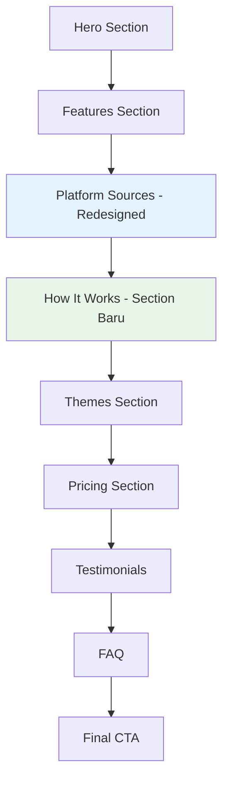
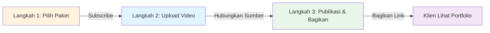

# Redesign Landing Page: Bagian Video Sources & How It Works

## Ringkasan
Redesign bagian "Sumber video yang didukung Showreels" agar lebih clean dan modern, serta menambahkan bagian baru "How it Works" yang terinspirasi dari gambar referensi dengan alur 3 langkah.

## Analisis Gambar Referensi

### Gambar Referensi (1.png)
Gambar referensi menampilkan bagian "HOW IT WORKS" dengan:
- **Judul**: "Fast & Easy" di tengah atas
- **Proses 3 Langkah** ditampilkan dalam kartu:
  - **Step 1**: "Pick a plan & subscribe" - Menampilkan UI subscription dengan tombol Subscribe
  - **Step 2**: "48-Hours Updates" - Menampilkan interface progress/update dengan tombol "48-Hours Update"
  - **Step 3**: "Approval & Repeat" - Menampilkan dokumen dengan tanda centang untuk approval
- **Gaya Visual**: 
  - Kartu putih bersih dengan bayangan halus
  - Background abu-abu muda/netral
  - Ilustrasi/ikon minimalis
  - Alur terhubung dengan panah melengkung antar langkah
  - Spasi dan alignment yang konsisten

## Analisis Kondisi Saat Ini

### Bagian Platform Sources Saat Ini (Baris 1162-1218)
Terletak di [`landing-page.tsx`](src/components/landing-page.tsx:1162)

**Desain Saat Ini:**
- Badge: "Platform"
- Judul: "Sumber video yang didukung Showreels"
- 5 kartu platform dalam grid (2 kolom di mobile, 5 kolom di desktop)
- Setiap kartu menampilkan: Ikon, Nama platform, Teks helper
- Background gradient untuk setiap platform
- Styling border dan shadow

**Masalah yang Perlu Diperbaiki:**
- Layout terasa sempit di mobile
- Bisa lebih clean dan modern secara visual
- Kurang hierarki visual yang jelas
- Tidak ada penekanan yang jelas pada platform utama

## Usulan Redesign

### 1. Redesign Bagian Video Sources

#### Desain Visual
```
┌─────────────────────────────────────────────────────────┐
│                    [BADGE: Platform]                     │
│                                                          │
│         Sumber video yang didukung Showreels            │
│                                                          │
│    Hubungkan karya dari platform utama yang sudah       │
│         dipakai creator sehari-hari...                  │
│                                                          │
│  ┌──────┐  ┌──────┐  ┌──────┐  ┌──────┐  ┌──────┐    │
│  │ GDrv │  │  YT  │  │  IG  │  │ Vimeo│  │  FB  │    │
│  │  🔵  │  │  🔴  │  │  🟣  │  │  🔵  │  │  🔵  │    │
│  │Drive │  │YouTube│  │Insta │  │Vimeo │  │ Face │    │
│  └──────┘  └──────┘  └──────┘  └──────┘  └──────┘    │
│                                                          │
└─────────────────────────────────────────────────────────┘
```

#### Perubahan Utama:
- **Desain kartu lebih bersih**: Hapus gradient berat, gunakan background halus
- **Spasi lebih baik**: Tingkatkan padding dan gap antar kartu
- **Ikon yang disederhanakan**: Lebih besar, ikon platform lebih menonjol
- **Ukuran konsisten**: Semua kartu ukuran sama, alignment lebih baik
- **Layout mobile lebih baik**: Stacking yang lebih baik di layar kecil
- **Animasi halus**: Fade-in saat scroll, efek hover

#### Spesifikasi Teknis:
- Background kartu: `bg-white` dengan border halus
- Container ikon: Lebih besar (h-14 w-14), di tengah
- Tipografi: Hierarki lebih bersih
- Spasi: Gap ditingkatkan dari `gap-3` ke `gap-4` atau `gap-5`
- Border radius: Lebih konsisten `rounded-2xl`
- Shadow: Lebih ringan, lebih halus `shadow-sm`

### 2. Bagian Baru "How It Works"

#### Desain Visual
```
┌─────────────────────────────────────────────────────────┐
│                [BADGE: How It Works]                     │
│                                                          │
│                    Fast & Easy                           │
│                                                          │
│         Mulai gunakan Showreels dalam 3 langkah         │
│                                                          │
│  ┌──────────┐      ┌──────────┐      ┌──────────┐     │
│  │ Langkah 1│  ──→ │ Langkah 2│  ──→ │ Langkah 3│     │
│  │          │      │          │      │          │     │
│  │   📝     │      │   🔄     │      │   ✅     │     │
│  │          │      │          │      │          │     │
│  │  Pilih   │      │  Upload  │      │Publikasi │     │
│  │  paket & │      │   video  │      │   dan    │     │
│  │  daftar  │      │   kamu   │      │  bagikan │     │
│  │          │      │          │      │          │     │
│  └──────────┘      └──────────┘      └──────────┘     │
│                                                          │
└─────────────────────────────────────────────────────────┘
```

#### Struktur Konten:
**Langkah 1: Pilih paket & daftar**
- Ikon: Ikon User/Profile atau ikon subscription
- Judul: "Pilih paket & daftar" (ID) / "Pick a plan & subscribe" (EN)
- Deskripsi: "Pilih paket yang cocok, lalu daftar dengan email atau Google dalam hitungan menit."
- Visual: Mockup menampilkan tombol/form subscription

**Langkah 2: Upload video kamu**
- Ikon: Ikon Upload/Video
- Judul: "Upload video kamu" (ID) / "Upload your videos" (EN)
- Deskripsi: "Hubungkan video dari YouTube, Drive, Instagram, Vimeo, atau Facebook ke portfolio kamu."
- Visual: Mockup menampilkan interface upload video

**Langkah 3: Publikasikan & bagikan**
- Ikon: Ikon Checkmark/Share
- Judul: "Publikasikan & bagikan" (ID) / "Publish and share" (EN)
- Deskripsi: "Atur visibilitas, publikasikan karya, dan bagikan link profil kamu ke klien."
- Visual: Mockup menampilkan profil yang sudah dipublikasikan dengan tanda centang

#### Spesifikasi Teknis:
- Background section: Abu-abu muda `bg-[#f7f9fc]` atau serupa
- Desain kartu: Kartu putih dengan `rounded-2xl`, shadow halus
- Layout: 3 kolom di desktop, stacked di mobile
- Indikator langkah: Label "Langkah 1", "Langkah 2", "Langkah 3"
- Panah penghubung: Panah melengkung antar kartu (hanya desktop)
- Ikon: Ikon besar berwarna (h-12 w-12 atau lebih besar)
- Animasi: Fade-in saat scroll, efek stagger untuk kartu

## Rencana Implementasi

### Fase 1: Update Dictionary i18n
Tambahkan key translasi baru ke [`i18n.ts`](src/lib/i18n.ts):

```typescript
// Indonesian
landingHowItWorksBadge: "Cara Kerja",
landingHowItWorksTitleLead: "Fast &",
landingHowItWorksTitleAccent: "Easy",
landingHowItWorksDescription: "Mulai gunakan Showreels dalam 3 langkah sederhana dan cepat.",

landingHowItWorksStep1Label: "Langkah 1",
landingHowItWorksStep1Title: "Pilih paket & daftar",
landingHowItWorksStep1Description: "Pilih paket yang cocok, lalu daftar dengan email atau Google dalam hitungan menit.",

landingHowItWorksStep2Label: "Langkah 2",
landingHowItWorksStep2Title: "Upload video kamu",
landingHowItWorksStep2Description: "Hubungkan video dari YouTube, Drive, Instagram, Vimeo, atau Facebook ke portfolio kamu.",

landingHowItWorksStep3Label: "Langkah 3",
landingHowItWorksStep3Title: "Publikasikan & bagikan",
landingHowItWorksStep3Description: "Atur visibilitas, publikasikan karya, dan bagikan link profil kamu ke klien.",

// English
landingHowItWorksBadge: "How It Works",
landingHowItWorksTitleLead: "Fast &",
landingHowItWorksTitleAccent: "Easy",
landingHowItWorksDescription: "Start using Showreels in 3 simple and quick steps.",

landingHowItWorksStep1Label: "Step 1",
landingHowItWorksStep1Title: "Pick a plan & subscribe",
landingHowItWorksStep1Description: "Choose the right plan, then sign up with email or Google in minutes.",

landingHowItWorksStep2Label: "Step 2",
landingHowItWorksStep2Title: "Upload your videos",
landingHowItWorksStep2Description: "Connect videos from YouTube, Drive, Instagram, Vimeo, or Facebook to your portfolio.",

landingHowItWorksStep3Label: "Step 3",
landingHowItWorksStep3Title: "Publish and share",
landingHowItWorksStep3Description: "Set visibility, publish your work, and share your profile link with clients.",
```

### Fase 2: Redesign Bagian Platform Sources

**Lokasi**: [`landing-page.tsx`](src/components/landing-page.tsx:1162-1218)

**Perubahan**:
1. Update styling kartu untuk tampilan lebih bersih
2. Sederhanakan background gradient
3. Tingkatkan spasi dan padding
4. Perbaiki responsivitas mobile
5. Tambahkan animasi hover yang halus
6. Update ukuran ikon untuk visibilitas lebih baik

**Styling Baru**:
```tsx
// Container kartu
className="rounded-2xl border border-[#e5eaf2] bg-white p-5 text-center shadow-sm transition-all hover:shadow-md hover:-translate-y-1"

// Container ikon
className="mx-auto inline-flex h-14 w-14 items-center justify-center rounded-full bg-[#f0f4ff] border border-[#d5e1ff]"

// Layout grid
className="mt-8 grid grid-cols-2 gap-4 sm:grid-cols-3 lg:grid-cols-5 lg:gap-5"
```

### Fase 3: Buat Bagian "How It Works"

**Lokasi**: Sisipkan setelah bagian Platform Sources, sebelum bagian Themes

**Struktur Komponen**:
```tsx
<section className="mx-auto w-full max-w-[1160px] px-4 py-12 sm:px-6 sm:py-16 lg:px-8 lg:py-20">
  <div className="text-center">
    <Badge className={sectionBadgeClass}>
      {dictionary.landingHowItWorksBadge}
    </Badge>
    <h2 className={sectionTitleClass}>
      {dictionary.landingHowItWorksTitleLead}{" "}
      <span className={accentTextClass}>
        {dictionary.landingHowItWorksTitleAccent}
      </span>
    </h2>
    <p className={centeredSectionDescriptionClass}>
      {dictionary.landingHowItWorksDescription}
    </p>
  </div>

  <div className="mt-8 grid gap-6 lg:grid-cols-3 lg:gap-8">
    {/* Kartu Langkah 1 */}
    {/* Kartu Langkah 2 */}
    {/* Kartu Langkah 3 */}
  </div>
</section>
```

**Komponen Kartu Langkah**:
```tsx
<m.article
  initial={{ opacity: 0, y: 20 }}
  whileInView={{ opacity: 1, y: 0 }}
  viewport={{ once: true, amount: 0.3 }}
  transition={{ duration: 0.4, delay: index * 0.15 }}
  className="relative rounded-2xl border border-[#e5eaf2] bg-white p-6 text-center shadow-sm"
>
  {/* Label langkah */}
  <span className="inline-flex items-center gap-2 rounded-full bg-[#eef5ff] px-3 py-1 text-xs font-semibold uppercase tracking-wider text-[#2f66e4]">
    {stepLabel}
  </span>
  
  {/* Ikon */}
  <div className="mx-auto mt-5 inline-flex h-16 w-16 items-center justify-center rounded-full bg-gradient-to-br from-[#eef5ff] to-[#d5e7ff]">
    <StepIcon className="h-8 w-8 text-[#2f66e4]" />
  </div>
  
  {/* Judul */}
  <h3 className="mt-4 text-xl font-bold text-[#1d1714]">
    {stepTitle}
  </h3>
  
  {/* Deskripsi */}
  <p className="mt-2 text-sm text-[#5c514b] leading-relaxed">
    {stepDescription}
  </p>
  
  {/* Panah penghubung (hanya desktop) */}
  {index < 2 && (
    <div className="absolute -right-4 top-1/2 hidden -translate-y-1/2 lg:block">
      <ArrowRight className="h-6 w-6 text-[#cbd5e1]" />
    </div>
  )}
</m.article>
```

### Fase 4: Ikon untuk Langkah-langkah

Gunakan ikon lucide-react:
- **Langkah 1**: `UserPlus` atau `CreditCard` atau `CheckSquare`
- **Langkah 2**: `Upload` atau `Video` atau `Link`
- **Langkah 3**: `CheckCircle` atau `Share2` atau `Sparkles`

### Fase 5: Perilaku Responsif

**Mobile (< 640px)**:
- Kartu platform: 2 kolom
- How It Works: Stacked vertikal
- Tidak ada panah penghubung
- Padding dikurangi

**Tablet (640px - 1024px)**:
- Kartu platform: 3 kolom
- How It Works: 2 kolom, lalu 1 di baris ketiga
- Spasi disesuaikan

**Desktop (> 1024px)**:
- Kartu platform: 5 kolom
- How It Works: 3 kolom dengan panah penghubung
- Spasi dan animasi penuh

## Hierarki Visual & Styling

### Palet Warna
- **Biru Utama**: `#2f66e4` / `#2f73ff`
- **Biru Muda**: `#eef5ff` / `#d5e7ff`
- **Abu-abu Netral**: `#f7f9fc` / `#e5eaf2`
- **Teks Gelap**: `#1d1714` / `#1f1a17`
- **Teks Terang**: `#5c514b` / `#6f625b`

### Tipografi
- **Judul Section**: `text-section-display font-extrabold`
- **Judul Kartu**: `text-xl font-bold`
- **Teks Body**: `text-sm` atau `text-base`
- **Label**: `text-xs font-semibold uppercase`

### Spasi
- **Padding Section**: `py-12 sm:py-16 lg:py-20`
- **Padding Kartu**: `p-5` atau `p-6`
- **Gap Grid**: `gap-4` sampai `gap-8`
- **Margin Elemen**: `mt-4` sampai `mt-8`

## Strategi Animasi

### Kartu Platform Sources
```tsx
initial={{ opacity: 0, y: 8 }}
whileInView={{ opacity: 1, y: 0 }}
viewport={{ once: true, amount: 0.4 }}
transition={{ duration: 0.25, delay: index * 0.05 }}
```

### Kartu How It Works
```tsx
initial={{ opacity: 0, y: 20 }}
whileInView={{ opacity: 1, y: 0 }}
viewport={{ once: true, amount: 0.3 }}
transition={{ duration: 0.4, delay: index * 0.15 }}
```

### Efek Hover
```tsx
className="transition-all hover:shadow-md hover:-translate-y-1"
```

## Urutan Section di Landing Page

1. Hero Section
2. Features Section
3. **Platform Sources Section** (Redesigned) ✨
4. **How It Works Section** (Baru) ✨
5. Themes Section
6. Pricing Section
7. Testimonials Section
8. FAQ Section
9. Final CTA Section

## Checklist Testing

- [ ] Bagian platform sources tampil dengan benar di semua ukuran layar
- [ ] Bagian How It Works tampil dengan benar di semua ukuran layar
- [ ] Animasi trigger dengan benar saat scroll
- [ ] Efek hover bekerja dengan mulus
- [ ] Teks mudah dibaca dan aligned dengan benar
- [ ] Ikon tampil dengan benar
- [ ] Panah penghubung hanya muncul di desktop
- [ ] Translasi i18n bekerja untuk ID dan EN
- [ ] Tidak ada layout shift atau overflow
- [ ] Aksesibilitas: hierarki heading yang benar
- [ ] Aksesibilitas: label ARIA yang tepat jika diperlukan

## File yang Akan Dimodifikasi

1. [`src/lib/i18n.ts`](src/lib/i18n.ts) - Tambahkan entry dictionary baru
2. [`src/components/landing-page.tsx`](src/components/landing-page.tsx) - Update sections

## Diagram Mermaid: Alur Section



## Diagram Mermaid: Alur How It Works



## Kriteria Sukses

1. ✅ Bagian platform sources memiliki desain yang lebih bersih dan modern
2. ✅ Bagian How It Works menjelaskan proses 3 langkah dengan jelas
3. ✅ Kedua section fully responsive
4. ✅ Animasi meningkatkan pengalaman user tanpa mengganggu
5. ✅ Konsistensi visual dengan desain landing page yang ada
6. ✅ Dukungan i18n untuk Bahasa Indonesia dan Inggris
7. ✅ Pemahaman user yang lebih baik tentang kemampuan platform
8. ✅ Conversion funnel yang lebih baik dengan penjelasan proses yang jelas

## Langkah Selanjutnya

Setelah plan disetujui:
1. Switch ke mode Code
2. Implementasi update i18n
3. Redesign bagian Platform Sources
4. Buat bagian How It Works
5. Test di semua breakpoint
6. Verifikasi animasi dan interaksi
7. Review final dan penyesuaian
