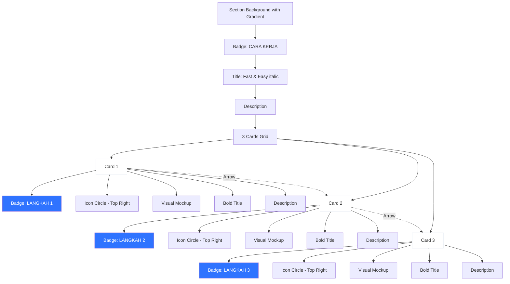

# Plan Enhancement Visual: How It Works & Platform Sources

## Analisis Referensi Gambar

### Referensi 1 (Gambar Pertama - HOW IT WORKS)
**Karakteristik:**
- Background abu-abu sangat terang/putih bersih
- Judul "HOW IT WORKS" dengan badge kecil di atas
- "Fast & Easy" sebagai judul utama (Fast hitam, Easy biru italic)
- 3 kartu putih dengan shadow halus
- Step labels di pojok kiri atas kartu
- Ilustrasi/mockup visual di tengah kartu (bukan hanya icon)
- Panah melengkung tipis menghubungkan kartu
- Typography clean dan modern

### Referensi 2 (Gambar Kedua - Bahasa Indonesia)
**Karakteristik:**
- Badge biru "CARA KERJA" di atas
- "Fast & Easy" dengan Easy dalam italic biru
- 3 kartu dengan shadow lebih prominent
- Label "LANGKAH 1/2/3" dalam badge biru di dalam kartu
- Icon besar dalam circle biru muda di kanan atas
- Judul bold di tengah
- Deskripsi di bawah
- Panah abu-abu tipis antar kartu

## Improvement yang Akan Dilakukan

### 1. Platform Sources Section - Logo Alignment

#### Masalah Saat Ini:
- Logo dalam circle tapi tidak perfectly aligned
- Ukuran icon bervariasi
- Background color kurang konsisten

#### Solusi:
```tsx
// Container yang lebih konsisten
<div className="mx-auto flex h-16 w-16 items-center justify-center rounded-full bg-gradient-to-br from-[#f0f5ff] to-[#e0ebff] border border-[#d0e0ff]">
  <PlatformIcon className="h-7 w-7" style={{ color: platform.brandColor }} />
</div>
```

**Perubahan:**
- Ukuran container konsisten: `h-16 w-16` (lebih besar)
- Gradient background yang lebih soft
- Icon size konsisten: `h-7 w-7`
- Gunakan brand color asli platform
- Perfect center alignment dengan flex

### 2. How It Works Section - Visual Enhancement

#### A. Layout & Structure

**Current:**
```
[Badge] [Icon] [Title] [Description] [Arrow]
```

**Enhanced:**
```
┌─────────────────────────────────────┐
│ [LANGKAH 1 Badge]    [Large Icon]  │
│                                     │
│         [Visual Mockup]             │
│                                     │
│      [Bold Title]                   │
│   [Description Text]                │
│                                     │
└─────────────────────────────────────┘
        ↓ (curved arrow)
```

#### B. Card Design Enhancement

**Styling Baru:**
```tsx
className="relative overflow-hidden rounded-3xl border border-[#e8edf5] bg-white p-8 shadow-[0_4px_20px_-4px_rgba(0,0,0,0.08)] transition-all hover:shadow-[0_8px_30px_-4px_rgba(0,0,0,0.12)] hover:-translate-y-1"
```

**Perubahan:**
- Border radius lebih besar: `rounded-3xl`
- Shadow lebih soft dan natural
- Padding lebih generous: `p-8`
- Hover effect lebih smooth

#### C. Step Badge Enhancement

**Current:**
```tsx
<span className="inline-flex items-center gap-2 rounded-full bg-[#eef5ff] px-3 py-1 text-xs font-semibold uppercase tracking-wider text-[#2f66e4]">
```

**Enhanced:**
```tsx
<span className="inline-flex items-center gap-2 rounded-lg bg-[#2f73ff] px-4 py-2 text-xs font-bold uppercase tracking-wider text-white shadow-sm">
  LANGKAH {index + 1}
</span>
```

**Perubahan:**
- Background biru solid (seperti referensi)
- Text putih untuk kontras lebih baik
- Rounded-lg bukan rounded-full
- Padding lebih besar
- Shadow untuk depth

#### D. Icon Container Enhancement

**Current:**
```tsx
<div className="mx-auto mt-5 inline-flex h-16 w-16 items-center justify-center rounded-full bg-gradient-to-br from-[#eef5ff] to-[#d5e7ff]">
```

**Enhanced:**
```tsx
<div className="absolute right-6 top-6 flex h-20 w-20 items-center justify-center rounded-full bg-gradient-to-br from-[#dce7ff] to-[#c5d9ff] shadow-lg">
  <StepIcon className="h-10 w-10 text-[#2f66e4]" strokeWidth={2} />
</div>
```

**Perubahan:**
- Posisi absolute di kanan atas (seperti referensi)
- Ukuran lebih besar: `h-20 w-20`
- Icon lebih besar: `h-10 w-10`
- Shadow untuk depth
- Gradient lebih kuat

#### E. Visual Mockup/Illustration

**Tambahkan ilustrasi sederhana untuk setiap step:**

**Step 1 - Pilih Paket:**
```tsx
<div className="mx-auto my-6 flex h-32 w-full items-center justify-center">
  <div className="flex flex-col items-center gap-3">
    <div className="flex gap-2">
      <div className="h-8 w-20 rounded-lg bg-gradient-to-r from-[#e8f0ff] to-[#d5e5ff] border border-[#c5d9ff]" />
      <div className="h-8 w-20 rounded-lg bg-gradient-to-r from-[#2f73ff] to-[#1e5fd9] border border-[#1e5fd9]" />
      <div className="h-8 w-20 rounded-lg bg-gradient-to-r from-[#e8f0ff] to-[#d5e5ff] border border-[#c5d9ff]" />
    </div>
    <div className="flex items-center gap-2 rounded-full bg-[#1e1e1e] px-4 py-2 text-xs font-semibold text-white">
      <Check className="h-3 w-3" />
      Subscribe
    </div>
  </div>
</div>
```

**Step 2 - Upload Video:**
```tsx
<div className="mx-auto my-6 flex h-32 w-full items-center justify-center">
  <div className="relative">
    <div className="h-24 w-32 rounded-xl bg-gradient-to-br from-[#f0f5ff] to-[#e0ebff] border-2 border-dashed border-[#2f73ff] flex items-center justify-center">
      <PlayCircle className="h-12 w-12 text-[#2f73ff] opacity-40" />
    </div>
    <div className="absolute -right-2 -top-2 h-8 w-8 rounded-full bg-[#2f73ff] flex items-center justify-center shadow-lg">
      <Plus className="h-5 w-5 text-white" strokeWidth={3} />
    </div>
  </div>
</div>
```

**Step 3 - Publikasi:**
```tsx
<div className="mx-auto my-6 flex h-32 w-full items-center justify-center">
  <div className="relative">
    <div className="h-28 w-36 rounded-xl bg-white border-2 border-[#e5eaf2] shadow-md p-3">
      <div className="h-2 w-full rounded bg-[#e8edf5] mb-2" />
      <div className="h-2 w-3/4 rounded bg-[#e8edf5] mb-2" />
      <div className="h-2 w-5/6 rounded bg-[#e8edf5] mb-3" />
      <div className="h-1.5 w-full rounded bg-[#e8edf5] mb-1" />
      <div className="h-1.5 w-2/3 rounded bg-[#e8edf5]" />
    </div>
    <div className="absolute -right-3 -bottom-3 h-12 w-12 rounded-full bg-gradient-to-br from-[#10b981] to-[#059669] flex items-center justify-center shadow-lg">
      <Check className="h-7 w-7 text-white" strokeWidth={3} />
    </div>
  </div>
</div>
```

#### F. Typography Enhancement

**Title:**
```tsx
<h3 className="mt-6 text-2xl font-extrabold tracking-tight text-[#1a1a1a]">
  {step.title}
</h3>
```

**Description:**
```tsx
<p className="mt-3 text-[0.95rem] leading-relaxed text-[#6b7280]">
  {step.description}
</p>
```

#### G. Arrow Connector Enhancement

**Current:**
```tsx
<ArrowRight className="h-6 w-6 text-[#cbd5e1]" />
```

**Enhanced:**
```tsx
<svg className="h-8 w-8 text-[#d1d5db]" viewBox="0 0 24 24" fill="none" stroke="currentColor" strokeWidth="2">
  <path d="M5 12h14M12 5l7 7-7 7" strokeLinecap="round" strokeLinejoin="round"/>
</svg>
```

Atau gunakan curved arrow:
```tsx
<svg className="h-12 w-12 text-[#e5e7eb]" viewBox="0 0 48 48" fill="none">
  <path d="M8 24 Q 24 8, 40 24" stroke="currentColor" strokeWidth="2" fill="none" strokeLinecap="round"/>
  <path d="M35 20 L 40 24 L 35 28" stroke="currentColor" strokeWidth="2" fill="none" strokeLinecap="round" strokeLinejoin="round"/>
</svg>
```

### 3. Platform Sources - Enhanced Design

#### Card Enhancement:

**Current:**
```tsx
className="rounded-2xl border border-[#e5eaf2] bg-white p-5 text-center shadow-sm transition-all hover:shadow-md hover:-translate-y-1"
```

**Enhanced:**
```tsx
className="group relative overflow-hidden rounded-2xl border border-[#e8edf5] bg-white p-6 text-center shadow-[0_2px_12px_-2px_rgba(0,0,0,0.06)] transition-all hover:shadow-[0_8px_24px_-4px_rgba(0,0,0,0.1)] hover:-translate-y-2"
```

**Tambahkan gradient overlay on hover:**
```tsx
<div className="absolute inset-0 bg-gradient-to-br from-transparent to-[#f0f5ff] opacity-0 group-hover:opacity-100 transition-opacity duration-300" />
```

#### Logo Container Enhancement:

```tsx
<div className="relative z-10 mx-auto flex h-18 w-18 items-center justify-center rounded-full bg-gradient-to-br from-white to-[#f8faff] border-2 border-[#e0e8f5] shadow-sm group-hover:shadow-md group-hover:scale-110 transition-all duration-300">
  <div className="flex h-16 w-16 items-center justify-center rounded-full" style={{ backgroundColor: `${platform.lightBg}` }}>
    <PlatformIcon className="h-8 w-8" style={{ color: platform.brandColor }} />
  </div>
</div>
```

**Brand Colors untuk Platform:**
```tsx
const PLATFORM_SOURCES = [
  {
    name: "Google Drive",
    icon: SiGoogledrive,
    brandColor: "#4285F4",
    lightBg: "#E8F0FE",
  },
  {
    name: "YouTube",
    icon: SiYoutube,
    brandColor: "#FF0000",
    lightBg: "#FFEBEE",
  },
  {
    name: "Instagram",
    icon: SiInstagram,
    brandColor: "#E4405F",
    lightBg: "#FCE4EC",
  },
  {
    name: "Vimeo",
    icon: SiVimeo,
    brandColor: "#1AB7EA",
    lightBg: "#E1F5FE",
  },
  {
    name: "Facebook",
    icon: SiFacebook,
    brandColor: "#1877F2",
    lightBg: "#E3F2FD",
  },
];
```

### 4. Section Background Enhancement

**How It Works Section:**
```tsx
<section className="relative overflow-hidden bg-gradient-to-b from-[#fafbfc] to-white py-16 sm:py-20 lg:py-24">
  {/* Decorative elements */}
  <div className="absolute left-0 top-0 h-64 w-64 rounded-full bg-[#eef5ff] opacity-30 blur-3xl" />
  <div className="absolute right-0 bottom-0 h-64 w-64 rounded-full bg-[#f0f5ff] opacity-30 blur-3xl" />
  
  <div className="relative z-10 mx-auto w-full max-w-[1160px] px-4 sm:px-6 lg:px-8">
    {/* Content */}
  </div>
</section>
```

### 5. Title Enhancement

**Current:**
```tsx
<h2 className={sectionTitleClass}>
  {dictionary.landingHowItWorksTitleLead}{" "}
  <span className={accentTextClass}>
    {dictionary.landingHowItWorksTitleAccent}
  </span>
</h2>
```

**Enhanced:**
```tsx
<h2 className="mt-4 font-display text-[2.5rem] sm:text-[3rem] lg:text-[3.5rem] font-extrabold leading-tight tracking-tight text-[#0f1419]">
  {dictionary.landingHowItWorksTitleLead}{" "}
  <span className="font-accent italic text-[#2f73ff]">
    {dictionary.landingHowItWorksTitleAccent}
  </span>
</h2>
```

**Perubahan:**
- Font size lebih besar
- "Easy" dalam italic (seperti referensi)
- Tracking lebih tight
- Leading lebih tight untuk impact

## Implementation Checklist

### Phase 1: Platform Sources Enhancement
- [ ] Update PLATFORM_SOURCES dengan brand colors
- [ ] Enhance logo container dengan double circle
- [ ] Add gradient overlay on hover
- [ ] Improve shadow dan spacing
- [ ] Add scale animation on hover

### Phase 2: How It Works Enhancement
- [ ] Update card design dengan rounded-3xl
- [ ] Change step badge ke solid blue
- [ ] Move icon ke kanan atas (absolute positioning)
- [ ] Add visual mockups untuk setiap step
- [ ] Enhance typography (title & description)
- [ ] Improve arrow connectors
- [ ] Add decorative background elements

### Phase 3: Polish & Refinement
- [ ] Test responsive behavior
- [ ] Adjust spacing dan alignment
- [ ] Verify animations smooth
- [ ] Check color contrast accessibility
- [ ] Test di berbagai browser
- [ ] Optimize performance

## Expected Results

### Platform Sources:
- ✨ Logo perfectly aligned dan centered
- ✨ Brand colors yang authentic
- ✨ Hover effects yang smooth dan engaging
- ✨ Visual hierarchy yang jelas

### How It Works:
- ✨ Layout yang match dengan referensi
- ✨ Visual mockups yang membantu pemahaman
- ✨ Typography yang bold dan impactful
- ✨ Card design yang modern dan clean
- ✨ Animations yang smooth dan professional

## Mermaid Diagram: Enhanced Layout



## Next Steps

1. Switch ke Code mode
2. Implement platform sources enhancement
3. Implement How It Works visual improvements
4. Test dan refine
5. Commit dan push ke GitHub
6. Verify di Vercel deployment
