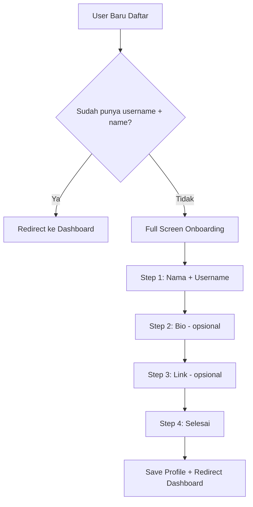

# Rencana: Fix Modal Centering + Redesign Onboarding Compact

## Masalah yang Ditemukan

### 1. AddLinkModal Tidak Rata Tengah
- Modal di `AddLinkModal.tsx:400` sudah menggunakan `fixed inset-0 flex items-center justify-center`
- Masalah: Saat muncul di halaman dengan sidebar (Link Bio page), modal terlihat offset karena content area sudah di-shift oleh sidebar
- Fix: Pastikan modal benar-benar `fixed inset-0` tanpa terpengaruh parent layout

### 2. Onboarding Terlalu Banyak Step
- Saat ini: name → role → username → bio → links → done (6 steps)
- Yang diminta: Nama+Username → Bio → Link → Selesai (4 steps, lebih compact)

---

## Rencana Implementasi

### Task 1: Fix AddLinkModal Centering

**File:** `src/components/build-link/add-link-modal/AddLinkModal.tsx`

- Pastikan wrapper `fixed inset-0` benar-benar centered
- Tambahkan `isolate` atau pastikan tidak ada parent transform yang mempengaruhi
- Verifikasi z-index cukup tinggi (sudah z-95)

### Task 2: Redesign OnboardingWizard - Compact 4 Steps

**File:** `src/components/onboarding/onboarding-wizard.tsx`

Ubah dari 6 steps menjadi 4 steps:

```
Step 1: "Identitas" - Nama + Username (gabung jadi satu screen)
Step 2: "Bio" - Bio singkat (opsional)
Step 3: "Link" - Tambah link (opsional)
Step 4: "Selesai" - Konfirmasi & masuk dashboard
```

**Desain per step:**
- Full screen (`min-h-dvh`)
- Content centered (`flex items-center justify-center`)
- Progress bar di atas
- Tombol navigasi di bawah: Back | Skip | Next

**Navigasi:**
- Step 1: Wajib (tidak bisa skip) - harus isi nama & username
- Step 2: Bisa skip
- Step 3: Bisa skip
- Step 4: Tombol "Masuk Dashboard"

### Task 3: Update Onboarding Page Logic

**File:** `src/app/onboarding/page.tsx`

- Tetap redirect ke dashboard jika sudah punya username & name
- Pastikan full-screen tanpa navbar/sidebar

### Task 4: Update .env.production dengan Tripay Sandbox Keys

**File:** `.env.production`

Update Tripay keys ke sandbox:
```
TRIPAY_API_KEY=DEV-nvu18SQM4yz6f3g5TmZmUWM7LqBTzxR1mf6JhmrV
TRIPAY_PRIVATE_KEY=5bI6g-sSsrJ-Xn5qZ-ZM2nB-w4hDb
TRIPAY_MERCHANT_CODE=T30523
TRIPAY_IS_PRODUCTION=false
TRIPAY_CALLBACK_SECRET=5bI6g-sSsrJ-Xn5qZ-ZM2nB-w4hDb
```

### Task 5: Push ke GitHub

---

## Diagram Alur Onboarding Baru



## File yang Perlu Diubah

1. `src/components/build-link/add-link-modal/AddLinkModal.tsx` - Fix centering
2. `src/components/onboarding/onboarding-wizard.tsx` - Redesign compact 4-step
3. `src/app/onboarding/page.tsx` - Pastikan logic redirect benar
4. `.env.production` - Update Tripay sandbox keys
5. `vercel-env-tripay-sandbox.env` - Sudah dibuat
