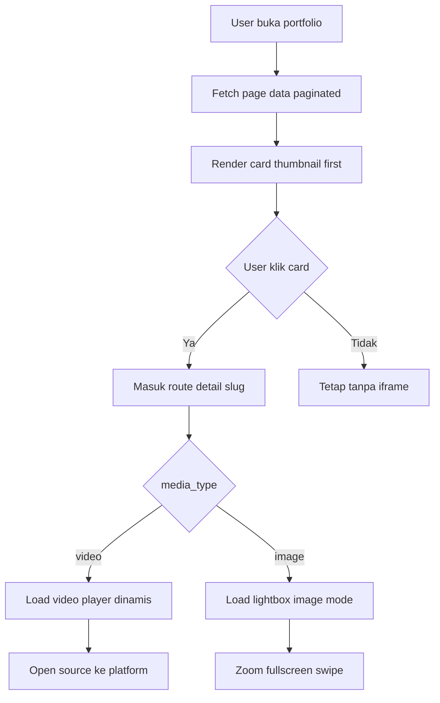

# PRD Implementation Plan — Portfolio Performance & UX Optimization

## 1) Konteks Arsitektur Existing

- Route portfolio creator publik saat ini sudah aktif di [`src/app/[slug]/show/page.tsx`](showreels-id-main/src/app/[slug]/show/page.tsx:1) dan merender komponen [`PortfolioCreatorPublicPage`](showreels-id-main/src/components/public/public-creator-pages.tsx:215).
- Route detail publik saat ini memakai slug tunggal di [`src/app/[slug]/page.tsx`](showreels-id-main/src/app/[slug]/page.tsx:1) yang bisa merender [`BioCreatorPublicPage`](showreels-id-main/src/components/public/public-creator-pages.tsx:115) atau [`VideoDetailPublicPage`](showreels-id-main/src/components/public/public-creator-pages.tsx:449).
- Data profile + video publik disuplai dari [`getPublicProfile`](showreels-id-main/src/server/public-data.ts:472) dan [`getPublicVideo`](showreels-id-main/src/server/public-data.ts:579).
- Model tabel media saat ini berada di [`videos`](showreels-id-main/src/db/schema.ts:122).

## 2) Keputusan Scope Final

- Tetap mempertahankan struktur route existing:
  - portfolio: [`/[slug]/show`](showreels-id-main/src/lib/public-route-utils.ts:39)
  - detail media: [`/[slug]`](showreels-id-main/src/lib/public-route-utils.ts:43)
- Tidak memecah route detail untuk image agar SEO slug dan canonical existing tetap aman.
- Library image detail yang dipakai: `yet-another-react-lightbox`.
- Fase render list:
  - fase awal: pagination server-driven
  - fase lanjutan: virtual list berbasis `react-virtual` setelah stabil

## 3) Desain Data Model & Migrasi

### 3.1 Perubahan tabel [`videos`](showreels-id-main/src/db/schema.ts:122)

Tambahkan kolom baru:

- `media_type` text default `video`
  - value: `video` | `image`
- `preview_type` text default empty
  - value target: `youtube` | `tiktok` | `vimeo` | `upload` | `image`
- `preview_image` text default empty
- `source_url` sudah ada di [`sourceUrl`](showreels-id-main/src/db/schema.ts:150), dipertahankan
- `thumbnail_url` sudah ada di [`thumbnailUrl`](showreels-id-main/src/db/schema.ts:141), dipertahankan

### 3.2 Backward compatibility

- Semua data existing di-backfill:
  - `media_type = video`
  - `preview_type = source` untuk source yang valid
  - `preview_image = thumbnail_url` bila ada
- Query lama tetap jalan karena kolom lama tidak dihapus.
- Adaptasi schema TypeScript di [`VideoItem`](showreels-id-main/src/lib/types.ts:58) dan validator di [`videoSchema`](showreels-id-main/src/lib/auth-schemas.ts:233).

### 3.3 Indeks yang disarankan

- Tambah index gabungan pada `user_id`, `visibility`, `media_type`, `created_at`.
- Tujuan: paging publik dan lookup next/previous lebih efisien.

## 4) Pipeline Thumbnail TikTok + Fallback Berlapis

### 4.1 Lokasi integrasi backend

- Create API: [`POST /api/videos`](showreels-id-main/src/app/api/videos/route.ts:40)
- Update API: [`PATCH /api/videos/[id]`](showreels-id-main/src/app/api/videos/[id]/route.ts:39)

### 4.2 Alur pipeline

1. Normalisasi URL lewat [`validateEmbedReadyVideoUrl`](showreels-id-main/src/lib/video-utils.ts:254).
2. Jika source TikTok:
   - panggil service fetch thumbnail (provider utama TikWM, fallback oEmbed)
   - simpan ke `thumbnail_url` atau `preview_image`.
3. Jika fetch gagal, lanjut resolver fallback prioritas.

### 4.3 Resolver prioritas thumbnail global

Urutan final:
1. custom thumbnail creator
2. auto-generated thumbnail backend
3. platform thumbnail
4. default [`public/default-thumbnail.jpg`](showreels-id-main/public/default-thumbnail.jpg)

Implement resolver util tunggal di [`src/lib/video-utils.ts`](showreels-id-main/src/lib/video-utils.ts:1) agar dipakai lintas:
- card portfolio [`PortfolioVideoCard`](showreels-id-main/src/components/public/public-creator-pages.tsx:374)
- card bio pinned [`BioCreatorPublicPage`](showreels-id-main/src/components/public/public-creator-pages.tsx:115)
- metadata detail [`generateMetadata`](showreels-id-main/src/app/[slug]/page.tsx:23)
- carousel detail [`MediaPreviewCarousel`](showreels-id-main/src/components/media-preview-carousel.tsx:28)

## 5) Strategi Performa Halaman Portfolio Publik

### 5.1 Prinsip render

- Thumbnail-first: jangan render iframe di list awal.
- Player hanya di-inject saat user klik card atau masuk detail.
- Matikan autoplay pada context portfolio list.

### 5.2 Tahap awal pagination

- Tambah parameter page pada route [`/[slug]/show`](showreels-id-main/src/app/[slug]/show/page.tsx:60).
- Fetch data bertahap di [`getPublicProfile`](showreels-id-main/src/server/public-data.ts:472) agar tidak merender semua item.
- UI skeleton card saat loading page.

### 5.3 Tahap lanjutan virtual list

- Setelah stabil, ganti renderer list ke `react-virtual`.
- Tetap mempertahankan fallback pagination untuk browser/perangkat low-end.

### 5.4 Prevent massive re-render

- Memoisasi komponen card publik dengan [`React.memo`](showreels-id-main/src/components/public/public-creator-pages.tsx:374).
- Stabilkan callback dengan [`useCallback`](showreels-id-main/src/components/media-preview-carousel.tsx:28) untuk interaksi gallery.
- Cache derived list pakai [`useMemo`](showreels-id-main/src/components/media-preview-carousel.tsx:42).

## 6) Strategi Optimasi Halaman Detail [`/[slug]`](showreels-id-main/src/app/[slug]/page.tsx:92)

- Pisahkan player berat dengan dynamic import `ssr: false`.
- Gunakan suspense + skeleton di area preview.
- Hydration media hanya saat viewport/interaksi.
- Konten related/creator section diload bertahap.

### 6.1 Open Source action

- Tombol source tetap di detail card [`VideoDetailPublicPage`](showreels-id-main/src/components/public/public-creator-pages.tsx:449).
- Wajib `target` blank + `rel` noopener noreferrer seperti implementasi yang sudah ada di [`Link`](showreels-id-main/src/components/public/public-creator-pages.tsx:488).

### 6.2 QR dipindah ke share modal

- Gunakan komponen existing [`PublicShareQrActions`](showreels-id-main/src/components/public/public-share-qr-actions.tsx:10) sebagai pusat share.
- Remove tombol QR sebagai action primer terpisah.

## 7) Next/Previous Navigation

- Tambahkan resolver urutan karya di backend berdasarkan `created_at` atau urutan yang disepakati.
- Tampilkan navigasi jika total karya creator lebih dari 2.
- Desktop: tombol kiri/kanan pada sisi konten detail.
- Mobile: sticky bottom navigation.

## 8) Dukungan Image Portfolio pada Route yang Sama

- Gunakan `media_type` untuk menentukan renderer detail.
- Jika `media_type=image`:
  - render image viewer berbasis `yet-another-react-lightbox`
  - dukung zoom, fullscreen, swipe, next/back.
- Jika campuran media:
  - fallback ke gallery carousel aman dengan prioritas preview image.

## 9) Mobile Performance Guard

Di halaman publik [`public-creator-pages.tsx`](showreels-id-main/src/components/public/public-creator-pages.tsx:1):

- Kurangi animasi background berat pada mobile.
- Nonaktifkan efek blur berlebih.
- Prioritaskan transform + opacity.
- Hindari shadow dan filter yang mahal.

## 10) Cache & Delivery Media

- Tetap gunakan [`next/image`](showreels-id-main/src/components/public/public-creator-pages.tsx:1) untuk seluruh thumbnail/image.
- Pertahankan header immutable di [`next.config.ts`](showreels-id-main/next.config.ts:34).
- Tambah remote patterns untuk domain thumbnail baru bila diperlukan.
- Hindari [`unoptimized`](showreels-id-main/src/components/media-preview-carousel.tsx:157) untuk asset yang bisa dioptimasi.

## 11) Acceptance Criteria Teknis

### Portfolio page
- Scroll terasa smooth.
- Tidak ada preload iframe massal.
- Thumbnail selalu terisi sesuai fallback chain.
- Autoplay tidak aktif di list.

### Detail page
- TTFI lebih cepat karena dynamic hydration media.
- Tombol source membuka platform asli dengan aman.
- Next/back muncul sesuai aturan jumlah karya.
- Image detail mode berfungsi penuh.
- QR berada dalam flow share modal.

### Global
- Lazy load aktif di image/video/iframe.
- Skeleton tampil saat fetch/hydration.
- Mobile lebih stabil tanpa jank.

## 12) Urutan Implementasi Aman

1. Migrasi DB + tipe schema.
2. Update API create/update video untuk media_type + thumbnail resolver TikTok.
3. Refactor util resolver thumbnail tunggal.
4. Refactor list portfolio ke pagination + skeleton + thumbnail-first.
5. Refactor detail page dynamic media renderer video/image.
6. Tambah next/previous navigation.
7. Integrasi `yet-another-react-lightbox` untuk image detail.
8. Optimasi mobile effects dan cache pattern tambahan.
9. QA Lighthouse + regression checklist.
10. Fase upgrade pagination ke virtual list.

## 13) Diagram Arsitektur Alur Media

## 14) Risiko & Mitigasi

- Risiko mismatch data lama
  - mitigasi: migration backfill + fallback default pada resolver
- Risiko domain thumbnail baru belum diizinkan
  - mitigasi: update [`remotePatterns`](showreels-id-main/next.config.ts:7) sebelum rollout
- Risiko regresi SEO slug
  - mitigasi: route tetap di [`/[slug]`](showreels-id-main/src/app/[slug]/page.tsx:92) dan canonical existing dipertahankan
