# Rencana Implementasi PRD v3.0 — showreels.id

> **Tanggal:** 7 Mei 2026  
> **Berdasarkan:** PRD v3.0 Revisi Implementasi  
> **Status:** Draft untuk review

---

## Ringkasan Analisis Kondisi Saat Ini

### Temuan Utama dari Audit Codebase

| Area | Kondisi Saat Ini | Gap dengan PRD v3.0 |
|---|---|---|
| Payment Gateway | Sepenuhnya Midtrans — 47 referensi di `.ts` files | Harus migrasi ke Tripay |
| Verified Badge | Komponen `verified-badge.tsx` ada tapi sederhana, tanpa logic eligibility | Perlu helper `canShowVerifiedBadge` + integrasi plan |
| Plan Feature Matrix | Sudah ada di `plan-feature-matrix.ts` dengan lokalisasi | Perlu tambah property `verifiedBadge` |
| Subscription Policy | Sudah ada di `subscription-policy.ts` dengan entitlements | Perlu tambah `verifiedBadge` ke entitlements |
| Dashboard Navigation | Sudah pakai `next/link` di shell, tapi ada 19 `window.location` di `.tsx` | Beberapa perlu diganti client-side navigation |
| Onboarding | 4 step saat ini — termasuk video upload | Perlu disederhanakan jadi 3 step |
| Favicon | Ada di `src/app/favicon.ico` | Perlu pastikan metadata lengkap |
| Database Schema | `billingTransactions` sudah punya `provider`, `rawPayload` | Perlu tambah `checkoutUrl`, `qrUrl`, `payCode`, `expiredAt` |
| Env Variables | Midtrans keys di `.env.example` | Perlu ganti ke Tripay keys |

### File-file Kunci yang Terdampak

```
src/server/billing.ts                          — 873 baris, full Midtrans logic
src/server/subscription-policy.ts              — 265 baris, entitlements
src/lib/plan-feature-matrix.ts                 — 261 baris, feature rows
src/db/schema.ts                               — 568 baris, billing tables
src/components/dashboard/billing-panel.tsx      — 379 baris
src/components/onboarding/onboarding-stepper.tsx — 585 baris
src/components/dashboard/dashboard-shell.tsx   — 394 baris
src/components/verified-badge.tsx              — 10 baris
src/app/api/billing/checkout/route.ts          — 166 baris
src/app/api/billing/midtrans/webhook/route.ts  — 57 baris
.env.example                                   — 35 baris
```

---

## Arsitektur Perubahan

```mermaid
graph TD
    A[PRD v3.0 Revisi] --> B[Phase 1: Plan & Badge]
    A --> C[Phase 2: Tripay Migration]
    A --> D[Phase 3: Copywriting & UI]
    A --> E[Phase 4: Dashboard No Refresh]
    A --> F[Phase 5: Onboarding Simplification]
    A --> G[Phase 6: Favicon & Branding]
    
    B --> B1[plan-feature-matrix.ts update]
    B --> B2[subscription-policy.ts + badge helper]
    B --> B3[verified-badge.tsx enhanced]
    B --> B4[API /billing/plan response update]
    
    C --> C1[Tripay client helper baru]
    C --> C2[Callback handler baru]
    C --> C3[DB migration - field baru]
    C --> C4[Checkout route refactor]
    C --> C5[Deprecate Midtrans endpoints]
    
    D --> D1[Landing page copy]
    D --> D2[Pricing page copy]
    D --> D3[Billing page copy]
    D --> D4[Dashboard copy]
    
    E --> E1[Audit window.location usage]
    E --> E2[Replace dengan router/Link]
    E --> E3[Form preventDefault]
    
    F --> F1[Reduce 4 step ke 3 step]
    F --> F2[Remove video upload step]
    F --> F3[Simplify payload]
    
    G --> G1[Metadata update layout.tsx]
    G --> G2[Verify favicon files]
```



---

## Phase 1: Plan & Verified Badge

### 1.1 Update `src/lib/plan-feature-matrix.ts`

Tambahkan row baru untuk verified badge:

```ts
{
  id: "verified-badge",
  category: { id: "Centang Biru", en: "Verified Badge" },
  values: {
    free: { text: { id: "Tidak tersedia", en: "Not available" }, status: "unavailable" },
    creator: { text: { id: "Aktif selama plan berjalan", en: "Active while plan is active" }, status: "available" },
    business: { text: { id: "Aktif selama plan berjalan", en: "Active while plan is active" }, status: "available" },
  },
}
```

### 1.2 Buat helper `canShowVerifiedBadge`

Lokasi: `src/server/subscription-policy.ts`

```ts
export function canShowVerifiedBadge(subscription?: {
  planName: PlanName;
  status: SubscriptionStatus;
}) {
  if (!subscription) return false;
  const isPremium = subscription.planName === "creator" || subscription.planName === "business";
  const isUsable = subscription.status === "active" || subscription.status === "trial";
  return isPremium && isUsable;
}
```

**Catatan:** Saat ini `ENTITLED_SUBSCRIPTION_STATUSES` hanya berisi `"active"`. Perlu ditambahkan `"trial"` agar trial juga dianggap usable untuk badge.

### 1.3 Update `src/components/verified-badge.tsx`

Enhance komponen dengan:
- Tooltip support
- `aria-label` sesuai PRD: "Creator terverifikasi melalui plan aktif"
- Variant untuk expired state

### 1.4 Update API `/api/billing/plan`

Tambahkan field `verifiedBadge` di response:

```json
{
  "verifiedBadge": {
    "active": true,
    "label": "Terverifikasi",
    "reason": "Trial Creator aktif"
  }
}
```

### 1.5 Integrasi badge di UI

- Dashboard header — `dashboard-shell.tsx`
- Public profile — `src/app/[slug]/page.tsx`
- Onboarding preview — `onboarding-stepper.tsx` step 3
- Pricing card — `pricing-subscription-page.tsx`
- Billing page — `billing-panel.tsx`

---

## Phase 2: Migrasi Tripay

### 2.1 Environment Variables

**File:** `.env.example`

```bash
# Payment Gateway — Tripay
TRIPAY_API_KEY=""
TRIPAY_PRIVATE_KEY=""
TRIPAY_MERCHANT_CODE=""
TRIPAY_IS_PRODUCTION="false"
TRIPAY_CALLBACK_SECRET=""

# deprecated — Midtrans
# MIDTRANS_SERVER_KEY=""
# MIDTRANS_CLIENT_KEY=""
# MIDTRANS_IS_PRODUCTION=""
```

### 2.2 Buat Tripay Client Helper

**File baru:** `src/server/tripay.ts`

Fungsi utama:
- `getTripayConfig()` — runtime config
- `isTripayConfigured()` — check env
- `createTripayClosedPayment()` — create transaction
- `verifyTripayCallback()` — signature verification
- `mapTripayStatus()` — status mapping

### 2.3 Database Migration

**File baru:** `drizzle/0017_tripay_migration.sql`

```sql
ALTER TABLE billing_transactions
  ALTER COLUMN provider SET DEFAULT 'tripay';

ALTER TABLE billing_transactions
  ADD COLUMN IF NOT EXISTS checkout_url text DEFAULT '' NOT NULL,
  ADD COLUMN IF NOT EXISTS qr_url text DEFAULT '' NOT NULL,
  ADD COLUMN IF NOT EXISTS pay_code text DEFAULT '' NOT NULL,
  ADD COLUMN IF NOT EXISTS expired_at timestamp;

ALTER TABLE creator_settings
  ALTER COLUMN payment_method SET DEFAULT 'tripay';
```

### 2.4 Update Schema

**File:** `src/db/schema.ts`

Tambahkan field baru ke `billingTransactions`:
- `checkoutUrl`
- `qrUrl`
- `payCode`
- `expiredAt`

### 2.5 Refactor Billing Server

**File:** `src/server/billing.ts`

Strategi:
1. Pertahankan fungsi Midtrans lama dengan prefix `legacy_` atau biarkan untuk backward compatibility
2. Buat fungsi baru `createTripayUpgradeTransaction()` 
3. Update `createUpgradeTransaction()` untuk memanggil Tripay
4. Buat `handleTripayCallback()` 
5. Deprecate `handleMidtransWebhook()` — jangan hapus, masih dibutuhkan untuk transaksi lama

### 2.6 Buat Callback Endpoint

**File baru:** `src/app/api/billing/tripay/callback/route.ts`

Flow:
1. Terima POST dari Tripay
2. Verify signature
3. Map status
4. Update transaction + subscription
5. Return 200

### 2.7 Update Checkout Route

**File:** `src/app/api/billing/checkout/route.ts`

- Ganti panggilan `createUpgradeTransaction` agar menggunakan Tripay
- Error code `midtrans_not_configured` → `tripay_not_configured`

### 2.8 Deprecate Midtrans Endpoint

**File:** `src/app/api/billing/midtrans/webhook/route.ts`

- Tambahkan header `X-Deprecated: true`
- Log warning
- Tetap fungsional untuk transaksi lama yang belum selesai

---

## Phase 3: Copywriting & UI Update

### 3.1 Landing Page

**File:** `src/components/landing-page.tsx`

Update:
- Hero headline: "Portfolio video profesional untuk creator."
- Hero subheadline: "Tampilkan karya terbaik, link penting, dan profil creator Anda dalam satu halaman yang mudah dibagikan."
- CTA utama: "Mulai buat portfolio"
- CTA kedua: "Lihat paket"

### 3.2 Pricing Page

**File:** `src/components/pricing/pricing-subscription-page.tsx`

Update:
- CTA Free: "Mulai gratis"
- CTA Creator: "Coba Creator"
- CTA Business: "Pilih Business"
- Tambah badge "Termasuk centang biru" di Creator card
- Tambah "Free trial 1 bulan" di Creator card

### 3.3 Billing Page

**File:** `src/components/dashboard/billing-panel.tsx`

Update status copy sesuai PRD:
- Free: "Anda sedang menggunakan plan Free. Upgrade untuk membuka fitur profesional."
- Trial Creator: "Trial Creator aktif. Centang biru aktif sampai masa trial berakhir."
- Creator Active: "Plan Creator aktif. Centang biru aktif di profil Anda."
- Business Active: "Plan Business aktif. Centang biru aktif di profil Anda."
- Expired: "Plan Anda sudah berakhir. Centang biru dan fitur premium dinonaktifkan."
- Payment Pending: "Pembayaran sedang menunggu konfirmasi. Selesaikan pembayaran melalui Tripay."

### 3.4 Dashboard Shell

**File:** `src/components/dashboard/dashboard-shell.tsx`

Update route labels:
- "Build Link" → "Kelola Link"
- "Upload Video" → "Tambah Video"
- "Billing" → "Plan & Billing"

### 3.5 Terminologi UI Global

Cari dan ganti:
- "Showreel profile" → "Portfolio creator"
- "Semi-private" → "Terbatas"
- "Snap checkout" → "Pembayaran Tripay"
- "Verified Badge" → "Centang biru"
- "Trial Period" → "Trial 1 bulan"

---

## Phase 4: Dashboard Tanpa Full Refresh

### 4.1 Audit `window.location` Usage

Dari hasil search, ada 19 penggunaan `window.location` di `.tsx` files:

**Yang HARUS diganti ke client-side navigation:**
- `billing-panel.tsx:160` — `window.location.assign(/payment?plan=...)` → `router.push()`
- `link-builder-editor.tsx:976` — `window.location.assign(/payment?...)` → `router.push()`
- `AddLinkModal.tsx:220` — `window.location.assign(/payment?...)` → `router.push()`

**Yang BOLEH tetap `window.location` karena external/auth:**
- `login-form.tsx` — auth redirect setelah login, perlu hard refresh untuk session
- `signup-form.tsx` — auth redirect setelah signup
- `landing-page.tsx:910` — logout, perlu clear state
- `session-activity-manager.tsx` — logout/session expired
- `dashboard-shell.tsx:155` — logout
- `settings-hub.tsx:150` — logout
- `settings-panel.tsx:109` — logout
- `pricing-subscription-page.tsx:281` — redirect ke Tripay payment page (external)

**Yang perlu evaluasi:**
- `pricing-subscription-page.tsx:212,304` — redirect ke login jika belum auth
- `landing-page.tsx:972` — redirect ke signup

### 4.2 Pastikan Layout Persistent

**File:** `src/app/dashboard/layout.tsx` — sudah menggunakan persistent layout ✓

**File:** `src/components/dashboard/dashboard-shell.tsx` — sudah menggunakan `next/link` untuk sidebar ✓

### 4.3 Form Submit Prevention

Audit semua form di dashboard area:
- Profile form
- Video form
- Link builder
- Settings forms
- Billing checkout

Pastikan menggunakan `onSubmit` dengan `preventDefault()` dan fetch API, bukan native form submission.

### 4.4 Loading Skeleton per Section

Sudah ada `src/components/loading-skeletons.tsx`. Pastikan setiap sub-route dashboard menggunakan skeleton loading di content area saja.

---

## Phase 5: Onboarding Simplification

### 5.1 Perubahan Step

| Saat Ini | PRD v3.0 |
|---|---|
| Step 1: Identitas Creator | Step 1: Profil Creator — nama, username, bio |
| Step 2: Buat Link Pertama | Step 2: Tambah Link Penting — multi link |
| Step 3: Preview Halaman | Step 3: Preview Compact |
| Step 4: Selesai | Dihapus — langsung redirect |

### 5.2 Update `STEP_ITEMS`

**File:** `src/components/onboarding/onboarding-stepper.tsx`

```ts
const STEP_ITEMS = [
  { id: 1, title: "Profil Creator" },
  { id: 2, title: "Tambah Link" },
  { id: 3, title: "Preview" },
] as const;
```

### 5.3 Simplifikasi Step 1

- Hapus field `role` dari onboarding (bisa diisi nanti di dashboard)
- Field: nama, username, bio
- Copy title: "Buat profil creator Anda"
- Copy description: "Tambahkan nama, username, dan bio singkat agar orang mudah mengenal Anda."

### 5.4 Update Step 2

- Fokus pada link sosial, event, form, contact, portfolio
- Hapus kategori kompleks
- Copy title: "Tambahkan link penting"
- Copy description: "Pilih link yang paling sering Anda bagikan, seperti Instagram, YouTube, form booking, atau kontak kerja."

### 5.5 Update Step 3 — Preview Compact

- Tampilkan: avatar, nama, username, bio, badge jika trial, maks 3 link
- CTA primary: "Lanjut ke Dashboard"
- CTA secondary: "Kembali"
- Skip: "Lewati onboarding"

### 5.6 Skip Behavior

- Skip dari semua step → `onboardingSkipped = true`, redirect `/dashboard`
- Dashboard tampilkan reminder: "Lengkapi profil agar halaman Anda siap dibagikan."

### 5.7 Onboarding Route

**File:** `src/app/onboarding/page.tsx`

Saat ini hanya redirect ke `/dashboard`. Perlu diubah menjadi full screen onboarding page yang merender `OnboardingStepper` secara standalone (bukan embedded di dashboard).

---

## Phase 6: Favicon & Branding

### 6.1 Verifikasi File Favicon

File yang ada:
- `src/app/favicon.ico` ✓

File yang perlu dicek/ditambahkan di `public/`:
- `public/favicon.ico`
- `public/favicon.svg`
- `public/apple-touch-icon.png`

### 6.2 Update Metadata

**File:** `src/app/layout.tsx`

```ts
export const metadata: Metadata = {
  title: "showreels.id",
  description: "Portfolio video profesional untuk creator.",
  icons: {
    icon: "/favicon.ico",
    shortcut: "/favicon.ico",
    apple: "/apple-touch-icon.png",
  },
};
```

---

## Urutan Implementasi yang Direkomendasikan

```mermaid
gantt
    title Urutan Implementasi PRD v3.0
    dateFormat X
    axisFormat %s
    
    section Phase 1
    Plan feature matrix update          :p1a, 0, 1
    Badge helper + subscription policy  :p1b, 0, 1
    Verified badge component enhance    :p1c, 1, 2
    API billing/plan response           :p1d, 1, 2
    Badge integration di UI             :p1e, 2, 3
    
    section Phase 2
    Env variables + Tripay config       :p2a, 3, 4
    Tripay client helper                :p2b, 3, 4
    DB migration                        :p2c, 4, 5
    Schema update                       :p2d, 4, 5
    Checkout refactor                   :p2e, 5, 6
    Callback handler                    :p2f, 5, 6
    Billing server refactor             :p2g, 6, 7
    Deprecate Midtrans                  :p2h, 7, 8
    
    section Phase 3
    Landing page copy                   :p3a, 8, 9
    Pricing page copy                   :p3b, 8, 9
    Billing page copy                   :p3c, 9, 10
    Dashboard copy                      :p3d, 9, 10
    Terminologi global                  :p3e, 10, 11
    
    section Phase 4
    Audit window.location               :p4a, 11, 12
    Replace dengan router               :p4b, 11, 12
    Form prevention                     :p4c, 12, 13
    
    section Phase 5
    Onboarding route update             :p5a, 13, 14
    Step reduction 4 ke 3               :p5b, 13, 14
    Skip/complete behavior              :p5c, 14, 15
    
    section Phase 6
    Favicon verification                :p6a, 15, 16
    Metadata update                     :p6b, 15, 16
```



---

## Dependensi Antar Phase

| Phase | Depends On | Alasan |
|---|---|---|
| Phase 2 (Tripay) | Phase 1 (Plan & Badge) | Badge logic perlu siap sebelum payment callback mengaktifkan plan |
| Phase 3 (Copy) | Phase 1 + 2 | Copy harus mencerminkan fitur yang sudah ada |
| Phase 4 (No Refresh) | Tidak ada | Bisa paralel |
| Phase 5 (Onboarding) | Phase 1 | Preview perlu badge logic |
| Phase 6 (Favicon) | Tidak ada | Bisa paralel |

---

## Risiko Implementasi

| Risiko | Mitigasi |
|---|---|
| Tripay callback gagal di production | Buat logging detail, retry mechanism, admin manual override |
| Breaking change di billing schema | Migration bertahap, backward compatible fields |
| Onboarding existing users terganggu | Check `onboardingCompleted`/`onboardingSkipped` sebelum redirect |
| Badge muncul untuk user yang seharusnya tidak eligible | Unit test untuk semua kombinasi plan + status |
| `window.location` yang diganti menyebabkan state loss | Test manual setiap flow yang diubah |

---

## Acceptance Criteria Ringkas

### Must Pass Sebelum Release

1. ✅ Checkout baru menggunakan Tripay
2. ✅ Callback Tripay PAID mengaktifkan plan + badge
3. ✅ Badge muncul untuk Creator/Business active + trial
4. ✅ Badge TIDAK muncul untuk Free/expired/failed
5. ✅ Tidak ada teks "Midtrans" di UI baru
6. ✅ Dashboard navigation tanpa full reload
7. ✅ Onboarding 3 step + skip works
8. ✅ Favicon tampil benar
9. ✅ Copywriting konsisten dan profesional
10. ✅ Transaksi Midtrans lama tetap bisa dilihat sebagai histori
