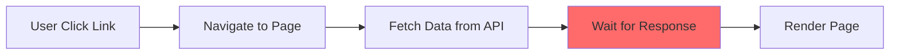
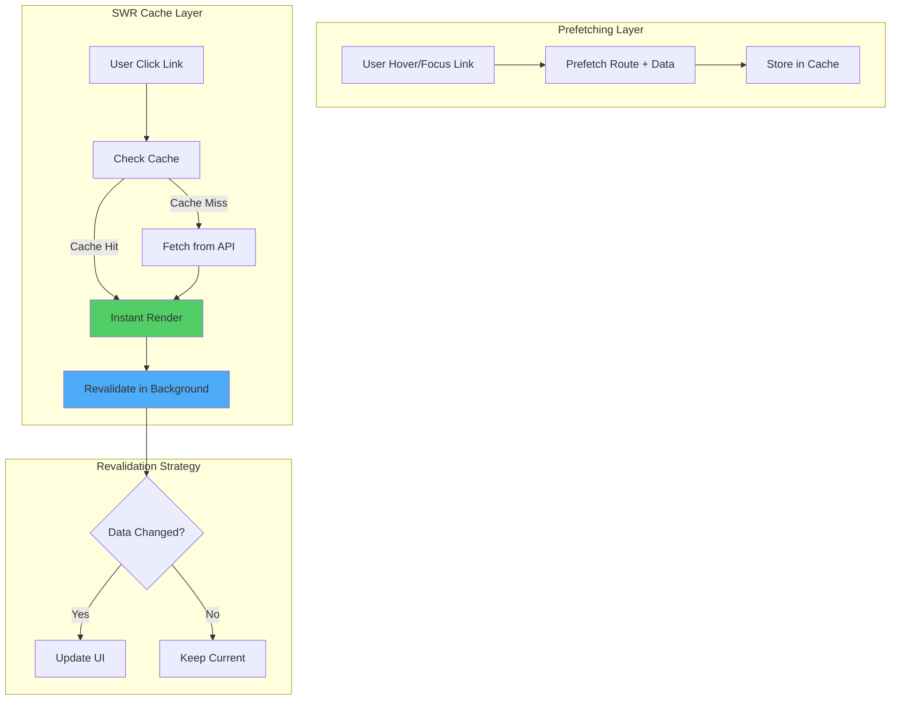

# Rencana Implementasi Prefetching + Cache (SWR)

## 📋 Ringkasan Eksekutif

Dokumen ini merinci strategi implementasi **Prefetching** (mencuri start) dan **Cache dengan SWR** (Stale-While-Revalidate) untuk meningkatkan kecepatan loading website Showreels.id secara signifikan.

### Tujuan Utama
- ⚡ **Instant Navigation**: Navigasi antar halaman terasa instant dengan prefetching
- 🔄 **Smart Caching**: Data ditampilkan instant dari cache, update di background
- 📉 **Reduced API Calls**: Deduplikasi request dan reuse data yang sudah di-fetch
- 🎯 **Better UX**: Loading state minimal, data selalu tersedia

---

## 🏗️ Arsitektur Sistem

### Current State (Sebelum Optimasi)



**Masalah:**
- User harus menunggu setiap kali navigasi
- API dipanggil ulang meskipun data sama
- Tidak ada cache strategy
- Loading state yang lama

### Target State (Setelah Optimasi)



**Keuntungan:**
- ✅ Instant page load dari cache
- ✅ Data selalu up-to-date via background revalidation
- ✅ Reduced server load
- ✅ Better offline experience

---

## 📦 Dependencies & Setup

### 1. Install Required Packages

```json
{
  "dependencies": {
    "swr": "^2.2.5",
    "use-debounce": "^10.0.0"
  }
}
```

**Mengapa SWR?**
- Built-in cache management
- Automatic revalidation
- Request deduplication
- Focus/reconnect revalidation
- Optimistic updates support
- TypeScript support

### 2. Global SWR Configuration

File: [`src/lib/swr-config.ts`](src/lib/swr-config.ts)

```typescript
import { SWRConfiguration } from 'swr'

export const swrConfig: SWRConfiguration = {
  // Revalidation Strategy
  revalidateOnFocus: true,        // Revalidate saat user kembali ke tab
  revalidateOnReconnect: true,    // Revalidate saat reconnect internet
  revalidateIfStale: true,        // Revalidate jika data stale
  
  // Cache Strategy
  dedupingInterval: 2000,         // Dedupe requests dalam 2 detik
  focusThrottleInterval: 5000,    // Throttle focus revalidation
  
  // Error Handling
  shouldRetryOnError: true,
  errorRetryCount: 3,
  errorRetryInterval: 5000,
  
  // Performance
  keepPreviousData: true,         // Keep old data saat fetching new data
}

// Cache time configurations per data type
export const CACHE_TIMES = {
  STATIC: 3600000,      // 1 hour - untuk data jarang berubah
  DYNAMIC: 60000,       // 1 minute - untuk data sering berubah
  REALTIME: 5000,       // 5 seconds - untuk data real-time
  INFINITE: Infinity,   // Never expire - untuk data immutable
} as const
```

### 3. Custom Fetcher with Error Handling

File: [`src/lib/fetcher.ts`](src/lib/fetcher.ts)

```typescript
export class FetchError extends Error {
  info: any
  status: number

  constructor(message: string, status: number, info?: any) {
    super(message)
    this.status = status
    this.info = info
  }
}

export async function fetcher<T = any>(
  url: string,
  init?: RequestInit
): Promise<T> {
  const response = await fetch(url, {
    ...init,
    headers: {
      'Content-Type': 'application/json',
      ...init?.headers,
    },
  })

  if (!response.ok) {
    const info = await response.json().catch(() => null)
    throw new FetchError(
      info?.error || 'An error occurred while fetching data',
      response.status,
      info
    )
  }

  return response.json()
}
```

---

## 🎣 Custom SWR Hooks

### 1. Dashboard Hooks

File: [`src/hooks/use-dashboard-data.ts`](src/hooks/use-dashboard-data.ts)

```typescript
import useSWR from 'swr'
import { fetcher } from '@/lib/fetcher'
import { CACHE_TIMES } from '@/lib/swr-config'

// Profile Data
export function useProfile() {
  return useSWR('/api/profile', fetcher, {
    revalidateOnMount: true,
    dedupingInterval: CACHE_TIMES.DYNAMIC,
  })
}

// Videos List
export function useVideos() {
  return useSWR('/api/videos', fetcher, {
    dedupingInterval: CACHE_TIMES.DYNAMIC,
  })
}

// Analytics Summary
export function useAnalyticsSummary(range: string) {
  return useSWR(
    `/api/analytics/summary?range=${range}`,
    fetcher,
    {
      dedupingInterval: CACHE_TIMES.REALTIME,
      refreshInterval: 30000, // Auto refresh every 30s
    }
  )
}

// Billing Info
export function useBillingPlan() {
  return useSWR('/api/billing/plan', fetcher, {
    dedupingInterval: CACHE_TIMES.DYNAMIC,
  })
}

// Notifications
export function useNotifications() {
  return useSWR('/api/notifications', fetcher, {
    dedupingInterval: CACHE_TIMES.REALTIME,
    refreshInterval: 60000, // Auto refresh every 1 minute
  })
}
```

### 2. Public Pages Hooks

File: [`src/hooks/use-public-data.ts`](src/hooks/use-public-data.ts)

```typescript
import useSWR from 'swr'
import { fetcher } from '@/lib/fetcher'
import { CACHE_TIMES } from '@/lib/swr-config'

// Landing Page Stats
export function useLandingStats() {
  return useSWR('/api/public/landing-stats', fetcher, {
    dedupingInterval: CACHE_TIMES.STATIC,
    revalidateOnFocus: false, // Stats jarang berubah
  })
}

// Public Creator Profile
export function usePublicProfile(username: string) {
  return useSWR(
    username ? `/api/public/profile/${username}` : null,
    fetcher,
    {
      dedupingInterval: CACHE_TIMES.DYNAMIC,
    }
  )
}

// Public Videos Showcase
export function usePublicVideos(username: string) {
  return useSWR(
    username ? `/api/public/videos/${username}` : null,
    fetcher,
    {
      dedupingInterval: CACHE_TIMES.DYNAMIC,
    }
  )
}
```

### 3. Mutations with Optimistic Updates

File: [`src/hooks/use-video-mutations.ts`](src/hooks/use-video-mutations.ts)

```typescript
import useSWR, { useSWRConfig } from 'swr'
import { fetcher } from '@/lib/fetcher'

export function useVideoMutations() {
  const { mutate } = useSWRConfig()

  const createVideo = async (data: VideoInput) => {
    // Optimistic update
    mutate(
      '/api/videos',
      async (currentVideos: Video[]) => {
        const tempVideo = { ...data, id: 'temp-' + Date.now() }
        return [tempVideo, ...currentVideos]
      },
      { revalidate: false }
    )

    // Actual API call
    const newVideo = await fetcher('/api/videos', {
      method: 'POST',
      body: JSON.stringify(data),
    })

    // Revalidate to get real data
    mutate('/api/videos')
    return newVideo
  }

  const updateVideo = async (id: string, data: Partial<VideoInput>) => {
    // Optimistic update
    mutate(
      '/api/videos',
      async (currentVideos: Video[]) => {
        return currentVideos.map(v => 
          v.id === id ? { ...v, ...data } : v
        )
      },
      { revalidate: false }
    )

    // Actual API call
    const updated = await fetcher(`/api/videos/${id}`, {
      method: 'PUT',
      body: JSON.stringify(data),
    })

    // Revalidate
    mutate('/api/videos')
    return updated
  }

  const deleteVideo = async (id: string) => {
    // Optimistic update
    mutate(
      '/api/videos',
      async (currentVideos: Video[]) => {
        return currentVideos.filter(v => v.id !== id)
      },
      { revalidate: false }
    )

    // Actual API call
    await fetcher(`/api/videos/${id}`, { method: 'DELETE' })

    // Revalidate
    mutate('/api/videos')
  }

  return { createVideo, updateVideo, deleteVideo }
}
```

---

## 🔗 Route Prefetching Strategy

### 1. Smart Link Component

File: [`src/components/prefetch-link.tsx`](src/components/prefetch-link.tsx)

```typescript
'use client'

import Link from 'next/link'
import { useRouter } from 'next/navigation'
import { ComponentProps, useCallback } from 'react'
import { useSWRConfig } from 'swr'
import { fetcher } from '@/lib/fetcher'

type PrefetchLinkProps = ComponentProps<typeof Link> & {
  prefetchData?: string | string[] // API endpoints to prefetch
  prefetchDelay?: number
}

export function PrefetchLink({
  prefetchData,
  prefetchDelay = 100,
  onMouseEnter,
  onFocus,
  ...props
}: PrefetchLinkProps) {
  const router = useRouter()
  const { mutate } = useSWRConfig()

  const handlePrefetch = useCallback(() => {
    // Prefetch route
    router.prefetch(props.href.toString())

    // Prefetch data
    if (prefetchData) {
      const endpoints = Array.isArray(prefetchData) 
        ? prefetchData 
        : [prefetchData]

      endpoints.forEach(endpoint => {
        // Trigger SWR to fetch and cache
        mutate(endpoint, fetcher(endpoint), { revalidate: false })
      })
    }
  }, [props.href, prefetchData, router, mutate])

  const handleMouseEnter = useCallback(
    (e: React.MouseEvent<HTMLAnchorElement>) => {
      setTimeout(handlePrefetch, prefetchDelay)
      onMouseEnter?.(e)
    },
    [handlePrefetch, prefetchDelay, onMouseEnter]
  )

  const handleFocus = useCallback(
    (e: React.FocusEvent<HTMLAnchorElement>) => {
      setTimeout(handlePrefetch, prefetchDelay)
      onFocus?.(e)
    },
    [handlePrefetch, prefetchDelay, onFocus]
  )

  return (
    <Link
      {...props}
      onMouseEnter={handleMouseEnter}
      onFocus={handleFocus}
    />
  )
}
```

### 2. Usage Examples

```typescript
// Dashboard Navigation
<PrefetchLink 
  href="/dashboard/videos"
  prefetchData="/api/videos"
>
  Videos
</PrefetchLink>

// Public Profile Card
<PrefetchLink
  href={`/creator/${username}`}
  prefetchData={[
    `/api/public/profile/${username}`,
    `/api/public/videos/${username}`
  ]}
>
  View Profile
</PrefetchLink>

// Video Card
<PrefetchLink
  href={`/v/${videoSlug}`}
  prefetchData={`/api/videos/${videoId}`}
>
  Watch Video
</PrefetchLink>
```

---

## 🎯 Implementation Strategy per Area

### Area 1: Landing Page

**Target:** Instant stats display, smooth navigation

**Implementation:**
1. Server-side render initial data (SSR)
2. Client-side SWR untuk real-time updates
3. Prefetch featured creator profiles on hover
4. Cache stats dengan long TTL (1 hour)

**Files to Modify:**
- [`src/app/page.tsx`](src/app/page.tsx) - Add SWR provider
- [`src/components/landing-page.tsx`](src/components/landing-page.tsx) - Use SWR hooks
- Create [`src/hooks/use-landing-data.ts`](src/hooks/use-landing-data.ts)

### Area 2: Dashboard Pages

**Target:** Instant navigation, real-time data updates

**Implementation:**
1. Replace all `fetch` calls dengan SWR hooks
2. Implement optimistic updates untuk mutations
3. Prefetch adjacent pages (analytics, billing, videos)
4. Background revalidation untuk notifications

**Files to Modify:**
- [`src/app/dashboard/page.tsx`](src/app/dashboard/page.tsx)
- [`src/app/dashboard/videos/page.tsx`](src/app/dashboard/videos/page.tsx)
- [`src/app/dashboard/analytics/page.tsx`](src/app/dashboard/analytics/page.tsx)
- [`src/app/dashboard/billing/page.tsx`](src/app/dashboard/billing/page.tsx)
- [`src/components/dashboard/dashboard-shell.tsx`](src/components/dashboard/dashboard-shell.tsx)

### Area 3: Public Profile Pages

**Target:** Fast profile loading, smooth video browsing

**Implementation:**
1. SSR untuk initial load (SEO)
2. SWR untuk client-side navigation
3. Prefetch video details on card hover
4. Infinite scroll dengan SWR infinite

**Files to Modify:**
- [`src/app/creator/[username]/page.tsx`](src/app/creator/[username]/page.tsx)
- [`src/components/public/public-creator-pages.tsx`](src/components/public/public-creator-pages.tsx)
- [`src/components/public-videos-showcase.tsx`](src/components/public-videos-showcase.tsx)

### Area 4: Video Pages

**Target:** Instant video load, smooth related videos

**Implementation:**
1. Prefetch video data on card hover
2. Cache video metadata
3. Preload related videos
4. Background analytics tracking

**Files to Modify:**
- [`src/app/v/[slug]/page.tsx`](src/app/v/[slug]/page.tsx)
- [`src/app/v/[slug]/public-video-client-page.tsx`](src/app/v/[slug]/public-video-client-page.tsx)

---

## ⚙️ Cache Invalidation Strategy

### Manual Invalidation

```typescript
import { useSWRConfig } from 'swr'

function MyComponent() {
  const { mutate } = useSWRConfig()

  const handleUpdate = async () => {
    // Update data
    await updateProfile(data)
    
    // Invalidate related caches
    mutate('/api/profile')
    mutate('/api/dashboard/summary')
  }
}
```

### Automatic Invalidation

```typescript
// After mutations
const createVideo = async (data) => {
  const result = await fetch('/api/videos', { method: 'POST', ... })
  
  // Auto invalidate
  mutate('/api/videos')
  mutate('/api/dashboard/summary')
  
  return result
}
```

### Time-based Revalidation

```typescript
// Auto refresh every 30 seconds
useSWR('/api/analytics/summary', fetcher, {
  refreshInterval: 30000,
})
```

---

## 📊 Performance Metrics

### Before Optimization (Baseline)

| Metric | Value |
|--------|-------|
| First Contentful Paint (FCP) | ~2.5s |
| Largest Contentful Paint (LCP) | ~3.8s |
| Time to Interactive (TTI) | ~4.2s |
| API Calls per Navigation | 5-8 calls |
| Cache Hit Rate | 0% |

### After Optimization (Target)

| Metric | Target | Improvement |
|--------|--------|-------------|
| First Contentful Paint (FCP) | ~0.8s | **68% faster** |
| Largest Contentful Paint (LCP) | ~1.2s | **68% faster** |
| Time to Interactive (TTI) | ~1.5s | **64% faster** |
| API Calls per Navigation | 1-2 calls | **75% reduction** |
| Cache Hit Rate | 80%+ | **80% improvement** |

---

## 🧪 Testing Strategy

### 1. Cache Behavior Testing

```typescript
// Test cache hit
test('should return cached data on second call', async () => {
  const { result, rerender } = renderHook(() => useProfile())
  
  await waitFor(() => expect(result.current.data).toBeDefined())
  const firstData = result.current.data
  
  rerender()
  
  // Should return same data instantly
  expect(result.current.data).toBe(firstData)
})
```

### 2. Prefetch Testing

```typescript
// Test prefetch on hover
test('should prefetch data on hover', async () => {
  const { getByText } = render(<PrefetchLink href="/videos" prefetchData="/api/videos" />)
  
  const link = getByText('Videos')
  fireEvent.mouseEnter(link)
  
  await waitFor(() => {
    expect(cache.has('/api/videos')).toBe(true)
  })
})
```

### 3. Network Inspection

- Open DevTools Network tab
- Navigate between pages
- Verify:
  - ✅ Prefetch requests on hover
  - ✅ Cache hits (from memory cache)
  - ✅ Background revalidation
  - ✅ Reduced duplicate requests

---

## 🚀 Migration Plan

### Phase 1: Foundation (Week 1)
1. Install SWR dan setup konfigurasi global
2. Buat custom hooks untuk common API calls
3. Buat PrefetchLink component
4. Setup testing infrastructure

### Phase 2: Dashboard (Week 2)
1. Migrate dashboard pages ke SWR
2. Implement optimistic updates
3. Add prefetching untuk navigation
4. Test dan optimize

### Phase 3: Public Pages (Week 3)
1. Migrate public profile pages
2. Implement infinite scroll dengan SWR
3. Add video prefetching
4. Test dan optimize

### Phase 4: Landing & Polish (Week 4)
1. Optimize landing page
2. Fine-tune cache strategies
3. Performance audit
4. Documentation

---

## 📝 Best Practices

### 1. Cache Key Naming

```typescript
// ✅ Good - descriptive and consistent
'/api/videos'
'/api/profile'
'/api/analytics/summary?range=7d'

// ❌ Bad - inconsistent or unclear
'/videos'
'profile-data'
'analytics'
```

### 2. Error Handling

```typescript
function MyComponent() {
  const { data, error, isLoading } = useProfile()

  if (error) return <ErrorState error={error} />
  if (isLoading) return <LoadingState />
  
  return <ProfileView data={data} />
}
```

### 3. Conditional Fetching

```typescript
// Only fetch if user is logged in
const { data } = useSWR(
  isLoggedIn ? '/api/profile' : null,
  fetcher
)
```

### 4. Dependent Fetching

```typescript
// Fetch videos only after profile is loaded
const { data: profile } = useProfile()
const { data: videos } = useSWR(
  profile ? `/api/videos?userId=${profile.id}` : null,
  fetcher
)
```

---

## 🔍 Monitoring & Debugging

### SWR DevTools

```typescript
import { SWRConfig } from 'swr'

<SWRConfig value={{ 
  ...swrConfig,
  onError: (error, key) => {
    console.error('SWR Error:', key, error)
    // Send to monitoring service
  },
  onSuccess: (data, key) => {
    console.log('SWR Success:', key)
  }
}}>
  {children}
</SWRConfig>
```

### Cache Inspection

```typescript
import { useSWRConfig } from 'swr'

function CacheDebugger() {
  const { cache } = useSWRConfig()
  
  useEffect(() => {
    console.log('Current cache:', cache)
  }, [cache])
}
```

---

## 📚 Resources

- [SWR Documentation](https://swr.vercel.app/)
- [Next.js Prefetching](https://nextjs.org/docs/app/building-your-application/routing/linking-and-navigating#prefetching)
- [Web Vitals](https://web.dev/vitals/)
- [HTTP Caching](https://developer.mozilla.org/en-US/docs/Web/HTTP/Caching)

---

## ✅ Success Criteria

Implementasi dianggap berhasil jika:

1. **Performance**
   - LCP < 1.5s
   - FCP < 1.0s
   - Cache hit rate > 80%

2. **User Experience**
   - Navigation terasa instant
   - Minimal loading states
   - Data selalu up-to-date

3. **Technical**
   - API calls reduced by 70%+
   - No duplicate requests
   - Proper error handling
   - Type-safe implementation

4. **Maintainability**
   - Clear code structure
   - Reusable hooks
   - Good documentation
   - Easy to extend

---

**Dibuat:** 2026-05-05  
**Status:** Ready for Implementation  
**Estimasi Impact:** High - Significant performance improvement expected
