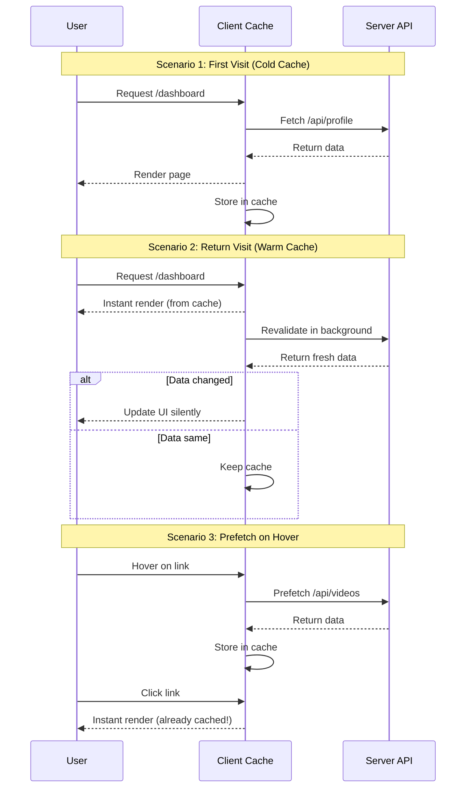

# Quick Reference: Prefetching + SWR Implementation

## 🎯 Ringkasan Singkat

Implementasi **Prefetching** + **Cache (SWR)** untuk membuat website Showreels.id loading super cepat dengan strategi:

1. **Prefetch** route & data saat user hover/focus link
2. **Cache** data dengan SWR (Stale-While-Revalidate)
3. **Revalidate** di background untuk data fresh
4. **Optimistic Updates** untuk UX yang smooth

---

## 📊 Data Flow Diagram



---

## 🔄 Cache Strategy Matrix

| Data Type | Revalidate Interval | Cache Duration | Auto Refresh |
|-----------|---------------------|----------------|--------------|
| **User Profile** | On focus/reconnect | 1 minute | ❌ |
| **Videos List** | On focus/reconnect | 1 minute | ❌ |
| **Analytics** | On focus | 5 seconds | ✅ 30s |
| **Notifications** | On focus | 5 seconds | ✅ 60s |
| **Billing Info** | On focus/reconnect | 1 minute | ❌ |
| **Landing Stats** | Manual | 1 hour | ❌ |
| **Public Profile** | On focus | 1 minute | ❌ |

---

## 🎣 Common Hooks Cheatsheet

### Dashboard Hooks

```typescript
import { useProfile, useVideos, useAnalytics, useBilling } from '@/hooks/use-dashboard-data'

// Profile
const { data, error, isLoading, mutate } = useProfile()

// Videos
const { data: videos } = useVideos()

// Analytics
const { data: analytics } = useAnalyticsSummary('7d')

// Billing
const { data: billing } = useBillingPlan()
```

### Mutations

```typescript
import { useVideoMutations } from '@/hooks/use-video-mutations'

const { createVideo, updateVideo, deleteVideo } = useVideoMutations()

// Create with optimistic update
await createVideo({ title: 'New Video', ... })

// Update with optimistic update
await updateVideo('video-id', { title: 'Updated' })

// Delete with optimistic update
await deleteVideo('video-id')
```

### Prefetch Link

```typescript
import { PrefetchLink } from '@/components/prefetch-link'

// Simple prefetch
<PrefetchLink href="/dashboard/videos" prefetchData="/api/videos">
  Videos
</PrefetchLink>

// Multiple endpoints
<PrefetchLink 
  href={`/creator/${username}`}
  prefetchData={[
    `/api/public/profile/${username}`,
    `/api/public/videos/${username}`
  ]}
>
  View Profile
</PrefetchLink>
```

---

## 🚀 Quick Start Guide

### 1. Install Dependencies

```bash
npm install swr use-debounce
```

### 2. Setup SWR Provider

```typescript
// src/app/layout.tsx
import { SWRConfig } from 'swr'
import { swrConfig } from '@/lib/swr-config'

export default function RootLayout({ children }) {
  return (
    <SWRConfig value={swrConfig}>
      {children}
    </SWRConfig>
  )
}
```

### 3. Create Custom Hook

```typescript
// src/hooks/use-profile.ts
import useSWR from 'swr'
import { fetcher } from '@/lib/fetcher'

export function useProfile() {
  return useSWR('/api/profile', fetcher)
}
```

### 4. Use in Component

```typescript
// src/app/dashboard/page.tsx
import { useProfile } from '@/hooks/use-profile'

export default function DashboardPage() {
  const { data, error, isLoading } = useProfile()
  
  if (error) return <div>Error loading profile</div>
  if (isLoading) return <div>Loading...</div>
  
  return <div>Welcome, {data.name}!</div>
}
```

---

## 🎨 Component Patterns

### Pattern 1: Loading States

```typescript
function MyComponent() {
  const { data, error, isLoading, isValidating } = useProfile()
  
  // Initial loading
  if (isLoading) return <Skeleton />
  
  // Error state
  if (error) return <ErrorBoundary error={error} />
  
  // Show data with background refresh indicator
  return (
    <div>
      {isValidating && <RefreshIndicator />}
      <ProfileView data={data} />
    </div>
  )
}
```

### Pattern 2: Optimistic Updates

```typescript
function VideoCard({ video }) {
  const { mutate } = useSWRConfig()
  
  const handleDelete = async () => {
    // Optimistic update
    mutate('/api/videos', 
      (videos) => videos.filter(v => v.id !== video.id),
      { revalidate: false }
    )
    
    // Actual delete
    await fetch(`/api/videos/${video.id}`, { method: 'DELETE' })
    
    // Revalidate
    mutate('/api/videos')
  }
}
```

### Pattern 3: Conditional Fetching

```typescript
function UserVideos({ userId }) {
  // Only fetch if userId exists
  const { data } = useSWR(
    userId ? `/api/videos?userId=${userId}` : null,
    fetcher
  )
  
  if (!userId) return <div>Select a user</div>
  if (!data) return <div>Loading...</div>
  
  return <VideoList videos={data} />
}
```

---

## 🐛 Common Issues & Solutions

### Issue 1: Data Not Updating

**Problem:** Data tidak update setelah mutation

**Solution:**
```typescript
// Pastikan mutate dipanggil setelah mutation
await updateProfile(data)
mutate('/api/profile') // ✅ Revalidate cache
```

### Issue 2: Too Many Requests

**Problem:** Terlalu banyak API calls

**Solution:**
```typescript
// Increase deduping interval
useSWR('/api/data', fetcher, {
  dedupingInterval: 5000, // 5 seconds
})
```

### Issue 3: Stale Data on Focus

**Problem:** Data tidak refresh saat kembali ke tab

**Solution:**
```typescript
// Enable revalidate on focus
useSWR('/api/data', fetcher, {
  revalidateOnFocus: true, // ✅
})
```

### Issue 4: Cache Not Persisting

**Problem:** Cache hilang setelah refresh

**Solution:**
```typescript
// Use localStorage provider (optional)
import { SWRConfig } from 'swr'

const localStorageProvider = () => {
  const map = new Map(JSON.parse(localStorage.getItem('app-cache') || '[]'))
  
  window.addEventListener('beforeunload', () => {
    localStorage.setItem('app-cache', JSON.stringify(Array.from(map.entries())))
  })
  
  return map
}

<SWRConfig value={{ provider: localStorageProvider }}>
  {children}
</SWRConfig>
```

---

## 📈 Performance Checklist

- [ ] SWR installed dan configured
- [ ] Custom hooks created untuk common API calls
- [ ] PrefetchLink component implemented
- [ ] Optimistic updates untuk mutations
- [ ] Error handling di semua hooks
- [ ] Loading states di semua components
- [ ] Cache invalidation strategy defined
- [ ] Deduping interval configured
- [ ] Revalidation strategy configured
- [ ] Network tab inspection passed
- [ ] Lighthouse score > 90
- [ ] Cache hit rate > 80%

---

## 🔗 File Structure

```
src/
├── lib/
│   ├── swr-config.ts          # Global SWR configuration
│   ├── fetcher.ts             # Custom fetcher with error handling
│   └── cache-keys.ts          # Centralized cache key constants
├── hooks/
│   ├── use-dashboard-data.ts  # Dashboard hooks
│   ├── use-public-data.ts     # Public pages hooks
│   ├── use-video-mutations.ts # Video CRUD mutations
│   └── use-profile-mutations.ts # Profile mutations
├── components/
│   ├── prefetch-link.tsx      # Smart prefetch link component
│   └── swr-provider.tsx       # SWR provider wrapper
└── app/
    └── layout.tsx             # Root layout with SWR config
```

---

## 📚 Next Steps

1. **Review** dokumen lengkap: [`prefetching-cache-swr-implementation.md`](prefetching-cache-swr-implementation.md)
2. **Install** dependencies: `npm install swr use-debounce`
3. **Create** base files (swr-config, fetcher, hooks)
4. **Migrate** satu page dulu sebagai proof of concept
5. **Test** dan measure performance improvement
6. **Iterate** ke pages lainnya

---

**Pro Tip:** Mulai dari dashboard pages karena paling banyak API calls dan user interaction. Impact-nya akan paling terasa!
