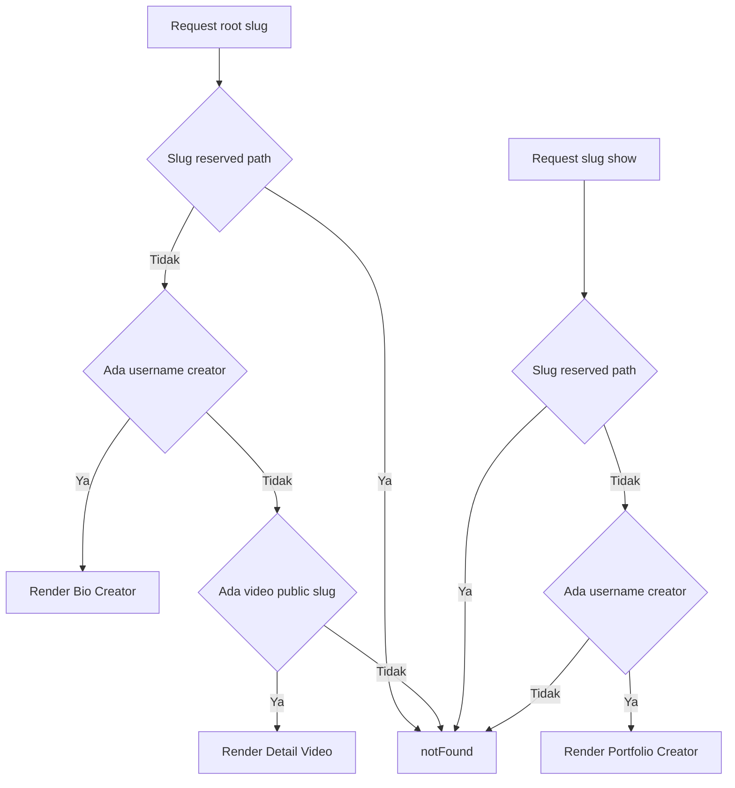

# Rencana Implementasi Redesign Halaman Public Showreels.id

## Keputusan yang Sudah Dikonfirmasi

- Route public pendek wajib dibuat:
  - Bio Creator: `/[username]`
  - Portfolio Creator: `/[username]/show`
  - Detail Video: `/[videoSlug]`
- Route lama tetap ada tetapi menjadi redirect:
  - `/creator/[username]` -> `/[username]`
  - `/creator/[username]/portfolio` -> `/[username]/show`
  - `/v/[slug]` -> `/[slug]`
- Fokus hanya halaman public, bukan dashboard.
- About Creator tidak ditampilkan lagi di public page.

## Kondisi Kode Saat Ini

- Bio Creator saat ini berada di `src/app/creator/[username]/page.tsx`.
- Portfolio Creator saat ini berada di `src/app/creator/[username]/portfolio/page.tsx`.
- Detail Video saat ini berada di `src/app/v/[slug]/page.tsx`.
- Data public diambil dari `src/server/public-data.ts`.
- Schema utama ada di `src/db/schema.ts`.
- QR endpoint existing ada di `src/app/api/public/qr/route.ts`.
- Share card existing ada di `src/components/public-share-card.tsx`.

## Catatan Data dan Gap terhadap PRD

- `videos` saat ini punya field: `title`, `description`, `tags`, `visibility`, `thumbnailUrl`, `extraVideoUrls`, `imageUrls`, `sourceUrl`, `source`, `aspectRatio`, `outputType`, `durationLabel`, `pinnedToProfile`, `pinnedOrder`, `publicSlug`, timestamps.
- Field PRD seperti `projectStatus`, `projectType`, `client/brand`, `tools/software`, `industry/niche`, token semi-private belum terlihat di schema saat ini.
- Untuk phase awal, metadata yang tidak ada harus ditampilkan sebagai fallback bento badge yang aman, misalnya status `Published` atau `Public` jika belum ada `projectStatus`.
- `getPublicProfile` saat ini mengambil `public` dan `semi_private`; untuk portfolio public umum perlu dibatasi ke `public` kecuali ada implementasi token akses.

## Rencana Teknis

### 1. Routing Public Pendek

- Tambahkan route pendek:
  - `src/app/[username]/page.tsx` untuk Bio Creator.
  - `src/app/[username]/show/page.tsx` untuk Portfolio Creator.
  - `src/app/[videoSlug]/page.tsx` untuk Detail Video.
- Buat helper reserved route, misalnya `src/lib/public-route-utils.ts`, berisi daftar reserved path:
  - `dashboard`, `login`, `register`, `pricing`, `settings`, `admin`, `api`, `show`, `help`, `terms`, `privacy`, `billing`, `creator`, `profile`, `auth`, `about`, `legal`, `videos`, `v`, `customer-service`, `onboarding`, `payment`.
- Route pendek harus memanggil `notFound()` untuk reserved path.
- Detail Video `/[videoSlug]` berpotensi bentrok dengan username. Sesuai PRD, username diprioritaskan. Implementasi paling aman:
  - `src/app/[username]/page.tsx` hanya menangani Bio Creator.
  - `src/app/[username]/show/page.tsx` menangani Portfolio Creator.
  - Untuk detail video di root dynamic, perlu strategi Next.js karena `src/app/[username]/page.tsx` dan `src/app/[videoSlug]/page.tsx` sama-sama dynamic segment di level root tidak bisa berdampingan. Solusi yang disarankan: gunakan satu route `src/app/[slug]/page.tsx` sebagai resolver.
  - Resolver mencoba username lebih dulu; jika ada creator, render Bio Creator; jika tidak ada, coba video slug; jika ada video, render Detail Video; jika tidak ada, `notFound()`.
  - `src/app/[slug]/show/page.tsx` render Portfolio Creator.

### 2. Redirect Route Lama

- Ubah `src/app/creator/[username]/page.tsx` menjadi server component redirect ke `/${username}`.
- Ubah `src/app/creator/[username]/portfolio/page.tsx` menjadi redirect ke `/${username}/show` sambil menjaga query string penting seperti `view` dan `page` jika masih dipakai.
- Ubah `src/app/v/[slug]/page.tsx` menjadi redirect ke `/${slug}`.

### 3. Reusable Public UI

Agar route resolver tidak terlalu besar, buat komponen server/reusable:

- `src/components/public/bio-creator-page.tsx`
- `src/components/public/portfolio-creator-page.tsx`
- `src/components/public/video-detail-page.tsx`
- `src/components/public/public-page-shell.tsx` bila perlu untuk background monochrome dan layout umum.

### 4. Bio Creator UI

- Tema monochrome: background `#F5F5F4`, surface `#FFFFFF`, border `#E1E1DF`, text `#111111`/`#525252`.
- Layout center compact max width sekitar `480px`.
- Header:
  - cover card dengan fallback monochrome gradient.
  - avatar overlap.
  - display name, username, role, bio singkat maksimal sekitar 160 karakter.
- Social icon row:
  - tampilkan website, instagram, youtube, facebook, threads, linkedin dari data existing.
  - batasi baris dan pastikan `aria-label`.
- Pinned portfolio:
  - maksimal 3 dari `profile.pinnedVideos`.
  - card thumbnail kiri/atas, title, outputType, source/platform, status fallback, CTA `Lihat Project`.
- Link buttons:
  - pakai `profile.user.customLinks` yang sudah dinormalisasi.
  - hanya enabled/active.
  - semua external link pakai `target="_blank"` dan `rel="noopener noreferrer"`.
- CTA `Lihat Semua Portofolio` tampil hanya jika ada minimal 1 video public.
- Footer kecil `Made with Showreels.id` jika whitelabel tidak aktif.
- Hapus About Creator, Contact section panjang, dan CTA Profile.

### 5. Portfolio Creator UI

- Top bar: back ke `/${username}`, share page.
- Creator identity card ringkas bento:
  - avatar, display name, username, role, bio singkat, cover/fallback.
- Controls:
  - grid/list toggle via query `view`.
  - search/filter dapat dibuat basic server-side query jika mudah; kalau scope phase awal terlalu besar, tampilkan filter chips non-invasive berdasarkan `source/outputType` dari data yang ada.
- Portfolio cards:
  - grid 1 kolom mobile, 2 kolom tablet, 3 kolom desktop.
  - list view row card.
  - tampilkan thumbnail, title, short description 120 karakter, posted date, outputType, source/platform, durationLabel, status fallback.
  - CTA `Lihat Detail` ke `/${publicSlug}`.
- Empty state: `Belum ada portfolio yang dipublikasikan.` dan CTA kembali ke bio.
- Tidak ada About Creator dan contact section panjang.

### 6. Detail Video UI

- Route resolver `/[slug]` harus render detail video jika slug bukan username dan video ada.
- Layout desktop 2 kolom:
  - kiri: media slider/preview, description card.
  - kanan: project info card, creator mini card, share/QR card.
- Mobile:
  - media di atas, title dan metadata setelah media, action share/QR mudah dijangkau.
- Gunakan existing `MediaPreviewCarousel` untuk video/thumbnail/gallery.
- Metadata:
  - outputType, source/platform, durationLabel, createdAt, visibility public, tags.
  - status project fallback bila field belum ada.
- Share:
  - upgrade `PublicShareCard` untuk native Web Share API jika tersedia.
  - copy link dengan toast/state.
- QR:
  - gunakan endpoint `src/app/api/public/qr/route.ts` dengan data current URL.
  - buat modal client-side yang menampilkan QR image dan download PNG.
  - pastikan modal mobile tidak keluar viewport dan bisa ditutup keyboard.
- Creator mini card:
  - avatar, name, role, link ke `/${username}`, link ke `/${username}/show`.

### 7. SEO Metadata

- Tambahkan `generateMetadata` di resolver dan portfolio route.
- Bio:
  - title `[Display Name] — Showreels.id`.
  - description dari bio singkat.
  - OG image cover/avatar/fallback.
- Portfolio:
  - title `Portfolio [Display Name] — Showreels.id`.
  - description `Lihat portfolio video dari [Display Name].`
- Detail:
  - title `[Judul Video] by [Display Name] — Showreels.id`.
  - description short description.
  - OG image thumbnail.
  - canonical `/${publicSlug}`.
- Tambahkan Twitter Card.
- Structured data `CreativeWork`/`VideoObject` bisa ditambahkan di Detail Video bila tidak mengganggu.

### 8. Data dan Visibility

- Tambahkan opsi di `getPublicProfile` untuk hanya mengambil public videos untuk portfolio umum.
- Semi-private jangan tampil di portfolio umum tanpa token.
- Jika belum ada token model, jangan expose semi-private di public portfolio.
- `getPublicVideo` saat ini mengizinkan semi_private tanpa token. Sesuaikan agar semi-private hanya tampil bila viewer owner atau token valid jika token sudah tersedia. Jika token belum tersedia, treat sebagai tidak public untuk audience biasa.

### 9. Validasi

- Pastikan tidak ada horizontal scroll.
- Button minimal tinggi 44px.
- Image punya alt text.
- Icon button punya `aria-label`.
- External link aman.
- Jalankan lint/build sesuai script di `package.json`.

## Mermaid Flow

## Todo Eksekusi

- [ ] Buat helper reserved route dan public URL.
- [ ] Refactor data fetching public agar mendukung resolver username/video dan visibility public-only.
- [ ] Buat komponen reusable Bio Creator public.
- [ ] Buat komponen reusable Portfolio Creator public.
- [ ] Buat komponen reusable Detail Video public.
- [ ] Implement route resolver `/[slug]` dan route `/[slug]/show`.
- [ ] Implement redirect route lama.
- [ ] Tambahkan SEO metadata.
- [ ] Tambahkan QR modal/download dan native share.
- [ ] Validasi responsive/accessibility/security.
- [ ] Jalankan lint/build.
