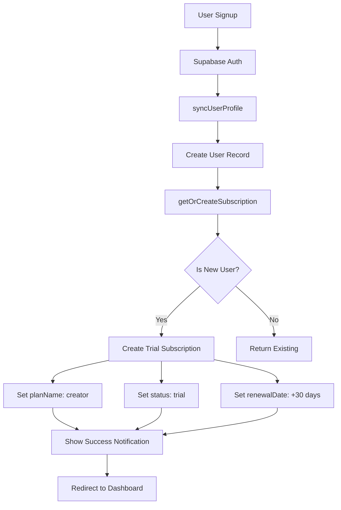

# Rencana Implementasi: Trial 1 Bulan Gratis Plan Creator untuk Pengguna Baru

## 📋 Ringkasan

Setiap pengguna baru yang mendaftar akan otomatis mendapatkan trial plan Creator selama 1 bulan terhitung dari tanggal registrasi. Setelah 1 bulan, akun akan otomatis turun ke plan Free.

## 🎯 Tujuan

- Memberikan pengalaman premium kepada pengguna baru
- Meningkatkan konversi dari trial ke paid subscription
- Menampilkan notifikasi yang jelas saat registrasi berhasil
- Mengelola transisi otomatis dari trial ke free plan

## 🔍 Analisis Sistem Saat Ini

### Database Schema
- Tabel [`billing_subscriptions`](src/db/schema.ts:260) sudah memiliki:
  - Field `status` dengan tipe `"active" | "trial" | "expired" | "failed" | "pending"`
  - Field `renewalDate` untuk tracking kapan subscription berakhir
  - Field `planName` untuk menyimpan plan aktif
  
### Sistem Billing
- Function [`getOrCreateSubscription`](src/server/billing.ts:339) saat ini membuat subscription dengan:
  - `planName: "free"`
  - `status: "active"`
  - Tidak ada `renewalDate`

### Subscription Policy
- Konstanta [`ENTITLED_SUBSCRIPTION_STATUSES`](src/server/subscription-policy.ts:95) sudah include `"trial"`
- Function [`getEffectivePlanForUser`](src/server/subscription-policy.ts:128) sudah menangani status trial

### Signup Flow
- File [`signup-form.tsx`](src/components/auth/signup-form.tsx:141) menangani registrasi
- Setelah signup berhasil, ada notifikasi di line 219-224

## 📐 Arsitektur Solusi



## 🗂️ Perubahan Database

### 1. Migrasi Database Baru

Buat file migrasi: `drizzle/0011_trial_creator_for_new_users.sql`

```sql
-- Tidak perlu menambah kolom baru karena schema sudah mendukung
-- Hanya perlu update logic di aplikasi

-- Optional: Update existing free users yang baru (< 7 hari) ke trial
-- UPDATE billing_subscriptions
-- SET 
--   plan_name = 'creator',
--   status = 'trial',
--   renewal_date = created_at + INTERVAL '30 days'
-- WHERE 
--   plan_name = 'free' 
--   AND status = 'active'
--   AND created_at > NOW() - INTERVAL '7 days';
```

## 🔧 Implementasi Kode

### 1. Update Server: Billing Logic

**File**: [`src/server/billing.ts`](src/server/billing.ts:339)

Modifikasi function `getOrCreateSubscription`:

```typescript
export async function getOrCreateSubscription(userId: string) {
  if (!isDatabaseConfigured()) {
    return buildFallbackSubscription(userId);
  }

  try {
    const existing = await db.query.billingSubscriptions.findFirst({
      where: eq(billingSubscriptions.userId, userId),
    });
    
    if (existing) {
      return {
        ...existing,
        planName: normalizeBillingPlanName(existing.planName),
        nextPlanName: normalizeBillingPlanName(existing.nextPlanName),
      };
    }

    // NEW USER: Create trial subscription
    const trialEndDate = new Date();
    trialEndDate.setDate(trialEndDate.getDate() + 30); // +30 hari

    const [created] = await db
      .insert(billingSubscriptions)
      .values({
        userId,
        planName: "creator",        // ← CHANGED: dari "free" ke "creator"
        billingCycle: "monthly",
        status: "trial",            // ← CHANGED: dari "active" ke "trial"
        price: 0,
        currency: "IDR",
        renewalDate: trialEndDate,  // ← ADDED: tanggal berakhir trial
        nextPlanName: "free",       // ← CHANGED: setelah trial, turun ke free
      })
      .returning();

    return {
      ...created,
      planName: normalizeBillingPlanName(created.planName),
      nextPlanName: normalizeBillingPlanName(created.nextPlanName),
    };
  } catch (error) {
    if (isMissingBillingSchemaError(error)) {
      return buildFallbackSubscription(userId);
    }
    throw error;
  }
}
```

### 2. Update Notifikasi Signup

**File**: [`src/components/auth/signup-form.tsx`](src/components/auth/signup-form.tsx:219)

Update notifikasi setelah signup berhasil:

```typescript
authLock.clearFailures();
await showFeedbackAlert({
  title: "🎉 Berhasil Daftar",
  text: "Akun Anda berhasil di-upgrade ke plan Creator gratis selama 1 bulan!",
  icon: "success",
  confirmButtonText: "Lanjut ke Dashboard",
});
window.location.replace(bootstrapResult.redirectTo);
```

### 3. Buat Cron Job untuk Auto-Downgrade

**File Baru**: `src/server/trial-expiry-handler.ts`

```typescript
import { and, eq, lte, sql } from "drizzle-orm";
import { db, isDatabaseConfigured } from "@/db";
import { billingSubscriptions } from "@/db/schema";

/**
 * Cron job untuk mengecek dan menurunkan trial yang sudah expired
 * Jalankan setiap hari pada jam 00:00 UTC
 */
export async function handleExpiredTrials() {
  if (!isDatabaseConfigured()) {
    console.log("Database not configured, skipping trial expiry check");
    return { processed: 0, errors: 0 };
  }

  try {
    const now = new Date();
    
    // Cari semua subscription dengan status trial yang sudah expired
    const expiredTrials = await db.query.billingSubscriptions.findMany({
      where: and(
        eq(billingSubscriptions.status, "trial"),
        lte(billingSubscriptions.renewalDate, now)
      ),
    });

    console.log(`Found ${expiredTrials.length} expired trials to process`);

    let processed = 0;
    let errors = 0;

    for (const subscription of expiredTrials) {
      try {
        // Downgrade ke free plan
        await db
          .update(billingSubscriptions)
          .set({
            planName: "free",
            status: "active",
            price: 0,
            nextPlanName: "free",
            renewalDate: null,
            updatedAt: new Date(),
          })
          .where(eq(billingSubscriptions.id, subscription.id));

        processed++;
        console.log(`Downgraded trial to free for user: ${subscription.userId}`);
      } catch (error) {
        errors++;
        console.error(`Failed to downgrade trial for user ${subscription.userId}:`, error);
      }
    }

    return { processed, errors, total: expiredTrials.length };
  } catch (error) {
    console.error("Error in handleExpiredTrials:", error);
    throw error;
  }
}
```

### 4. API Endpoint untuk Cron Job

**File Baru**: `src/app/api/cron/trial-expiry/route.ts`

```typescript
import { NextResponse } from "next/server";
import { handleExpiredTrials } from "@/server/trial-expiry-handler";

// Vercel Cron atau external cron service akan hit endpoint ini
export async function GET(request: Request) {
  // Verifikasi cron secret untuk keamanan
  const authHeader = request.headers.get("authorization");
  const cronSecret = process.env.CRON_SECRET || "your-secret-key";
  
  if (authHeader !== `Bearer ${cronSecret}`) {
    return NextResponse.json(
      { error: "Unauthorized" },
      { status: 401 }
    );
  }

  try {
    const result = await handleExpiredTrials();
    
    return NextResponse.json({
      success: true,
      message: `Processed ${result.processed} expired trials`,
      ...result,
    });
  } catch (error) {
    console.error("Cron job failed:", error);
    return NextResponse.json(
      { 
        success: false, 
        error: error instanceof Error ? error.message : "Unknown error" 
      },
      { status: 500 }
    );
  }
}
```

### 5. Dashboard: Tampilkan Status Trial

**File**: [`src/components/dashboard/billing-panel.tsx`](src/components/dashboard/billing-panel.tsx:1)

Tambahkan badge dan countdown untuk trial:

```typescript
// Di bagian display subscription info
{subscription.status === "trial" && subscription.renewalDate && (
  <div className="rounded-lg border border-blue-200 bg-blue-50 p-4">
    <div className="flex items-center gap-2">
      <span className="text-2xl">🎁</span>
      <div>
        <p className="font-semibold text-blue-900">
          Trial Plan Creator Aktif
        </p>
        <p className="text-sm text-blue-700">
          Berakhir pada: {new Date(subscription.renewalDate).toLocaleDateString("id-ID", {
            day: "numeric",
            month: "long",
            year: "numeric"
          })}
        </p>
        <p className="mt-1 text-xs text-blue-600">
          Setelah trial berakhir, akun akan otomatis turun ke plan Free
        </p>
      </div>
    </div>
  </div>
)}
```

### 6. Onboarding: Update Pesan

**File**: [`src/components/onboarding/onboarding-stepper.tsx`](src/components/onboarding/onboarding-stepper.tsx:544)

Update teks untuk menunjukkan status trial:

```typescript
<p className="mt-1 text-sm text-[#5e78a5]">
  Plan aktif: {planName.toUpperCase()}
  {planName === "creator" && subscriptionStatus === "trial" && (
    <span className="ml-2 rounded-full bg-blue-100 px-2 py-0.5 text-xs font-semibold text-blue-700">
      TRIAL 1 BULAN
    </span>
  )}
</p>
```

### 7. Environment Variables

**File**: `.env.local` (tambahkan)

```bash
# Cron job secret untuk keamanan
CRON_SECRET=your-random-secret-key-here
```

## 📅 Setup Cron Job

### Opsi 1: Vercel Cron (Recommended)

**File**: `vercel.json`

```json
{
  "crons": [
    {
      "path": "/api/cron/trial-expiry",
      "schedule": "0 0 * * *"
    }
  ]
}
```

### Opsi 2: External Cron Service

Gunakan service seperti:
- cron-job.org
- EasyCron
- GitHub Actions

Setup untuk hit endpoint setiap hari:
```
URL: https://your-domain.vercel.app/api/cron/trial-expiry
Method: GET
Header: Authorization: Bearer your-secret-key
Schedule: 0 0 * * * (setiap hari jam 00:00)
```

## 🧪 Testing Plan

### 1. Test Manual Signup Flow

```typescript
// Test case 1: New user signup
1. Buka /auth/signup
2. Isi form dan submit
3. Verify: Notifikasi muncul "Akun Anda berhasil di-upgrade ke plan Creator gratis selama 1 bulan!"
4. Check database: billing_subscriptions.status = "trial"
5. Check database: billing_subscriptions.planName = "creator"
6. Check database: billing_subscriptions.renewalDate = now + 30 days
```

### 2. Test Trial Features

```typescript
// Test case 2: Trial user can access creator features
1. Login sebagai trial user
2. Coba upload > 10 video (quota free)
3. Verify: Berhasil (creator quota = 50)
4. Coba akses analytics > 7 hari
5. Verify: Berhasil (creator analytics = 30 hari)
```

### 3. Test Expiry Handler

```typescript
// Test case 3: Manual trigger expiry
1. Update database: Set renewalDate ke kemarin
2. Hit endpoint: GET /api/cron/trial-expiry dengan auth header
3. Verify response: { processed: 1, errors: 0 }
4. Check database: status = "active", planName = "free"
```

### 4. Test Edge Cases

```typescript
// Test case 4: Existing user tidak dapat trial lagi
1. User yang sudah pernah trial
2. Logout dan signup dengan email baru
3. Verify: Dapat trial baru (karena userId berbeda)

// Test case 5: User upgrade manual saat trial
1. User dengan trial aktif
2. Upgrade ke paid creator
3. Verify: Status berubah ke "active", renewalDate update
```

## 📊 Monitoring & Analytics

### Metrics yang Perlu Ditrack

1. **Trial Conversion Rate**
   - Berapa % trial user yang upgrade ke paid
   - Track di analytics atau database

2. **Trial Usage**
   - Fitur apa yang paling banyak digunakan trial user
   - Video upload count, analytics access, dll

3. **Expiry Processing**
   - Log hasil cron job setiap hari
   - Alert jika ada error

### Dashboard Admin

Tambahkan di [`admin-panel-client.tsx`](src/components/admin/admin-panel-client.tsx:1):

```typescript
// Stats card untuk trial users
<div className="rounded-lg border bg-white p-4">
  <h3 className="font-semibold">Trial Users</h3>
  <p className="text-2xl font-bold">{trialUsersCount}</p>
  <p className="text-sm text-gray-600">
    {expiringThisWeek} expiring this week
  </p>
</div>
```

## 🚀 Deployment Checklist

### Pre-deployment

- [ ] Review semua perubahan kode
- [ ] Test di local environment
- [ ] Test signup flow lengkap
- [ ] Test cron job manual
- [ ] Update environment variables

### Deployment Steps

1. **Deploy Database Migration**
   ```bash
   npm run db:push
   # atau
   npm run db:migrate
   ```

2. **Deploy Application Code**
   ```bash
   git add .
   git commit -m "feat: add 1-month creator trial for new users"
   git push origin main
   ```

3. **Setup Cron Job**
   - Jika Vercel: Deploy vercel.json
   - Jika external: Setup di cron service

4. **Verify Environment Variables**
   - Check CRON_SECRET di Vercel dashboard
   - Test cron endpoint dengan curl

### Post-deployment

- [ ] Monitor signup flow untuk 24 jam pertama
- [ ] Check logs untuk error
- [ ] Verify trial users di database
- [ ] Test cron job berjalan sesuai schedule
- [ ] Monitor conversion metrics

## 📝 User Communication

### Email Template (Optional)

**Subject**: Selamat Datang di Showreels.id - Trial Creator 1 Bulan Gratis! 🎉

```
Halo [Name],

Selamat! Akun Anda telah berhasil dibuat dan otomatis di-upgrade ke plan Creator gratis selama 1 bulan.

Dengan plan Creator, Anda dapat:
✅ Upload hingga 50 video per platform
✅ Analytics hingga 30 hari
✅ Custom thumbnail
✅ Unlimited custom links
✅ Akses komunitas creator

Trial Anda akan berakhir pada: [Tanggal]

Setelah trial berakhir, akun akan otomatis turun ke plan Free. Anda dapat upgrade kapan saja dari dashboard billing.

Mulai sekarang: https://showreels-id.vercel.app/dashboard

Salam,
Tim Showreels.id
```

### In-App Notification

Tampilkan banner di dashboard untuk trial users:

```typescript
{subscription.status === "trial" && (
  <div className="mb-4 rounded-lg bg-gradient-to-r from-blue-500 to-purple-600 p-4 text-white">
    <p className="font-semibold">
      🎁 Anda sedang menggunakan trial Creator gratis!
    </p>
    <p className="text-sm">
      Nikmati semua fitur premium hingga {formatDate(renewalDate)}
    </p>
    <Link href="/pricing" className="mt-2 inline-block text-sm underline">
      Upgrade sekarang untuk terus menggunakan fitur Creator →
    </Link>
  </div>
)}
```

## 🔄 Future Enhancements

### Phase 2 (Optional)

1. **Email Reminder**
   - 7 hari sebelum trial habis
   - 1 hari sebelum trial habis
   - Setelah trial habis

2. **Trial Extension**
   - Admin dapat extend trial manual
   - Promo code untuk extend trial

3. **A/B Testing**
   - Test 14 hari vs 30 hari trial
   - Test notifikasi yang berbeda

4. **Analytics Dashboard**
   - Trial conversion funnel
   - Feature usage heatmap
   - Churn prediction

## 📚 Dokumentasi Terkait

- [Database Schema](src/db/schema.ts:260)
- [Billing Server](src/server/billing.ts:339)
- [Subscription Policy](src/server/subscription-policy.ts:95)
- [Signup Form](src/components/auth/signup-form.tsx:141)
- [Plan Feature Matrix](src/lib/plan-feature-matrix.ts:1)

## ⚠️ Catatan Penting

1. **Tidak Ada Kartu Kredit Required**
   - Trial tidak memerlukan payment method
   - User bisa langsung pakai tanpa input CC

2. **Auto-Downgrade Aman**
   - Data user tidak hilang saat downgrade
   - Hanya akses fitur yang dibatasi

3. **Transparent Communication**
   - User tahu kapan trial berakhir
   - User tahu apa yang terjadi setelah trial

4. **Prevent Abuse**
   - Trial berdasarkan userId (Supabase Auth)
   - Tidak bisa trial lagi dengan email sama
   - Bisa consider: IP tracking, device fingerprint

## 🎯 Success Metrics

Target setelah 1 bulan implementasi:

- **Signup Rate**: +30% (karena ada trial)
- **Trial-to-Paid Conversion**: 10-15%
- **Feature Adoption**: 70% trial users upload > 5 video
- **User Satisfaction**: 4.5/5 rating

---

**Status**: Ready for Implementation
**Priority**: High
**Estimated Effort**: 2-3 hari development + testing
**Risk Level**: Low (schema sudah support, minimal breaking changes)
