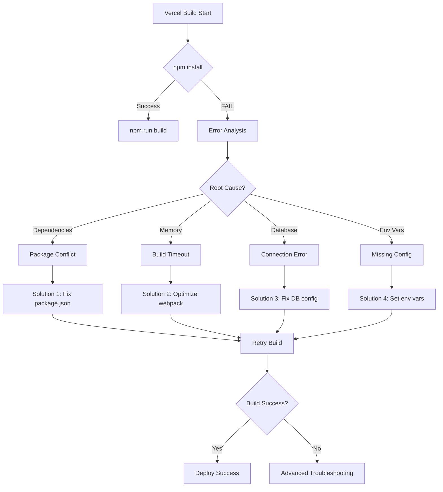
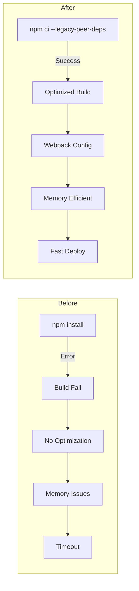
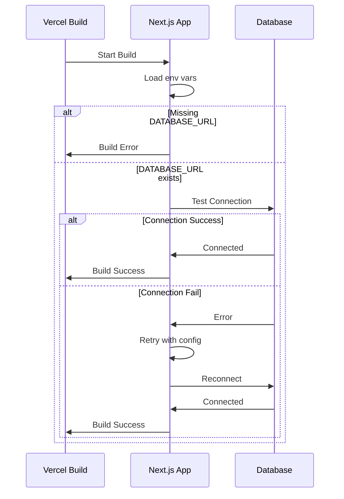
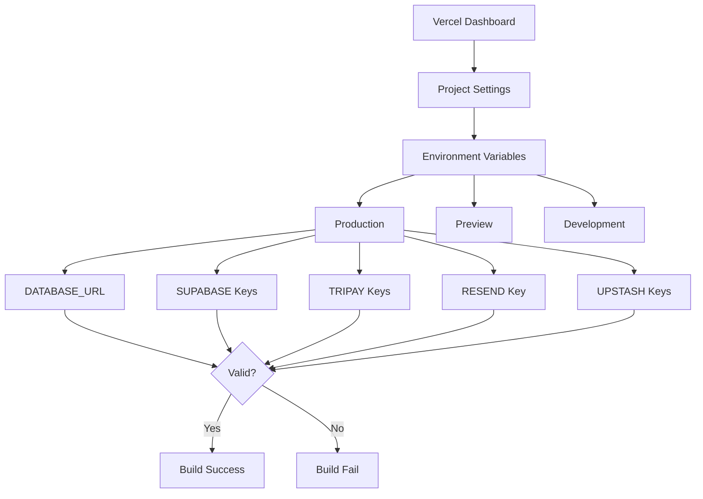
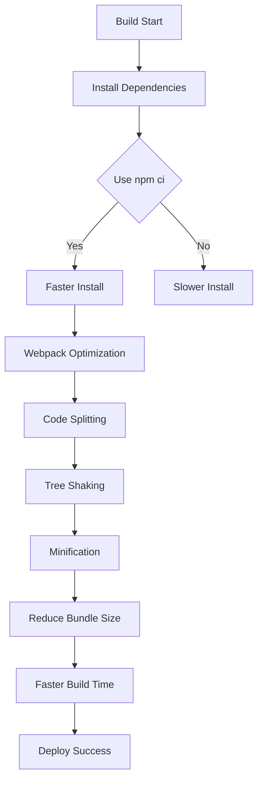
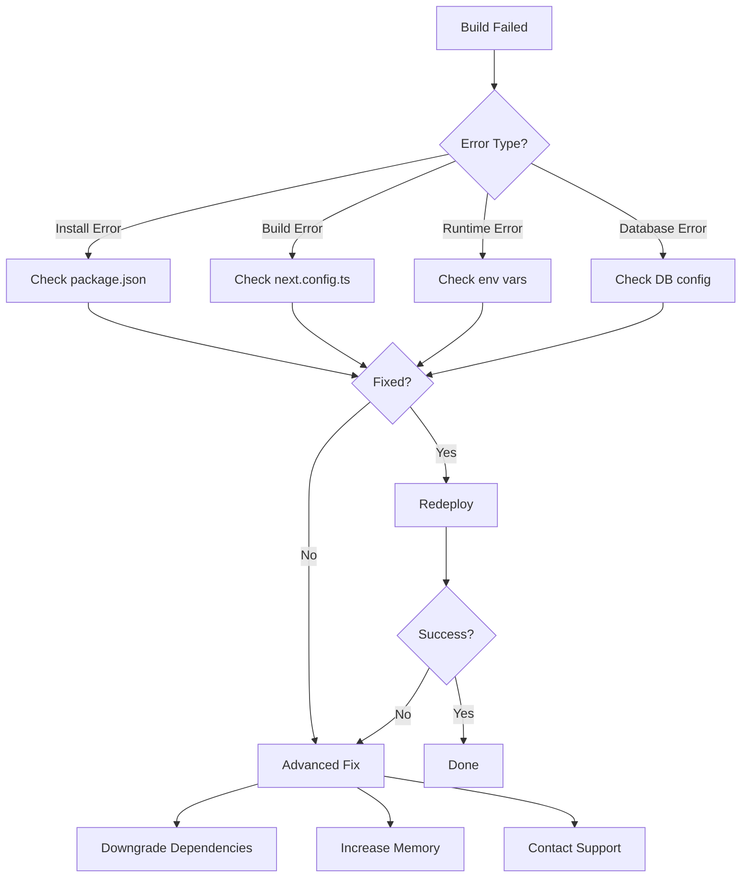
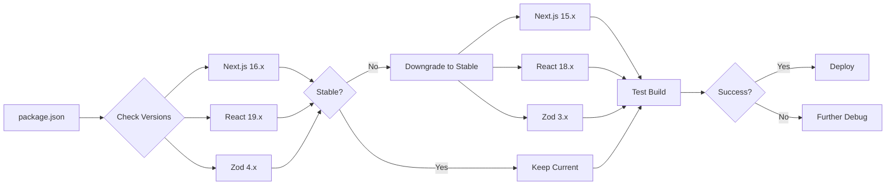
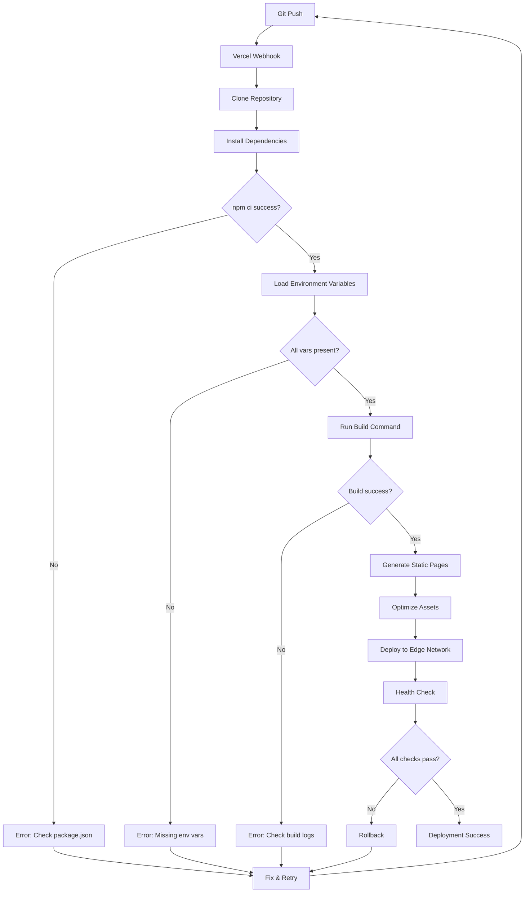
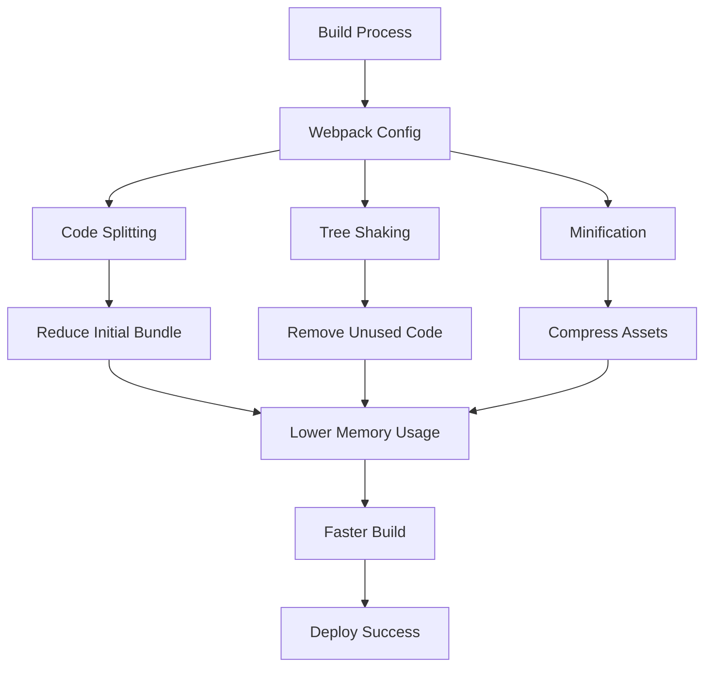
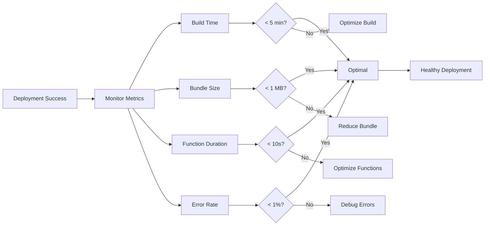

# Diagram Arsitektur Deployment Fix

## 1. Flow Diagnosis Error

## 2. Arsitektur Deployment Sebelum vs Sesudah

## 3. Database Connection Flow

## 4. Environment Variables Setup

## 5. Build Optimization Strategy

## 6. Troubleshooting Decision Tree

## 7. Dependency Management Flow

## 8. Complete Deployment Pipeline

## 9. Memory Optimization Strategy

## 10. Post-Deployment Monitoring

