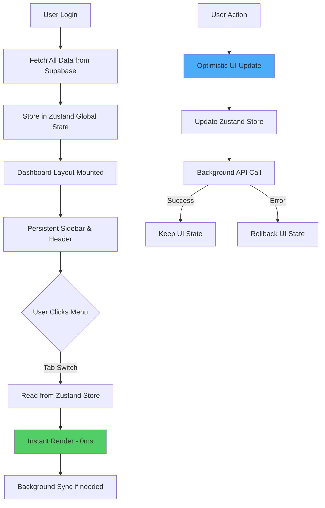
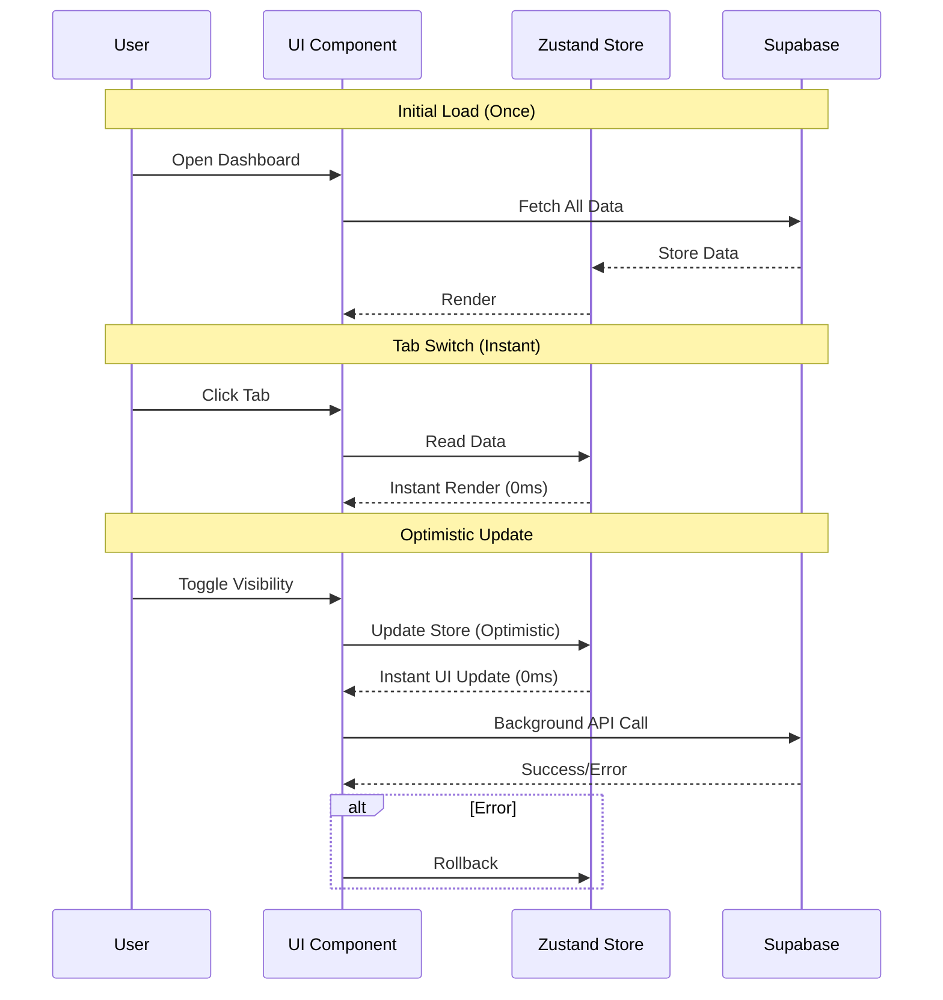

# Zero-Loading Dashboard Architecture

## 🎯 Objective

Membuat dashboard dengan **Zero-Loading Experience** (0ms delay) saat berpindah fitur menggunakan:
- Persistent Layout (Sidebar & Header tidak pernah unmount)
- Client-Side Navigation dengan Tabs
- Global Store (Zustand) untuk data caching
- Optimistic UI untuk instant feedback

---

## 🏗️ Architecture Overview



---

## 📁 File Structure

```
src/
├── app/
│   └── dashboard/
│       ├── layout.tsx              # Persistent layout (Sidebar + Header)
│       ├── page.tsx                # Dashboard home (redirect to profile)
│       └── _components/
│           ├── dashboard-shell.tsx # Main container dengan tabs
│           ├── sidebar.tsx         # Persistent sidebar
│           ├── header.tsx          # Persistent header
│           ├── profile-tab.tsx     # Tab: Profil Publik
│           ├── videos-tab.tsx      # Tab: Halaman Video
│           ├── links-tab.tsx       # Tab: Custom Links
│           └── visibility-tab.tsx  # Tab: Kontrol Visibilitas
│
├── stores/
│   └── dashboard-store.ts          # Zustand global store
│
├── hooks/
│   ├── use-dashboard-data.ts       # Hook untuk fetch & sync data
│   └── use-optimistic-update.ts    # Hook untuk optimistic updates
│
└── lib/
    └── dashboard-sync.ts           # Background sync utilities
```

---

## 🎨 Implementation Details

### 1. Persistent Layout

**File:** `src/app/dashboard/layout.tsx`

```typescript
import { Sidebar } from './_components/sidebar'
import { Header } from './_components/header'
import { DashboardDataLoader } from './_components/dashboard-data-loader'

export default function DashboardLayout({
  children,
}: {
  children: React.ReactNode
}) {
  return (
    <div className="flex h-screen overflow-hidden">
      {/* Persistent Sidebar - Never unmounts */}
      <Sidebar />
      
      <div className="flex flex-1 flex-col overflow-hidden">
        {/* Persistent Header - Never unmounts */}
        <Header />
        
        {/* Main Content Area */}
        <main className="flex-1 overflow-y-auto">
          {/* Data loader - runs once on mount */}
          <DashboardDataLoader />
          
          {/* Tab content */}
          {children}
        </main>
      </div>
    </div>
  )
}
```

**Key Points:**
- Layout hanya mount sekali
- Sidebar dan Header persistent
- Children (tabs) swap tanpa unmount layout

---

### 2. Zustand Global Store

**File:** `src/stores/dashboard-store.ts`

```typescript
import { create } from 'zustand'
import { devtools, persist } from 'zustand/middleware'

type Video = {
  id: string
  title: string
  url: string
  visibility: 'public' | 'private'
  thumbnailUrl: string | null
  createdAt: string
}

type CustomLink = {
  id: string
  title: string
  url: string
  isActive: boolean
  order: number
}

type Profile = {
  id: string
  username: string
  name: string | null
  bio: string | null
  avatarUrl: string | null
  isPublic: boolean
}

type DashboardState = {
  // Data
  profile: Profile | null
  videos: Video[]
  customLinks: CustomLink[]
  
  // Loading states
  isInitialLoading: boolean
  isSyncing: boolean
  
  // Actions
  setProfile: (profile: Profile) => void
  setVideos: (videos: Video[]) => void
  setCustomLinks: (links: CustomLink[]) => void
  
  // Optimistic updates
  updateVideoVisibility: (videoId: string, visibility: 'public' | 'private') => void
  toggleLinkActive: (linkId: string) => void
  
  // Sync
  setInitialLoading: (loading: boolean) => void
  setSyncing: (syncing: boolean) => void
  
  // Initialize
  initializeDashboard: (data: {
    profile: Profile
    videos: Video[]
    customLinks: CustomLink[]
  }) => void
}

export const useDashboardStore = create<DashboardState>()(
  devtools(
    persist(
      (set) => ({
        // Initial state
        profile: null,
        videos: [],
        customLinks: [],
        isInitialLoading: true,
        isSyncing: false,

        // Actions
        setProfile: (profile) => set({ profile }),
        setVideos: (videos) => set({ videos }),
        setCustomLinks: (customLinks) => set({ customLinks }),

        // Optimistic updates
        updateVideoVisibility: (videoId, visibility) =>
          set((state) => ({
            videos: state.videos.map((v) =>
              v.id === videoId ? { ...v, visibility } : v
            ),
          })),

        toggleLinkActive: (linkId) =>
          set((state) => ({
            customLinks: state.customLinks.map((link) =>
              link.id === linkId ? { ...link, isActive: !link.isActive } : link
            ),
          })),

        // Sync
        setInitialLoading: (loading) => set({ isInitialLoading: loading }),
        setSyncing: (syncing) => set({ isSyncing: syncing }),

        // Initialize
        initializeDashboard: (data) =>
          set({
            profile: data.profile,
            videos: data.videos,
            customLinks: data.customLinks,
            isInitialLoading: false,
          }),
      }),
      {
        name: 'dashboard-storage',
        partialize: (state) => ({
          // Only persist data, not loading states
          profile: state.profile,
          videos: state.videos,
          customLinks: state.customLinks,
        }),
      }
    )
  )
)
```

**Key Features:**
- ✅ Centralized state management
- ✅ Optimistic update methods
- ✅ Persist to localStorage
- ✅ DevTools integration

---

### 3. Data Loader Component

**File:** `src/app/dashboard/_components/dashboard-data-loader.tsx`

```typescript
'use client'

import { useEffect } from 'react'
import { useDashboardStore } from '@/stores/dashboard-store'
import { supabase } from '@/lib/supabase/client'

export function DashboardDataLoader() {
  const { initializeDashboard, isInitialLoading } = useDashboardStore()

  useEffect(() => {
    async function loadDashboardData() {
      try {
        // Fetch all data in parallel
        const [profileRes, videosRes, linksRes] = await Promise.all([
          supabase.from('profiles').select('*').single(),
          supabase.from('videos').select('*').order('created_at', { ascending: false }),
          supabase.from('custom_links').select('*').order('order', { ascending: true }),
        ])

        if (profileRes.error) throw profileRes.error
        if (videosRes.error) throw videosRes.error
        if (linksRes.error) throw linksRes.error

        // Initialize store with all data
        initializeDashboard({
          profile: profileRes.data,
          videos: videosRes.data || [],
          customLinks: linksRes.data || [],
        })
      } catch (error) {
        console.error('Failed to load dashboard data:', error)
      }
    }

    if (isInitialLoading) {
      loadDashboardData()
    }
  }, [isInitialLoading, initializeDashboard])

  return null // This component doesn't render anything
}
```

**Key Points:**
- Runs once on dashboard mount
- Fetches all data in parallel
- Stores in Zustand for instant access

---

### 4. Tab-Based Navigation

**File:** `src/app/dashboard/_components/dashboard-shell.tsx`

```typescript
'use client'

import { useState } from 'react'
import { ProfileTab } from './profile-tab'
import { VideosTab } from './videos-tab'
import { LinksTab } from './links-tab'
import { VisibilityTab } from './visibility-tab'
import { useDashboardStore } from '@/stores/dashboard-store'

type TabId = 'profile' | 'videos' | 'links' | 'visibility'

const tabs = [
  { id: 'profile' as TabId, label: 'Profil Publik', icon: '👤' },
  { id: 'videos' as TabId, label: 'Halaman Video', icon: '🎬' },
  { id: 'links' as TabId, label: 'Custom Links', icon: '🔗' },
  { id: 'visibility' as TabId, label: 'Kontrol Visibilitas', icon: '👁️' },
]

export function DashboardShell() {
  const [activeTab, setActiveTab] = useState<TabId>('profile')
  const { isInitialLoading } = useDashboardStore()

  if (isInitialLoading) {
    return (
      <div className="flex h-full items-center justify-center">
        <div className="text-center">
          <div className="h-8 w-8 animate-spin rounded-full border-4 border-gray-300 border-t-blue-600" />
          <p className="mt-4 text-sm text-gray-600">Loading dashboard...</p>
        </div>
      </div>
    )
  }

  return (
    <div className="flex h-full flex-col">
      {/* Tab Navigation */}
      <div className="border-b border-gray-200 bg-white">
        <nav className="flex space-x-8 px-6" aria-label="Tabs">
          {tabs.map((tab) => (
            <button
              key={tab.id}
              onClick={() => setActiveTab(tab.id)}
              className={`
                flex items-center gap-2 border-b-2 px-1 py-4 text-sm font-medium
                ${
                  activeTab === tab.id
                    ? 'border-blue-500 text-blue-600'
                    : 'border-transparent text-gray-500 hover:border-gray-300 hover:text-gray-700'
                }
              `}
            >
              <span>{tab.icon}</span>
              {tab.label}
            </button>
          ))}
        </nav>
      </div>

      {/* Tab Content - Instant switch, no loading */}
      <div className="flex-1 overflow-y-auto p-6">
        {activeTab === 'profile' && <ProfileTab />}
        {activeTab === 'videos' && <VideosTab />}
        {activeTab === 'links' && <LinksTab />}
        {activeTab === 'visibility' && <VisibilityTab />}
      </div>
    </div>
  )
}
```

**Key Features:**
- ✅ Client-side tab switching
- ✅ No route changes
- ✅ Instant rendering (0ms)
- ✅ All tabs read from Zustand store

---

### 5. Optimistic UI Example - Visibility Tab

**File:** `src/app/dashboard/_components/visibility-tab.tsx`

```typescript
'use client'

import { useDashboardStore } from '@/stores/dashboard-store'
import { supabase } from '@/lib/supabase/client'
import { useState } from 'react'

export function VisibilityTab() {
  const { videos, updateVideoVisibility } = useDashboardStore()
  const [syncing, setSyncing] = useState<string | null>(null)

  const handleToggleVisibility = async (
    videoId: string,
    currentVisibility: 'public' | 'private'
  ) => {
    const newVisibility = currentVisibility === 'public' ? 'private' : 'public'

    // 1. OPTIMISTIC UPDATE - Instant UI change
    updateVideoVisibility(videoId, newVisibility)

    // 2. BACKGROUND API CALL
    setSyncing(videoId)
    try {
      const { error } = await supabase
        .from('videos')
        .update({ visibility: newVisibility })
        .eq('id', videoId)

      if (error) throw error

      // Success - UI already updated
      console.log('✅ Visibility updated successfully')
    } catch (error) {
      // Error - Rollback
      console.error('❌ Failed to update visibility:', error)
      updateVideoVisibility(videoId, currentVisibility) // Rollback
      alert('Failed to update visibility. Please try again.')
    } finally {
      setSyncing(null)
    }
  }

  return (
    <div className="space-y-4">
      <div>
        <h2 className="text-2xl font-bold text-gray-900">Kontrol Visibilitas</h2>
        <p className="mt-1 text-sm text-gray-600">
          Atur visibilitas video Anda secara instant
        </p>
      </div>

      <div className="space-y-3">
        {videos.map((video) => (
          <div
            key={video.id}
            className="flex items-center justify-between rounded-lg border border-gray-200 bg-white p-4"
          >
            <div className="flex items-center gap-4">
              {video.thumbnailUrl && (
                
              )}
              <div>
                <h3 className="font-medium text-gray-900">{video.title}</h3>
                <p className="text-sm text-gray-500">
                  {video.visibility === 'public' ? '🌍 Public' : '🔒 Private'}
                </p>
              </div>
            </div>

            <button
              onClick={() => handleToggleVisibility(video.id, video.visibility)}
              disabled={syncing === video.id}
              className={`
                relative inline-flex h-6 w-11 items-center rounded-full transition-colors
                ${video.visibility === 'public' ? 'bg-blue-600' : 'bg-gray-200'}
                ${syncing === video.id ? 'opacity-50' : ''}
              `}
            >
              <span
                className={`
                  inline-block h-4 w-4 transform rounded-full bg-white transition-transform
                  ${video.visibility === 'public' ? 'translate-x-6' : 'translate-x-1'}
                `}
              />
            </button>
          </div>
        ))}
      </div>
    </div>
  )
}
```

**Key Features:**
- ✅ **Instant UI Update** - Toggle berubah seketika
- ✅ **Background Sync** - API call di latar belakang
- ✅ **Error Handling** - Rollback jika gagal
- ✅ **Visual Feedback** - Opacity saat syncing

---

## 🎯 Performance Characteristics

### Zero-Loading Metrics

| Action | Time | Method |
|--------|------|--------|
| **Tab Switch** | **0ms** | Read from Zustand store |
| **Toggle Visibility** | **0ms** | Optimistic update |
| **Initial Load** | ~500ms | One-time fetch |
| **Background Sync** | Async | Non-blocking |

### Data Flow



---

## 🚀 Implementation Checklist

### Phase 1: Setup (30 minutes)
- [ ] Install Zustand: `npm install zustand`
- [ ] Create dashboard store
- [ ] Setup persistent layout
- [ ] Create data loader component

### Phase 2: Tab System (1 hour)
- [ ] Create DashboardShell with tabs
- [ ] Implement ProfileTab
- [ ] Implement VideosTab
- [ ] Implement LinksTab
- [ ] Implement VisibilityTab

### Phase 3: Optimistic UI (1 hour)
- [ ] Implement toggle visibility with optimistic update
- [ ] Add error handling and rollback
- [ ] Add visual feedback (syncing state)
- [ ] Test edge cases

### Phase 4: Polish (30 minutes)
- [ ] Add loading states
- [ ] Add error boundaries
- [ ] Add animations
- [ ] Test performance

---

## 📊 Benefits

### User Experience
- ⚡ **Instant Navigation** - 0ms delay between tabs
- 🎨 **Smooth Interactions** - No loading spinners
- 💪 **Responsive UI** - Immediate feedback
- 🚀 **Fast Initial Load** - Parallel data fetching

### Technical Benefits
- 📦 **Efficient Data Management** - Single source of truth
- 🔄 **Optimistic Updates** - Better perceived performance
- 💾 **Persistent State** - Survives page refreshes
- 🎯 **Predictable State** - Zustand simplicity

### Developer Experience
- 🧩 **Simple Architecture** - Easy to understand
- 🔧 **Easy to Extend** - Add new tabs easily
- 🐛 **Easy to Debug** - Zustand DevTools
- 📝 **Type-Safe** - Full TypeScript support

---

## 🎓 Key Concepts

### 1. Persistent Layout
Layout component tidak pernah unmount, hanya children yang berubah.

### 2. Client-Side Tabs
Menggunakan state lokal untuk switch tabs, bukan routing.

### 3. Global Store
Semua data di-fetch sekali dan disimpan di Zustand untuk akses instant.

### 4. Optimistic UI
UI update dulu, API call belakangan. Rollback jika error.

---

## 🔍 Testing Strategy

### Performance Testing
```typescript
// Measure tab switch time
const start = performance.now()
setActiveTab('videos')
const end = performance.now()
console.log(`Tab switch: ${end - start}ms`) // Should be < 1ms
```

### Optimistic Update Testing
1. Toggle visibility
2. Disconnect network
3. Verify UI updates instantly
4. Reconnect network
5. Verify rollback on error

---

**Status:** Ready for Implementation  
**Expected Result:** True Zero-Loading Dashboard  
**Complexity:** Medium - Requires careful state management
