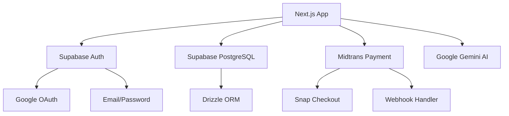

# Product Requirements Document (PRD) — showreels.id

> **Versi:** 2.0
> **Tanggal:** 5 Mei 2026
> **Platform:** [showreels-id.vercel.app](https://showreels-id.vercel.app)
> **Stack Utama:** Next.js 16.2.4 · React 19.2.4 · Drizzle ORM 0.45.2 · Supabase · Tailwind CSS 4

---

## Daftar Isi

1. [Ringkasan Eksekutif](#1-ringkasan-eksekutif)
2. [Arsitektur Sistem](#2-arsitektur-sistem)
3. [Fitur dan Fungsionalitas](#3-fitur-dan-fungsionalitas)
4. [Spesifikasi Teknis](#4-spesifikasi-teknis)
5. [Alur Kerja dan Use Cases](#5-alur-kerja-dan-use-cases)
6. [Keamanan dan Performa](#6-keamanan-dan-performa)
7. [Testing dan Quality Assurance](#7-testing-dan-quality-assurance)
8. [Deployment dan Infrastruktur](#8-deployment-dan-infrastruktur)
9. [Roadmap dan Pengembangan](#9-roadmap-dan-pengembangan)
10. [Lampiran](#10-lampiran)

---

## 1. Ringkasan Eksekutif

### 1.1 Gambaran Umum

**showreels.id** adalah platform portfolio video berbasis web yang dirancang khusus untuk kreator konten, videografer, dan editor video di Indonesia. Platform ini memungkinkan pengguna membuat profil publik profesional yang menampilkan karya video mereka dari berbagai sumber (YouTube, Google Drive, Instagram, Vimeo, Facebook) dalam satu halaman yang rapi dan siap dibagikan.

### 1.2 Tujuan Utama

- Menyediakan platform portfolio video yang **sederhana, cepat, dan profesional**
- Memungkinkan kreator menampilkan karya terbaik tanpa perlu hosting video sendiri
- Memberikan kontrol visibilitas penuh (draft, private, semi-private, public)
- Menyediakan link builder untuk custom links dan social links
- Menawarkan model bisnis freemium dengan tier Creator dan Business

### 1.3 Value Proposition

| Aspek | Nilai |
|-------|-------|
| **Untuk Kreator** | Satu halaman publik untuk semua karya video, siap dibagikan ke klien/brand |
| **Untuk Brand/Klien** | Akses cepat ke portfolio kreator tanpa perlu buka banyak platform |
| **Diferensiasi** | Multi-source video, kontrol visibilitas granular, link builder terintegrasi |
| **Monetisasi** | Freemium (Free → Creator Rp25.000/bulan → Business Rp49.000/bulan) |

### 1.4 Target Pengguna

- Freelance video editor
- Content creator / YouTuber
- Videografer profesional
- Production house kecil-menengah
- Brand yang mencari kreator

---

## 2. Arsitektur Sistem

### 2.1 Struktur Folder

```
showreels-id-main/
├── drizzle/                    # Migration files SQL
│   ├── 0000_real_mystique.sql
│   ├── ...
│   └── meta/                   # Migration metadata & snapshots
├── plans/                      # Dokumen perencanaan & implementasi
├── public/                     # Static assets (SVG, MP4, PNG)
├── src/
│   ├── app/                    # Next.js App Router pages & API routes
│   │   ├── [slug]/             # Dynamic public profile pages
│   │   ├── admin/              # Admin panel
│   │   ├── api/                # REST API endpoints
│   │   ├── auth/               # Authentication pages
│   │   ├── creator/            # Creator public pages (legacy redirect)
│   │   ├── dashboard/          # Creator dashboard
│   │   ├── legal/              # Legal pages (syarat, privasi, cookies, DPA)
│   │   ├── onboarding/         # Onboarding flow
│   │   ├── payment/            # Payment/checkout page
│   │   ├── pricing/            # Pricing page
│   │   ├── v/[slug]/           # Public video detail pages
│   │   └── videos/             # Public video gallery
│   ├── components/             # React components
│   │   ├── admin/              # Admin panel components
│   │   ├── auth/               # Auth form components
│   │   ├── build-link/         # Link builder modal
│   │   ├── builder/            # Link builder editor
│   │   ├── dashboard/          # Dashboard components
│   │   ├── onboarding/         # Onboarding stepper
│   │   ├── pricing/            # Pricing page components
│   │   ├── public/             # Public profile components
│   │   └── ui/                 # Reusable UI primitives
│   ├── db/                     # Database layer (Drizzle ORM)
│   ├── hooks/                  # Custom React hooks
│   ├── lib/                    # Utility libraries & helpers
│   │   ├── database/           # Database config
│   │   └── supabase/           # Supabase client/server helpers
│   ├── providers/              # React context providers
│   ├── server/                 # Server-side business logic
│   └── services/               # Service layer (auth, profile, video)
├── drizzle.config.ts           # Drizzle Kit configuration
├── next.config.ts              # Next.js configuration
├── package.json                # Dependencies & scripts
├── tsconfig.json               # TypeScript configuration
└── netlify.toml                # Netlify deployment config
```

### 2.2 Teknologi yang Digunakan

| Kategori | Teknologi | Versi |
|----------|-----------|-------|
| **Framework** | Next.js (App Router) | 16.2.4 |
| **UI Library** | React | 19.2.4 |
| **Bahasa** | TypeScript | ^5 |
| **Styling** | Tailwind CSS | ^4 |
| **ORM** | Drizzle ORM | ^0.45.2 |
| **Database** | PostgreSQL (Supabase) | - |
| **Auth** | Supabase Auth | ^2.104.0 |
| **State Management** | Zustand | ^5.0.12 |
| **Form** | React Hook Form + Zod | ^7.72.1 / ^4.3.6 |
| **Animation** | Framer Motion | ^12.38.0 |
| **Icons** | Lucide React + React Icons | ^1.8.0 / ^5.6.0 |
| **Drag & Drop** | @dnd-kit | ^6.3.1 |
| **Payment** | Midtrans Snap API | - |
| **AI** | Google Gemini API | gemini-1.5-flash |
| **Testing** | Jest + Testing Library | ^30.3.0 |
| **Alerts** | SweetAlert2 | ^11.26.24 |
| **Theming** | next-themes | ^0.4.6 |
| **Hashing** | bcryptjs | ^3.0.3 |

### 2.3 Pola Desain (Design Patterns)

- **App Router Pattern**: Server Components sebagai default, Client Components untuk interaktivitas
- **Server Actions & API Routes**: Business logic di server-side (`src/server/`)
- **Service Layer**: Abstraksi untuk auth, profile, dan video (`src/services/`)
- **Repository Pattern**: Database access melalui Drizzle ORM queries
- **Provider Pattern**: Context providers untuk preferences, mock data, dan app state
- **Feature-based Organization**: Komponen dikelompokkan berdasarkan fitur (admin, auth, dashboard, dll.)
- **Schema-first Database**: Drizzle schema sebagai single source of truth
- **URL-only Media Policy**: Tidak menyimpan base64 di database, hanya URL referensi

### 2.4 Dependensi Utama & Integrasi



---

## 3. Fitur dan Fungsionalitas

### 3.1 Autentikasi & Akun

| Fitur | Deskripsi |
|-------|-----------|
| **Email/Password Login** | Registrasi dan login dengan email + password |
| **Google OAuth** | Login dengan Google (toggle via env variable) |
| **Forgot Password** | Reset password via email dengan token recovery |
| **Session Management** | Auto-refresh session, activity tracking |
| **Auth Attempt Lock** | Rate limiting untuk percobaan login gagal |
| **Auto-confirm** | User langsung aktif tanpa konfirmasi email |

### 3.2 Profil Creator

| Fitur | Deskripsi |
|-------|-----------|
| **Profil Publik** | Avatar, cover image, bio, role, skills, kontak |
| **Username Unik** | Claim username untuk URL publik (`showreels.id/username`) |
| **Image Crop** | Crop avatar dan cover image dengan zoom control |
| **Social Links** | Instagram, YouTube, Facebook, Threads, LinkedIn, Website |
| **Custom Links** | Link builder dengan drag-and-drop reorder |
| **Visibility Control** | Private, semi-private, atau public |
| **Rich Text Bio** | Bio dengan formatting |
| **Verified Badge** | Badge verifikasi untuk creator tertentu |

### 3.3 Video Portfolio

| Fitur | Deskripsi |
|-------|-----------|
| **Multi-source Import** | YouTube, Google Drive, Instagram, Vimeo, Facebook |
| **Public Video Page** | Setiap video punya halaman publik per slug (`/v/slug`) |
| **Visibility per Video** | Draft, private, semi-private, public |
| **Custom Thumbnail** | Upload thumbnail kustom (Creator+ plan) |
| **Extra Video URLs** | Multiple video URLs per entry |
| **Image Gallery** | Galeri gambar pendukung per video |
| **Tags & Categories** | Tagging untuk organisasi |
| **Aspect Ratio** | Support landscape dan portrait |
| **Pin to Profile** | Pin video tertentu ke profil dengan custom order |
| **Duration Label** | Label durasi video |
| **Output Type** | Kategorisasi jenis output |

### 3.4 Link Builder

| Fitur | Deskripsi |
|-------|-----------|
| **Drag & Drop** | Reorder links dengan @dnd-kit |
| **Link Types** | Berbagai tipe link (social, custom, platform-specific) |
| **Draft/Publish** | Simpan draft sebelum publish |
| **Toggle Enable/Disable** | Aktifkan/nonaktifkan link tanpa hapus |
| **Link Validation** | Validasi URL dan format link |
| **Quota per Plan** | Free: 5 links, Creator/Business: unlimited |
| **Platform Detection** | Auto-detect platform dari URL |

### 3.5 Dashboard Creator

| Fitur | Deskripsi |
|-------|-----------|
| **Bento Grid Layout** | Dashboard dengan layout bento card |
| **Quick Actions** | Aksi cepat (build link, upload video, dll.) |
| **Stats Overview** | Total video, views, links, visitors |
| **Traffic Chart** | Grafik trafik kunjungan |
| **Notification Inbox** | Panel notifikasi in-app |
| **Onboarding Reminder** | Card pengingat untuk melengkapi profil |
| **Public Link Preview** | Preview link publik |
| **Share Profile** | Bagikan profil via QR code atau link |

### 3.6 Analytics

| Fitur | Deskripsi |
|-------|-----------|
| **Visitor Tracking** | Track visitor events per path |
| **Daily Rollup** | Agregasi harian (total events, unique visitors) |
| **Traffic Summary** | Ringkasan trafik per periode |
| **Top Pages** | Halaman paling banyak dikunjungi |
| **Analytics Period** | Free: 7 hari, Creator/Business: 30 hari |

### 3.7 Billing & Subscription

| Fitur | Deskripsi |
|-------|-----------|
| **3-Tier Plan** | Free, Creator (Rp25.000/bln), Business (Rp49.000/bln) |
| **Trial Period** | 30 hari trial Creator untuk user baru |
| **Midtrans Snap** | Checkout via Midtrans (kartu, QRIS, e-wallet) |
| **Webhook Handler** | Auto-update status pembayaran |
| **Invoice System** | Generate invoice ID unik |
| **Transaction History** | Riwayat transaksi lengkap |
| **Downgrade Flow** | Downgrade plan dengan grace period |
| **Trial Expiry Cron** | Auto-expire trial yang sudah habis |

### 3.8 Admin Panel

| Fitur | Deskripsi |
|-------|-----------|
| **User Management** | Lihat, block/unblock user |
| **Video Management** | Moderasi video |
| **Site Settings** | Maintenance mode, pause, billing toggle |
| **Notifications** | Kirim notifikasi ke user (scheduled/immediate) |
| **Health Check** | Endpoint health check sistem |
| **Transaction Export** | Export data transaksi |
| **Analytics Dashboard** | Overview analytics admin |

### 3.9 Onboarding

| Fitur | Deskripsi |
|-------|-----------|
| **Multi-step Stepper** | Onboarding bertahap |
| **Progress Tracking** | Simpan progress per step |
| **Skip Option** | Bisa skip onboarding |
| **Profile Setup** | Isi nama, username, role, bio |
| **First Link** | Buat link pertama |
| **First Video** | Upload video pertama |

### 3.10 Internationalization (i18n)

| Fitur | Deskripsi |
|-------|-----------|
| **Dual Language** | Bahasa Indonesia dan English |
| **Language Switcher** | Toggle bahasa di navbar |
| **Locale Persistence** | Simpan preferensi bahasa per user |
| **Server-side Locale** | Deteksi locale dari request headers |

### 3.11 Fitur Tambahan

| Fitur | Deskripsi |
|-------|-----------|
| **AI Bio Generator** | Generate bio dengan Google Gemini API (model: gemini-1.5-flash) |
| **QR Code Generator** | Generate QR code untuk profil publik via API |
| **Site Maintenance Gate** | Halaman maintenance dengan toggle admin |
| **Customer Service** | Halaman customer service terintegrasi |
| **Legal Pages** | Syarat Layanan, Kebijakan Privasi, Cookies Policy, DPA |
| **Image Crop Tool** | Crop avatar & cover image dengan zoom control |
| **Session Activity Manager** | Auto-refresh session & activity tracking |
| **Visitor Tracker** | Track visitor events untuk analytics |
| **Reduced Motion Support** | Accessibility untuk users dengan motion sensitivity |
| **Dark Mode** | Theme switching (prefersDarkMode field) |
| **Locale Persistence** | Simpan preferensi bahasa per user (id/en) |

### 3.12 Komponen UI Reusable

Platform ini memiliki library komponen UI yang konsisten:

| Komponen | Path | Deskripsi |
|----------|------|-----------|
| **Button** | [`components/ui/button.tsx`](src/components/ui/button.tsx) | Button dengan variants & sizes |
| **Card** | [`components/ui/card.tsx`](src/components/ui/card.tsx) | Card container dengan header/footer |
| **Input** | [`components/ui/input.tsx`](src/components/ui/input.tsx) | Text input dengan validation states |
| **Textarea** | [`components/ui/textarea.tsx`](src/components/ui/textarea.tsx) | Multi-line text input |
| **Select** | [`components/ui/select.tsx`](src/components/ui/select.tsx) | Dropdown select component |
| **Badge** | [`components/ui/badge.tsx`](src/components/ui/badge.tsx) | Badge untuk labels & status |
| **Toast** | [`components/ui/toast.tsx`](src/components/ui/toast.tsx) | Toast notification system |
| **Toast Container** | [`components/ui/toast-container.tsx`](src/components/ui/toast-container.tsx) | Toast container wrapper |

### 3.13 Custom Hooks

| Hook | Path | Fungsi |
|------|------|--------|
| **usePreferences** | [`hooks/use-preferences.ts`](src/hooks/use-preferences.ts) | Manage user preferences (locale, theme) |
| **useAuthAttemptLock** | [`hooks/use-auth-attempt-lock.ts`](src/hooks/use-auth-attempt-lock.ts) | Rate limiting untuk login attempts |
| **useToast** | [`hooks/use-toast.ts`](src/hooks/use-toast.ts) | Toast notification hook |
| **useMockApp** | [`hooks/use-mock-app.ts`](src/hooks/use-mock-app.ts) | Mock data untuk development |

---

## 4. Spesifikasi Teknis

### 4.1 API Endpoints

#### Auth API

| Method | Endpoint | Deskripsi |
|--------|----------|-----------|
| POST | `/api/auth/bootstrap` | Bootstrap user setelah auth |
| POST | `/api/auth/logout` | Logout user |
| POST | `/api/auth/password-recovery/reset` | Reset password |
| POST | `/api/auth/password-recovery/verify` | Verify recovery token |
| POST | `/api/auth/refresh-session` | Refresh auth session |
| GET | `/auth/callback` | OAuth callback handler |

#### Profile API

| Method | Endpoint | Deskripsi |
|--------|----------|-----------|
| GET/PUT | `/api/profile` | Get/update user profile |
| PUT | `/api/profile/visibility` | Update profile visibility |

#### Video API

| Method | Endpoint | Deskripsi |
|--------|----------|-----------|
| GET/POST | `/api/videos` | List/create videos |
| GET/PUT/DELETE | `/api/videos/[id]` | CRUD single video |
| POST | `/api/videos/pin` | Pin/unpin video to profile |

#### Link Builder API

| Method | Endpoint | Deskripsi |
|--------|----------|-----------|
| GET/POST | `/api/links` | List/create links |
| GET/PUT/DELETE | `/api/links/[id]` | CRUD single link |
| POST | `/api/links/[id]/toggle` | Toggle link enabled/disabled |
| POST | `/api/links/reorder` | Reorder links |
| GET/POST | `/api/blocks` | List/create blocks |
| PUT/DELETE | `/api/blocks/[id]` | Update/delete block |
| POST | `/api/blocks/[id]/toggle` | Toggle block |
| POST | `/api/blocks/reorder` | Reorder blocks |
| GET | `/api/creator-links` | Get creator links |
| GET | `/api/creator-links/limits` | Get link limits per plan |
| POST | `/api/creator-links/validate` | Validate link URL |
| GET | `/api/link-types` | Get available link types |
| PUT | `/api/link-page/draft` | Save link page draft |
| POST | `/api/link-page/publish` | Publish link page |

#### Billing API

| Method | Endpoint | Deskripsi |
|--------|----------|-----------|
| GET | `/api/billing/plan` | Get current plan |
| POST | `/api/billing/checkout` | Create checkout session |
| POST | `/api/billing/upgrade` | Upgrade plan |
| POST | `/api/billing/downgrade` | Downgrade plan |
| GET | `/api/billing/transactions` | Get transaction history |
| GET | `/api/billing/invoice/[id]` | Get invoice detail |
| GET | `/api/billing/payment-status/[invoiceId]` | Get payment status |
| GET | `/api/billing/payment-status/[invoiceId]/qr` | Get QR code for payment |
| POST | `/api/billing/midtrans/webhook` | Midtrans webhook handler |

#### Analytics API

| Method | Endpoint | Deskripsi |
|--------|----------|-----------|
| POST | `/api/analytics/event` | Track analytics event |
| GET | `/api/analytics/summary` | Get analytics summary |
| GET | `/api/analytics/top-pages` | Get top pages |
| GET | `/api/analytics/traffic` | Get traffic data |

#### Admin API

| Method | Endpoint | Deskripsi |
|--------|----------|-----------|
| GET | `/api/admin/health` | System health check |
| GET/PUT | `/api/admin/settings` | Get/update site settings |
| GET/PUT | `/api/admin/users/[id]` | Get/update user (block/unblock) |
| GET/DELETE | `/api/admin/videos/[id]` | Get/delete video |
| GET/POST | `/api/admin/notifications` | Manage notifications |
| GET | `/api/admin/export/transactions` | Export transactions |

#### Onboarding API

| Method | Endpoint | Deskripsi |
|--------|----------|-----------|
| GET | `/api/onboarding/status` | Get onboarding status |
| POST | `/api/onboarding/progress` | Update progress |
| POST | `/api/onboarding/complete` | Mark as complete |
| POST | `/api/onboarding/skip` | Skip onboarding |

#### Other API

| Method | Endpoint | Deskripsi |
|--------|----------|-----------|
| POST | `/api/ai/generate-bio` | Generate bio with AI |
| GET | `/api/dashboard/summary` | Dashboard summary data |
| GET | `/api/dashboard/quick-actions` | Quick action items |
| GET | `/api/notifications` | User notifications |
| GET | `/api/public/qr` | Generate QR code |
| GET | `/api/public/username-availability` | Check username availability |
| GET | `/api/settings/check-slug` | Check slug availability |
| PUT | `/api/settings/link-profile` | Update link profile settings |
| PUT | `/api/settings/payment` | Update payment settings |
| PUT | `/api/settings/privacy` | Update privacy settings |
| PUT | `/api/settings/security/password` | Change password |
| PUT | `/api/settings/whitelabel` | Update whitelabel settings |
| GET | `/api/site-status` | Get site status |
| POST | `/api/visitor` | Track visitor |
| GET | `/api/cron/trial-expiry` | Cron: expire trials |

### 4.2 Skema Database

#### Tabel `users`

```typescript
{
  id: uuid (PK, from Supabase Auth),
  name: text,
  email: text (unique, not null),
  image: text,                          // Avatar URL
  coverImageUrl: text,                  // Cover image URL
  avatarCropX/Y/Zoom: integer,         // Avatar crop settings
  coverCropX/Y/Zoom: integer,          // Cover crop settings
  username: text (unique),
  role: text,                           // e.g. "Video Editor"
  bio: text,
  experience: text,
  birthDate: text,
  city: text,
  address: text,
  contactEmail: text,
  phoneNumber: text,
  websiteUrl: text,
  instagramUrl: text,
  youtubeUrl: text,
  facebookUrl: text,
  threadsUrl: text,
  linkedinUrl: text,
  customLinks: jsonb (DbCustomLink[]),
  linkBuilderDraft: jsonb (DbCustomLink[]),
  linkBuilderPublishedAt: timestamp,
  profileVisibility: text ("private" | "semi_private" | "public"),
  skills: jsonb (string[]),
  isBlocked: boolean,
  blockedAt: timestamp,
  blockedReason: text,
  usernameChangeCount: integer,
  usernameChangeWindowStart: timestamp,
  locale: text ("id" | "en"),
  prefersDarkMode: boolean,
  createdAt: timestamp,
  updatedAt: timestamp,
}
```

#### Tabel `videos`

```typescript
{
  id: text (PK, UUID),
  userId: uuid (FK → users.id, CASCADE),
  title: text (not null),
  description: text,
  tags: jsonb (string[]),
  visibility: text ("draft" | "private" | "semi_private" | "public"),
  thumbnailUrl: text,
  extraVideoUrls: jsonb (string[]),
  imageUrls: jsonb (string[]),
  sourceUrl: text (not null),
  source: text (not null),              // "youtube" | "gdrive" | "instagram" | "vimeo" | "facebook"
  aspectRatio: text ("landscape" | "portrait"),
  outputType: text,
  durationLabel: text,
  pinnedToProfile: boolean,
  pinnedOrder: integer,
  publicSlug: text (unique, not null),
  createdAt: timestamp,
  updatedAt: timestamp,
}
```

#### Tabel `billing_subscriptions`

```typescript
{
  id: text (PK, UUID),
  userId: uuid (FK → users.id, unique),
  planName: text ("free" | "creator" | "business"),
  billingCycle: text ("monthly" | "yearly"),
  status: text ("active" | "trial" | "expired" | "failed" | "pending"),
  price: integer,
  currency: text ("IDR"),
  renewalDate: timestamp,
  nextPlanName: text,
  updatedAt: timestamp,
  createdAt: timestamp,
}
```

#### Tabel `billing_transactions`

```typescript
{
  id: text (PK, UUID),
  userId: uuid (FK → users.id),
  subscriptionId: text (FK → billing_subscriptions.id),
  invoiceId: text (unique),
  planName: text,
  billingCycle: text,
  amount: integer,
  currency: text,
  status: text ("pending" | "paid" | "failed" | "cancelled" | "expired"),
  provider: text ("midtrans"),
  providerReference: text,
  snapToken: text,
  redirectUrl: text,
  paymentMethod: text,
  description: text,
  rawPayload: jsonb,
  paidAt: timestamp,
  updatedAt: timestamp,
  createdAt: timestamp,
}
```

#### Tabel `visitor_events`

```typescript
{
  id: text (PK, UUID),
  visitorId: text (not null),
  path: text,
  createdAt: timestamp,
}
```

#### Tabel `visitor_daily_stats`

```typescript
{
  day: date (PK composite),
  path: text (PK composite),
  totalEvents: integer,
  uniqueVisitors: integer,
}
```

#### Tabel `creator_settings`

```typescript
{
  userId: uuid (PK, FK → users.id),
  publicProfile: boolean,
  searchIndexing: boolean,
  showPublicEmail: boolean,
  showSocialLinks: boolean,
  showPublicStats: boolean,
  whitelabelEnabled: boolean,
  billingEmail: text,
  paymentMethod: text,
  taxInfo: text,
  invoiceNotes: text,
  updatedAt: timestamp,
  createdAt: timestamp,
}
```

#### Tabel `user_onboarding`

```typescript
{
  userId: uuid (PK, FK → users.id),
  onboardingCompleted: boolean,
  onboardingSkipped: boolean,
  firstLinkCreated: boolean,
  firstVideoUploaded: boolean,
  hasPublicProfile: boolean,
  currentStep: integer,
  progressPayload: jsonb,
  createdAt: timestamp,
  updatedAt: timestamp,
}
```

#### Tabel `admin_notifications`

```typescript
{
  id: text (PK, UUID),
  type: text,
  severity: text ("info" | "success" | "warning" | "danger"),
  title: text,
  message: text,
  entityType: text,
  entityId: text,
  isRead: boolean,
  readAt: timestamp,
  createdAt: timestamp,
}
```

#### Tabel `admin_notification_schedules`

```typescript
{
  id: text (PK, UUID),
  notificationId: text (FK → admin_notifications.id),
  targetType: text ("all" | "active" | "blocked" | "public" | "private"),
  targetUserId: uuid (FK → users.id),
  title: text,
  message: text,
  status: text ("draft" | "scheduled" | "sent" | "paused" | "cancelled"),
  sendMode: text ("now" | "scheduled"),
  recurrence: text ("once" | "daily" | "weekly" | "monthly"),
  startsAt: timestamp,
  endsAt: timestamp,
  lastSentAt: timestamp,
  nextRunAt: timestamp,
  activeDurationDays: integer,
  metadata: jsonb,
  createdBy: uuid (FK → users.id),
  createdAt: timestamp,
  updatedAt: timestamp,
}
```

#### Tabel `user_notifications`

```typescript
{
  id: text (PK, UUID),
  userId: uuid (FK → users.id),
  scheduleId: text (FK → admin_notification_schedules.id),
  title: text,
  message: text,
  status: text ("unread" | "read"),
  deliveredAt: timestamp,
  readAt: timestamp,
  metadata: jsonb,
}
```

#### Tabel `site_settings`

```typescript
{
  id: text (PK, default "global"),
  maintenanceEnabled: boolean,
  pauseEnabled: boolean,
  maintenanceMessage: text,
  billingEnabled: boolean,
  updatedAt: timestamp,
}
```

### 4.3 Konfigurasi & Environment Variables

```bash
# Database Configuration
DATABASE_URL="postgresql://postgres.<project-ref>:<password>@aws-1-<region>.pooler.supabase.com:6543/postgres?sslmode=no-verify"
# ^ Pooler connection untuk runtime (port 6543)

DATABASE_URL_MIGRATION="postgresql://postgres:<password>@db.<project-ref>.supabase.co:5432/postgres?sslmode=no-verify"
# ^ Direct connection untuk migrations (port 5432)

DATABASE_SIZE_LIMIT_MB="500"
# ^ Database size limit monitoring

# Supabase Configuration
NEXT_PUBLIC_SUPABASE_URL="https://<project-ref>.supabase.co"
NEXT_PUBLIC_SUPABASE_PUBLISHABLE_KEY="sb_publishable_..."
NEXT_PUBLIC_ENABLE_GOOGLE_AUTH="false"
# ^ Toggle Google OAuth button visibility

# Application Configuration
NEXT_PUBLIC_APP_URL="http://localhost:3002"
# ^ Base URL untuk redirects & callbacks

PASSWORD_RECOVERY_SECRET="replace_with_long_random_secret"
# ^ Secret untuk bcrypt password recovery tokens

# Admin Configuration
ADMIN_EMAILS="hello@ucan.com"
# ^ Comma-separated admin emails (fail-closed jika kosong)

OWNER_EMAIL="hello@ucan.com"
OWNER_PASSWORD="masuk123"
OWNER_NAME="Owner showreels.id"
OWNER_USERNAME="owner_showreels"
# ^ Owner account credentials untuk seeding

# Payment Gateway (Midtrans)
MIDTRANS_SERVER_KEY=""
# ^ Midtrans server key (sandbox atau production)

MIDTRANS_CLIENT_KEY=""
# ^ Midtrans client key untuk Snap.js

MIDTRANS_IS_PRODUCTION="false"
# ^ "false" untuk sandbox, "true" untuk production

# AI Configuration
GEMINI_API_KEY=""
# ^ Google Gemini API key untuk bio generator

GEMINI_MODEL="gemini-1.5-flash"
# ^ Model yang digunakan (default: gemini-1.5-flash)
```

**Catatan Penting:**
- `DATABASE_URL` menggunakan **pooler connection** (port 6543) untuk runtime performance
- `DATABASE_URL_MIGRATION` menggunakan **direct connection** (port 5432) untuk migrations
- `ADMIN_EMAILS` menggunakan **fail-closed** pattern: jika kosong, tidak ada admin access
- `NEXT_PUBLIC_*` variables di-expose ke client-side
- Password recovery menggunakan **bcryptjs** untuk hashing tokens

### 4.4 Next.js Configuration

```typescript
// next.config.ts
const nextConfig: NextConfig = {
  images: {
    formats: ["image/avif", "image/webp"],
    minimumCacheTTL: 86400,
    remotePatterns: [
      { protocol: "https", hostname: "img.youtube.com" },
      { protocol: "https", hostname: "i.ytimg.com" },
      { protocol: "https", hostname: "lh3.googleusercontent.com" },
      { protocol: "https", hostname: "drive.google.com" },
      { protocol: "https", hostname: "vumbnail.com" },
      { protocol: "https", hostname: "www.instagram.com" },
      { protocol: "https", hostname: "avatars.githubusercontent.com" },
      { protocol: "https", hostname: "**.supabase.co" },
    ],
  },
  experimental: {
    optimizePackageImports: ["lucide-react", "react-icons", "framer-motion"],
  },
  compress: true,
};
```

### 4.5 Drizzle Configuration

```typescript
// drizzle.config.ts
export default defineConfig({
  schema: "./src/db/schema.ts",
  out: "./drizzle",
  dialect: "postgresql",
  dbCredentials: {
    url: process.env.DATABASE_URL_MIGRATION || process.env.DATABASE_URL || "",
  },
  verbose: true,
  strict: true,
});
```

---

## 5. Alur Kerja dan Use Cases

### 5.1 User Registration & Onboarding

```
1. User mengakses landing page → Claim username
2. Redirect ke /auth/signup?username=claimed_username
3. Isi form registrasi (email + password) atau Google OAuth
4. Auto-confirm → Login otomatis
5. Bootstrap profile via /api/auth/bootstrap
6. Redirect ke /dashboard?onboarding=1
7. Onboarding stepper:
   - Step 1: Isi profil (nama, username, role, bio)
   - Step 2: Buat link pertama
   - Step 3: Upload video pertama
8. Onboarding complete → Dashboard utama
```

### 5.2 Video Upload Flow

```
1. Creator buka /dashboard/videos/new
2. Isi form:
   - Title (required)
   - Source URL (required) → Auto-detect platform
   - Tags, description, visibility
   - Thumbnail URL (optional, Creator+ plan)
   - Extra video URLs, image gallery
3. Submit → POST /api/videos
4. Server:
   - Validate source URL format
   - Check video quota per platform per plan
   - Generate unique public slug
   - Auto-detect source platform
   - Save to database
5. Video tersedia di:
   - Dashboard: /dashboard/videos/[id]
   - Public: /v/[slug] (jika visibility = public)
```

### 5.3 Billing & Upgrade Flow

```
1. Creator buka /payment?plan=creator
2. Pilih plan → POST /api/billing/checkout
3. Server:
   - Validate plan & cycle
   - Create invoice ID (INV-YYYYMMDD-HHMMSS-SUFFIX)
   - Call Midtrans Snap API → Get snap token
   - Save transaction record (status: pending)
4. Client:
   - Open Midtrans Snap popup (atau redirect)
   - User bayar (kartu/QRIS/e-wallet)
5. Midtrans webhook → POST /api/billing/midtrans/webhook
6. Server:
   - Verify signature
   - Update transaction status
   - If paid: upgrade subscription, set renewal date
7. Redirect ke /dashboard/billing?payment=success
```

### 5.4 Public Profile Access

```
1. Visitor akses showreels.id/username
2. Server:
   - Lookup user by username
   - Check profileVisibility
   - If private → 404
   - If semi_private → show limited info
   - If public → show full profile
3. Track visitor event (POST /api/visitor)
4. Render:
   - Avatar, cover, bio, role, skills
   - Social links & custom links
   - Pinned videos
   - Video showcase grid
```

### 5.5 Link Builder Flow

```
1. Creator buka /dashboard/link-builder
2. Add link:
   - Pilih tipe dari catalog
   - Isi URL/value
   - Auto-detect platform & icon
3. Drag & drop untuk reorder
4. Toggle enable/disable per link
5. Save draft → PUT /api/link-page/draft
6. Preview perubahan
7. Publish → POST /api/link-page/publish
   - Update linkBuilderPublishedAt timestamp
   - Sync ke customLinks field
```

### 5.6 Admin Workflow

```
1. Admin login (email harus ada di ADMIN_EMAILS env)
2. Server validates via adminGuard() → fail-closed jika ADMIN_EMAILS kosong
3. Akses /admin → AdminPanelClient component
4. Capabilities:
   - User Management:
     * View all users dengan pagination
     * Block/unblock user (set isBlocked flag)
     * View user details & activity
   - Video Management:
     * View all videos
     * Delete video jika melanggar ToS
     * Moderate content
   - Site Settings:
     * Toggle maintenance mode (maintenanceEnabled)
     * Toggle pause mode (pauseEnabled)
     * Toggle billing enabled (billingEnabled)
     * Edit maintenance message
   - Notifications:
     * Create notification schedules
     * Target: all/active/blocked/public/private users
     * Send mode: immediate atau scheduled
     * Recurrence: once/daily/weekly/monthly
   - Analytics:
     * View system-wide analytics
     * Export transaction data (CSV)
     * Health check endpoint
   - Transaction Export:
     * Export billing transactions
     * Filter by date range & status
```

### 5.7 Service Layer Architecture

Platform menggunakan **service layer pattern** untuk abstraksi business logic:

#### Auth Service ([`services/auth-service.ts`](src/services/auth-service.ts))
```typescript
// Fungsi utama:
- signUp(email, password) → Create user di Supabase Auth
- signIn(email, password) → Login dengan credentials
- signInWithGoogle() → OAuth Google login
- signOut() → Logout & clear session
- resetPassword(email) → Send recovery email
- updatePassword(token, newPassword) → Update password via token
```

#### Profile Service ([`services/profile-service.ts`](src/services/profile-service.ts))
```typescript
// Fungsi utama:
- getProfile(userId) → Fetch user profile
- updateProfile(userId, data) → Update profile fields
- updateAvatar(userId, imageUrl, cropData) → Update avatar dengan crop
- updateCover(userId, imageUrl, cropData) → Update cover dengan crop
- updateVisibility(userId, visibility) → Set profile visibility
- checkUsernameAvailability(username) → Validate username
- updateUsername(userId, username) → Update username dengan rate limit
```

#### Video Service ([`services/video-service.ts`](src/services/video-service.ts))
```typescript
// Fungsi utama:
- createVideo(userId, data) → Create video dengan quota check
- updateVideo(videoId, data) → Update video fields
- deleteVideo(videoId) → Soft/hard delete video
- getVideo(videoId) → Fetch single video
- listVideos(userId, filters) → List videos dengan pagination
- pinVideo(videoId, order) → Pin video to profile
- unpinVideo(videoId) → Unpin video
- generatePublicSlug(title) → Generate unique slug
```

### 5.8 Server-Side Business Logic

#### Current User ([`server/current-user.ts`](src/server/current-user.ts))
```typescript
// Authentication helpers:
- getCurrentUser() → Get current authenticated user (nullable)
- requireCurrentUser() → Get user atau throw 401 error
- getCurrentUserId() → Get user ID only
```

#### Admin Guard ([`server/admin-guard.ts`](src/server/admin-guard.ts))
```typescript
// Authorization:
- adminGuard() → Validate admin access via ADMIN_EMAILS
- isAdmin(email) → Check if email is admin
// Fail-closed: jika ADMIN_EMAILS kosong, tidak ada admin access
```

#### Subscription Policy ([`server/subscription-policy.ts`](src/server/subscription-policy.ts))
```typescript
// Quota enforcement:
- checkVideoQuota(userId, source) → Validate video quota per platform
- checkLinkQuota(userId) → Validate link builder quota
- getAnalyticsPeriod(planName) → Get analytics retention period
- getUsernameChangeLimit(planName) → Get username change limit
- canUploadCustomThumbnail(planName) → Check thumbnail permission
```

#### Billing Logic ([`server/billing.ts`](src/server/billing.ts))
```typescript
// Subscription management:
- getCurrentSubscription(userId) → Get active subscription
- createCheckoutSession(userId, planName, cycle) → Midtrans Snap
- upgradeSubscription(userId, planName) → Upgrade plan
- downgradeSubscription(userId, planName) → Downgrade dengan grace period
- handleWebhook(payload) → Process Midtrans webhook
- expireTrials() → Cron job untuk expire trial subscriptions
```

#### Onboarding Logic ([`server/onboarding.ts`](src/server/onboarding.ts))
```typescript
// Onboarding flow:
- getOnboardingStatus(userId) → Get current onboarding state
- updateProgress(userId, step, payload) → Save progress per step
- completeOnboarding(userId) → Mark onboarding as complete
- skipOnboarding(userId) → Skip onboarding flow
```

#### Public Data ([`server/public-data.ts`](src/server/public-data.ts))
```typescript
// Public profile fetching:
- getPublicProfile(username) → Get profile dengan visibility check
- getPublicVideo(slug) → Get video dengan visibility check
- getPublicVideos(username) → List public videos
- getPinnedVideos(username) → Get pinned videos dengan order
```

---

## 6. Keamanan dan Performa

### 6.1 Autentikasi

- **Supabase Auth**: JWT-based session management
- **Server-side Session Validation**: Middleware validates session on every request
- **OAuth 2.0**: Google provider dengan PKCE flow
- **Password Hashing**: bcryptjs untuk password recovery tokens
- **Session Refresh**: Auto-refresh via `/api/auth/refresh-session`

### 6.2 Autorisasi

```typescript
// Middleware pattern (src/middleware.ts)
export async function middleware(request: NextRequest) {
  // 1. Legacy host redirect
  // 2. OAuth callback redirect
  // 3. Session validation via updateSession()
}

// Admin guard (src/server/admin-guard.ts)
// - Check user email against ADMIN_EMAILS env
// - Fail-closed when ADMIN_EMAILS is empty

// Current user (src/server/current-user.ts)
// - requireCurrentUser() → throws if not authenticated
// - Used in all protected API routes
```

### 6.3 Validasi

- **Zod Schemas**: Input validation untuk semua API endpoints
- **Username Rules**: 3-24 karakter, alphanumeric + underscore, rate-limited changes
- **URL Validation**: Hanya http/https URLs untuk media
- **File Size**: Tidak ada file upload langsung (URL-only policy)
- **Rate Limiting**: Auth attempt lock setelah gagal berulang

### 6.4 Error Handling

```typescript
// Pattern: Graceful degradation
// - isDatabaseConfigured check sebelum query
// - isMissingBillingSchemaError() → fallback ke free plan
// - isRelationMissingError() → return default values
// - Try-catch di semua server functions
// - SweetAlert2 untuk user-facing errors
```

### 6.5 Optimasi Performa

| Strategi | Implementasi |
|----------|-------------|
| **Image Optimization** | Next.js Image dengan AVIF/WebP, cache 86400s |
| **Package Optimization** | `optimizePackageImports` untuk lucide, react-icons, framer-motion |
| **Compression** | `compress: true` di next.config |
| **Lazy Motion** | Framer Motion `LazyMotion` dengan `domAnimation` |
| **Database Indexing** | Index pada email, username, userId, slug, status, createdAt |
| **Connection Pooling** | Supabase pooler untuk runtime connections |
| **Reduced Motion** | `useReducedMotion()` hook untuk accessibility |
| **Font Optimization** | `display: "swap"` untuk Inter dan Instrument Serif |
| **Static Assets** | `.vercelignore` untuk exclude unnecessary files |

### 6.6 Security Headers & Policies

- **Middleware Matcher**: Exclude static files dari middleware processing
- **CORS**: Handled by Next.js defaults + Vercel
- **Webhook Verification**: Midtrans signature validation
- **Environment Isolation**: Separate DATABASE_URL for runtime vs migration
- **Fail-fast**: Runtime fails immediately when DATABASE_URL missing

---

## 7. Testing dan Quality Assurance

### 7.1 Testing Stack

```json
{
  "jest": "^30.3.0",
  "jest-environment-jsdom": "^30.3.0",
  "@testing-library/jest-dom": "^6.9.1",
  "@testing-library/react": "^16.3.2",
  "@testing-library/user-event": "^14.6.1"
}
```

### 7.2 Test Configuration

```javascript
// jest.config.js
module.exports = {
  testEnvironment: "jsdom",
  // ... configuration
};

// jest.setup.js
// Setup testing-library matchers
```

### 7.3 Test Coverage

- **Unit Tests**: Component-level tests (e.g., `pricing-subscription-page.test.tsx`)
- **Integration Tests**: API route testing
- **Scripts**:
  ```bash
  npm test          # Run all tests
  npm run test:watch # Watch mode
  ```

### 7.4 Quality Tools

| Tool | Fungsi |
|------|--------|
| **ESLint** | Code linting (eslint-config-next) |
| **TypeScript** | Static type checking (strict mode) |
| **Drizzle Kit** | Schema validation (strict: true, verbose: true) |

---

## 8. Deployment dan Infrastruktur

### 8.1 Platform Deployment

| Platform | Status | Konfigurasi |
|----------|--------|-------------|
| **Vercel** | Primary | `vercel.json`, `.vercelignore` |
| **Netlify** | Alternative | `netlify.toml` dengan `@netlify/plugin-nextjs` |

### 8.2 Vercel Deployment

```bash
# Steps:
1. Push ke GitHub
2. Import repo ke Vercel
3. Set environment variables
4. Configure Supabase Auth URLs
5. Deploy
```

**Environment Variables di Vercel:**
- `DATABASE_URL` (pooler connection string)
- `DATABASE_URL_MIGRATION` (direct connection)
- `NEXT_PUBLIC_SUPABASE_URL`
- `NEXT_PUBLIC_SUPABASE_PUBLISHABLE_KEY`
- `NEXT_PUBLIC_ENABLE_GOOGLE_AUTH`
- `ADMIN_EMAILS`
- `NEXT_PUBLIC_APP_URL`
- `MIDTRANS_SERVER_KEY`
- `MIDTRANS_CLIENT_KEY`
- `MIDTRANS_IS_PRODUCTION`

### 8.3 Database Setup

```bash
# Development
npm run db:push          # Push schema langsung
npm run db:seed:owner    # Seed admin account

# Production
npm run db:generate      # Generate migration files
npm run db:migrate       # Run migrations

# Utilities
npm run db:backfill:profiles  # Backfill auth profiles
npm run db:reset:dummy        # Reset & seed dummy data
```

### 8.4 Supabase Auth Configuration

```
Site URL: https://showreels-id.vercel.app
Redirect URLs:
  - http://localhost:3002/auth/reset-password
  - https://showreels-id.vercel.app/auth/reset-password
  - http://localhost:3002/auth/callback
  - https://showreels-id.vercel.app/auth/callback

Settings:
  - Email/password: enabled
  - Email confirmation: disabled (immediate login)
  - Google provider: enabled (with OAuth client)
```

### 8.5 Infrastructure Requirements

| Komponen | Requirement |
|----------|-------------|
| **Runtime** | Node.js (Vercel serverless) |
| **Database** | PostgreSQL (Supabase, 500MB limit) |
| **Auth** | Supabase Auth (free tier sufficient) |
| **Payment** | Midtrans (sandbox/production) |
| **AI** | Google Gemini API (pay-per-use) |
| **CDN** | Vercel Edge Network |
| **DNS** | Custom domain (optional) |

### 8.6 Build Configuration

```bash
# Build command (Windows compatibility)
next build --webpack    # Fallback to WASM SWC on Windows

# Dev server
next dev --webpack      # Port 3002 default
```

---

## 9. Roadmap dan Pengembangan

### 9.1 Fitur yang Sudah Selesai ✅

- [x] Autentikasi (email/password + Google OAuth)
- [x] Profil creator dengan social links
- [x] Video portfolio multi-source
- [x] Link builder dengan drag-and-drop
- [x] Billing dengan Midtrans (3-tier plan)
- [x] Admin panel
- [x] Analytics (visitor tracking + daily rollup)
- [x] Onboarding stepper
- [x] Notification system
- [x] Trial 30 hari untuk user baru
- [x] Pin videos to profile
- [x] i18n (ID/EN)
- [x] AI bio generator
- [x] QR code sharing

### 9.2 Area yang Perlu Improvement

| Area | Detail |
|------|--------|
| **Theme Switch** | Coming soon untuk Business plan (sudah di plan-feature-matrix) |
| **Whitelabel** | Custom domain untuk Business plan |
| **Creator Group** | Komunitas creator (link-based saat ini) |
| **Video Analytics** | Per-video view tracking |
| **SEO** | Meta tags dinamis per profil/video |
| **Email Notifications** | Transactional emails (payment, trial expiry) |
| **Mobile App** | PWA atau native app |
| **Collaboration** | Multi-user per akun (team feature) |

### 9.3 Technical Debt

| Item | Prioritas | Detail |
|------|-----------|--------|
| **Migration conflicts** | Medium | File 0009 ada duplikat (rename + onboarding) |
| **Windows SWC fallback** | Low | Build menggunakan `--webpack` flag |
| **Yearly billing** | Low | Legacy yearly pricing masih di code tapi disabled |
| **Mock app provider** | Low | Mock data layer untuk development |
| **Database size limit** | Medium | 500MB limit perlu monitoring |
| **Test coverage** | High | Hanya 1 test file terdeteksi |
| **Error monitoring** | High | Belum ada Sentry/error tracking |
| **Cron reliability** | Medium | Trial expiry cron perlu monitoring |

### 9.4 Rencana Pengembangan (Roadmap)

#### Q2 2026 (Current)
- [ ] Stabilisasi billing production
- [ ] Increase test coverage
- [ ] Error monitoring integration
- [ ] SEO optimization

#### Q3 2026
- [ ] Theme switch untuk Business plan
- [ ] Whitelabel custom domain
- [ ] Email notification system
- [ ] Video analytics per-video

#### Q4 2026
- [ ] PWA support
- [ ] Creator collaboration/team
- [ ] Advanced analytics dashboard
- [ ] API public untuk integrasi

---

## 10. Lampiran

### 10.1 Plan Feature Matrix

| Fitur | Free | Creator (Rp25k/bln) | Business (Rp49k/bln) |
|-------|------|---------------------|----------------------|
| Link Builder | Max 5 | Unlimited | Unlimited |
| Analytics | 7 hari | 30 hari | 30 hari |
| Username Changes | 2x/30 hari | 3x/30 hari | 3x/30 hari |
| Custom Thumbnail | ❌ | ✅ | ✅ |
| Video Quota/Platform | 10 | 50 | Unlimited |
| Creator Group | ❌ | ✅ | ✅ |
| Contact Support | Standard | Priority | Priority |
| Whitelabel | ❌ | ❌ | ✅ |
| Theme Switch | ❌ | ❌ | Coming Soon |

### 10.2 Database Migration History

| # | Migration | Deskripsi |
|---|-----------|-----------|
| 0000 | real_mystique | Initial schema (users, videos, site_settings, visitor_events) |
| 0001 | auto_confirm_auth_users | Auto-confirm auth users |
| 0002 | visitor_daily_rollup | Visitor daily stats aggregation |
| 0003 | profile_visibility_and_semi_private | Profile visibility + semi-private |
| 0004 | profile_image_crop_fields | Avatar/cover crop fields |
| 0005 | closed_baron_strucker | Schema updates |
| 0006 | creator_settings_billing_domain | Creator settings + billing tables |
| 0007 | subscription_policy_video_quota_index | Video quota indexes |
| 0008 | add_linkedin_url | LinkedIn URL field |
| 0009 | rename_pro_plan_to_creator | Rename "pro" → "creator" |
| 0009 | user_onboarding_stepper | Onboarding table |
| 0010 | link_builder_draft_publish | Link builder draft/publish |
| 0011 | trial_creator_for_new_users | Trial subscription for new users |
| 0012 | admin_analytics | Admin analytics |
| 0013 | admin_notification_schedules | Notification scheduling |
| 0014 | user_notifications | User notification delivery |
| 0015 | pin_videos_to_profile | Pin videos feature |
| 0016 | billing_enabled_toggle | Billing toggle in site settings |

### 10.3 NPM Scripts

```bash
npm run dev              # Start dev server (webpack mode)
npm run build            # Production build
npm run start            # Start production server
npm run lint             # ESLint check
npm test                 # Run Jest tests
npm run test:watch       # Jest watch mode
npm run db:generate      # Generate Drizzle migrations
npm run db:push          # Push schema to DB
npm run db:migrate       # Run migrations
npm run db:seed:owner    # Seed owner account
npm run db:backfill:profiles  # Backfill auth profiles
npm run db:reset:dummy   # Reset & seed dummy data
```

### 10.4 Supported Video Sources

Platform mendukung 5 sumber video dengan auto-detection:

| Platform | URL Pattern | ID Extraction | Embed URL | Thumbnail |
|----------|-------------|---------------|-----------|-----------|
| **YouTube** | `youtube.com/watch?v=ID`<br>`youtu.be/ID`<br>`youtube.com/shorts/ID` | Regex: `[a-zA-Z0-9_-]{6,15}` | `youtube.com/embed/ID` | `img.youtube.com/vi/ID/maxresdefault.jpg` |
| **Google Drive** | `drive.google.com/file/d/ID/view` | Extract dari path `/d/ID/` | `drive.google.com/file/d/ID/preview` | - |
| **Instagram** | `instagram.com/p/ID`<br>`instagram.com/reel/ID`<br>`instagram.com/tv/ID` | Regex: `[a-zA-Z0-9._-]{5,}` | `instagram.com/p/ID/embed` | `www.instagram.com/p/ID/media/?size=l` |
| **Vimeo** | `vimeo.com/ID`<br>`player.vimeo.com/video/ID` | Numeric ID dari path | `player.vimeo.com/video/ID` | `vumbnail.com/ID.jpg` |
| **Facebook** | `facebook.com/watch/?v=ID`<br>`fb.watch/ID` | Extract dari query/path | `facebook.com/plugins/video.php?href=URL` | - |

**Video Source Detection Logic** ([`lib/video-utils.ts`](src/lib/video-utils.ts)):
```typescript
// Auto-detect source dari URL:
1. Parse URL → normalize host (remove www/m prefix)
2. Match host pattern:
   - youtube.com / youtu.be → YouTube
   - drive.google.com → Google Drive
   - instagram.com → Instagram
   - vimeo.com → Vimeo
   - facebook.com / fb.watch → Facebook
3. Extract ID dengan regex per platform
4. Generate embed URL & thumbnail URL
5. Return { source, id, canonicalUrl, embedUrl }
```

**Thumbnail Generation:**
- YouTube: `https://img.youtube.com/vi/{videoId}/maxresdefault.jpg`
- Instagram: `https://www.instagram.com/p/{postId}/media/?size=l`
- Vimeo: `https://vumbnail.com/{videoId}.jpg`
- Google Drive & Facebook: Tidak ada thumbnail auto-generation

### 10.5 Referensi Dokumen Perencanaan

Folder [`plans/`](plans/) berisi dokumen perencanaan detail untuk setiap fitur:

**Admin & System:**
- [`admin-panel-lengkap-prd-implementation-plan.md`](plans/admin-panel-lengkap-prd-implementation-plan.md) — Admin panel PRD lengkap
- [`midtrans-production-deployment-guide.md`](plans/midtrans-production-deployment-guide.md) — Panduan deploy Midtrans production
- [`trial-1-bulan-creator-plan.md`](plans/trial-1-bulan-creator-plan.md) — Spesifikasi trial 30 hari

**Dashboard & UI:**
- [`dashboard-redesign-architecture.md`](plans/dashboard-redesign-architecture.md) — Arsitektur redesign dashboard
- [`dashboard-monochrome-redesign-plan.md`](plans/dashboard-monochrome-redesign-plan.md) — Redesign monochrome dashboard
- [`dashboard-profile-bento-redesign.md`](plans/dashboard-profile-bento-redesign.md) — Bento grid layout
- [`dashboard-link-builder-ui-revision.md`](plans/dashboard-link-builder-ui-revision.md) — Revisi UI link builder

**Landing Page:**
- [`landing-page-monochrome-redesign-plan.md`](plans/landing-page-monochrome-redesign-plan.md) — Redesign monochrome
- [`landing-page-visual-enhancement-plan.md`](plans/landing-page-visual-enhancement-plan.md) — Enhancement visual
- [`features-bento-grid-redesign.md`](plans/features-bento-grid-redesign.md) — Features section bento grid

**Public Pages:**
- [`bio-page-ui-ux-revision-plan.md`](plans/bio-page-ui-ux-revision-plan.md) — Revisi UI/UX bio page
- [`video-detail-page-redesign-plan.md`](plans/video-detail-page-redesign-plan.md) — Redesign halaman video detail
- [`public-showreels-redesign-plan.md`](plans/public-showreels-redesign-plan.md) — Redesign public showreels

**Authentication:**
- [`auth-page-ui-improvements.md`](plans/auth-page-ui-improvements.md) — Improvement UI auth pages
- [`auth-ui-implementation-complete.md`](plans/auth-ui-implementation-complete.md) — Implementasi lengkap auth UI

### 10.6 Port & Development Server

```bash
# Default development port
PORT=3002

# Development server dengan webpack fallback (Windows compatibility)
npm run dev  # Runs: next dev --webpack

# Production build
npm run build  # Runs: next build --webpack
```

### 10.7 File Struktur Penting

```
showreels-id-main/
├── src/
│   ├── app/                    # Next.js App Router
│   │   ├── [slug]/             # Dynamic public profile (showreels.id/username)
│   │   ├── v/[slug]/           # Public video detail (showreels.id/v/video-slug)
│   │   ├── api/                # REST API endpoints
│   │   ├── auth/               # Authentication pages
│   │   ├── dashboard/          # Creator dashboard
│   │   ├── admin/              # Admin panel
│   │   ├── onboarding/         # Onboarding flow
│   │   ├── payment/            # Payment checkout
│   │   ├── pricing/            # Pricing page
│   │   └── legal/              # Legal pages
│   ├── components/             # React components
│   │   ├── ui/                 # Base UI components (button, card, input, etc.)
│   │   ├── dashboard/          # Dashboard-specific components
│   │   ├── admin/              # Admin panel components
│   │   ├── auth/               # Auth form components
│   │   ├── builder/            # Link builder editor
│   │   ├── onboarding/         # Onboarding stepper
│   │   ├── pricing/            # Pricing components
│   │   └── public/             # Public profile components
│   ├── db/                     # Database layer
│   │   ├── schema.ts           # Drizzle schema (single source of truth)
│   │   ├── index.ts            # Database client
│   │   ├── migrate.ts          # Migration runner
│   │   └── seed-owner.ts       # Owner account seeder
│   ├── lib/                    # Utility libraries
│   │   ├── supabase/           # Supabase client/server helpers
│   │   ├── database/           # Database config
│   │   ├── plan-feature-matrix.ts  # Plan features definition
│   │   ├── video-utils.ts      # Video source detection & utils
│   │   ├── username-rules.ts   # Username validation rules
│   │   └── i18n.ts             # Internationalization helpers
│   ├── server/                 # Server-side business logic
│   │   ├── current-user.ts     # User authentication helpers
│   │   ├── admin-guard.ts      # Admin authorization
│   │   ├── billing.ts          # Billing & subscription logic
│   │   ├── subscription-policy.ts  # Plan quota enforcement
│   │   ├── onboarding.ts       # Onboarding flow logic
│   │   └── public-data.ts      # Public profile data fetching
│   ├── services/               # Service layer
│   │   ├── auth-service.ts     # Authentication service
│   │   ├── profile-service.ts  # Profile management service
│   │   └── video-service.ts    # Video management service
│   ├── providers/              # React context providers
│   │   ├── app-providers.tsx   # Root providers wrapper
│   │   ├── preferences-provider.tsx  # User preferences context
│   │   └── mock-app-provider.tsx     # Mock data for development
│   ├── hooks/                  # Custom React hooks
│   │   ├── use-preferences.ts  # Preferences hook
│   │   ├── use-auth-attempt-lock.ts  # Auth rate limiting
│   │   └── use-toast.ts        # Toast notifications
│   └── middleware.ts           # Next.js middleware (auth, redirects)
├── drizzle/                    # Migration files
│   ├── 0000_real_mystique.sql  # Initial schema
│   ├── ...                     # Incremental migrations
│   └── meta/                   # Migration metadata
├── public/                     # Static assets
│   ├── logo.png                # App logo
│   ├── hero-loop.mp4           # Landing page hero video
│   └── auth-illustration.svg   # Auth page illustration
├── plans/                      # Planning documents
├── .env.example                # Environment variables template
├── drizzle.config.ts           # Drizzle Kit configuration
├── next.config.ts              # Next.js configuration
├── tailwind.config.ts          # Tailwind CSS configuration
├── tsconfig.json               # TypeScript configuration
├── package.json                # Dependencies & scripts
└── README.md                   # Project documentation
```

---

> **Dokumen ini di-generate berdasarkan analisis mendalam kode sumber proyek showreels.id pada 5 Mei 2026.**
> **Versi:** 2.0 — Revisi komprehensif dengan detail implementasi lengkap
